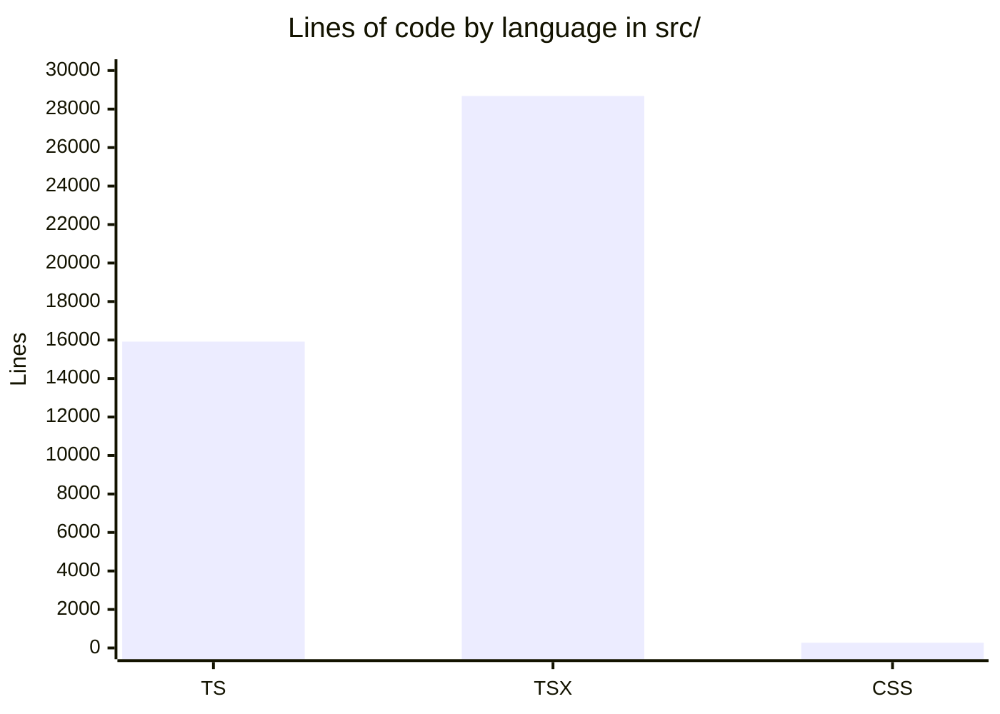
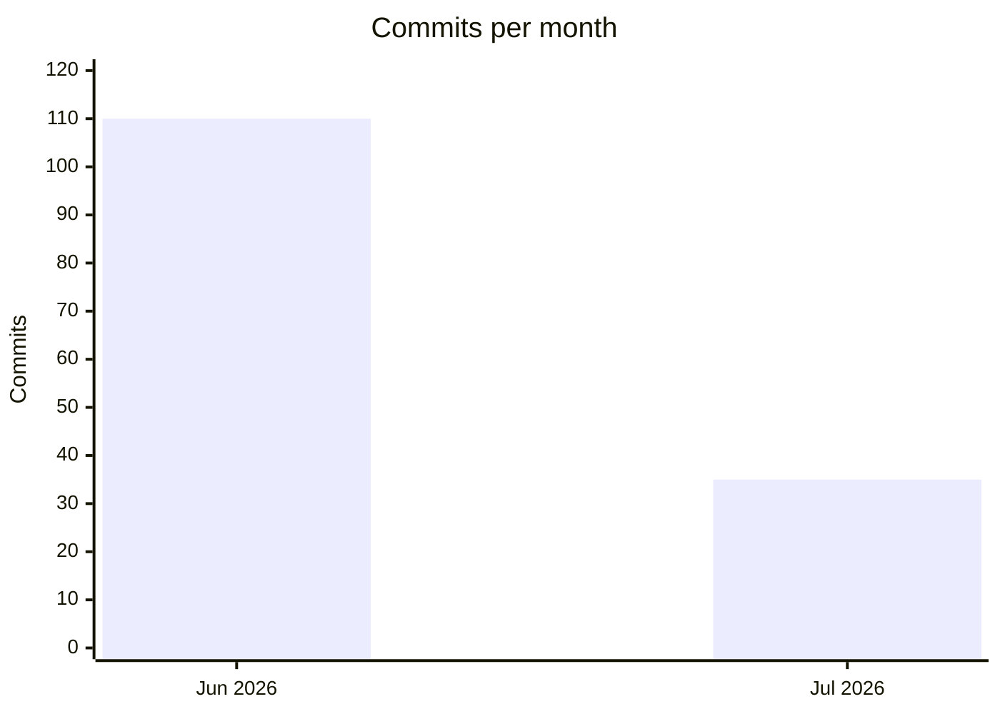

# By the numbers

> Data collected on 2026-07-07. Numbers come from `git`, `wc`, and `find` run
> against the checkout at `/Users/dylanmccavitt/projects/port-omp/` on `main`
> (commit `48b4df4240`). The repo is a single package (`omp-studio` in
> `package.json`, no `workspaces` field), not a monorepo, so every count below
> is for one app.

## Size

### Lines of code by language

`src/` holds roughly 44,900 lines of source. TSX dominates because the renderer
is React-heavy and the views, components, and their co-located Vitest tests are
all `.tsx`.

| Language | Files | Lines |
|---|---|---|
| TypeScript (`.ts`) | 83 | 15,916 |
| TSX (`.tsx`) | 144 | 28,678 |
| CSS | 1 | 272 |
| **Total in `src/`** | **228** | **44,866** |

### Source, test, and config files

| Category | Count | Notes |
|---|---|---|
| Source files in `src/` | 227 | 83 `.ts` + 144 `.tsx`, including 68 co-located test files |
| Node-side test files in `test/` | 39 | Run by `bun test` (session reducer, IPC degrade, store edges, sync-check) |
| E2E specs in `e2e/` | 5 | Playwright `_electron`: smoke, live, ui-flows, resize, browser — plus the `e2e/demo/` recording harness |
| Config files at repo root | 10 | `biome.json`, `bunfig.toml`, `electron.vite.config.ts`, `postcss.config.js`, `tailwind.config.js`, `playwright.config.ts`, `tsconfig.json`, `tsconfig.node.json`, `tsconfig.web.json`, `package.json` |
| Packages | 1 | Single `package.json`, no `workspaces` field |

The 68 co-located renderer tests mean the "227 source files" figure already
includes tests that live next to the code they exercise. Counting all test
files together (68 in `src/` + 39 in `test/` + 5 in `e2e/`) gives 112 test
files against roughly 159 non-test source files, a high test-to-source ratio
for a pre-1.0 app.

## Activity

### Commits per month

145 commits total, all on `main`. The first commit landed 2026-06-19; July is
only a week old at the time of this snapshot, so the July bar reflects a
partial month.

### Churn hotspots (last 90 days)

Files touched most often in the last 90 days, from
`git log --since='90 days ago' --name-only --pretty=format: | grep -v '^$' | sort | uniq -c | sort -rn | head -15`. The count is the number of commits that
touched the file, not added lines.

| Touches | File |
|---|---|
| 24 | `src/renderer/src/views/Chat.tsx` |
| 20 | `src/shared/ipc.ts` |
| 18 | `src/renderer/src/views/Settings.tsx` |
| 18 | `src/renderer/src/store/chat.ts` |
| 18 | `src/renderer/src/components/Sidebar.tsx` |
| 15 | `src/preload/index.ts` |
| 15 | `src/main/index.ts` |
| 13 | `src/renderer/src/store/session-reducer.ts` |
| 13 | `src/renderer/src/App.tsx` |
| 12 | `src/renderer/src/components/chat/Composer.tsx` |
| 12 | `CHANGELOG.md` |
| 11 | `src/renderer/src/views/Dashboard.tsx` |
| 11 | `src/renderer/src/components/chat/PromptComposer.tsx` |
| 11 | `src/main/services/settings-service.ts` |
| 11 | `package.json` |

The hotspots cluster where you would expect for a v2 expansion: the shared IPC
contract (`src/shared/ipc.ts`) and the preload/main bootstrap that register it
get touched every time a feature adds a channel; the chat view, chat store, and
session reducer absorb the subagent drill-in and pane model work; Settings and
the Sidebar churn with workspaces, layout, and the visual identity refresh.

### Bot-attributed commits

| Metric | Value |
|---|---|
| Commits with a `Co-authored-by` trailer | 1 of 145 |
| Commits with a bot/agent `Co-authored-by` trailer | 1 of 145 (~0.7%) |
| Total commits | 145 |

Run as `git log --format='%b' | grep -i 'co-authored-by'`. The single match is
the 2026-07-05 AGENTS.md commit, co-authored by `Cursor Agent`. This counts
only git-traceable co-authorship, which is the only kind a commit history can
see. Inline AI coding tools that edit files without leaving a trailer leave no
trace in `git log`, so the real share of AI-assisted work is higher and not
measurable from history alone. The Factory Droid CI workflows added on
2026-07-02 were removed again on 2026-07-06 (AGE-837).

## Complexity

### Largest source files

From `find src -name '*.ts' -o -name '*.tsx' | xargs wc -l | sort -rn | head -12`.

| Lines | File |
|---|---|
| 1249 | `src/renderer/src/views/Settings.tsx` |
| 1129 | `src/renderer/src/store/chat.ts` |
| 1030 | `src/renderer/src/views/Dashboard.tsx` |
| 802 | `src/main/services/settings-service.ts` |
| 795 | `src/renderer/src/views/Browser.test.tsx` |
| 719 | `src/main/services/session-store.ts` |
| 691 | `src/renderer/src/components/chat/SessionList.tsx` |
| 681 | `src/renderer/src/store/session-reducer.ts` |
| 655 | `src/renderer/src/components/shell/CenterTabs.test.tsx` |
| 643 | `src/renderer/src/store/panes.ts` |
| 639 | `src/main/omp/rpc-session.ts` |

### Average file size by area

| Area | Files | Lines | Avg lines/file |
|---|---|---|---|
| `src/shared/` (cross-process contract) | 3 | 1,432 | ~477 |
| `src/renderer/src/views/` | 22 | 8,210 | ~373 |
| `src/main/` | 32 | 7,163 | ~224 |
| `src/renderer/src/components/` | 105 | 17,376 | ~165 |

The `shared/` average is high because three files carry the entire IPC, RPC, and
domain type surface for all three processes. The `views/` average is inflated by
`Settings.tsx` (1249) and `Dashboard.tsx` (1030). Component files stay small
(~165 lines) because the chat subtree is split into many focused pieces (42
entries under `src/renderer/src/components/chat/`).

### Where the complexity lives

The deepest logic is not in the longest files but in a few concentrated spots:

- **`src/renderer/src/store/chat.ts`** (1129 lines) holds every live session in
  a normalized `openSessions` map behind one global bridge subscription, routing
  JSONL frames to per-session slices.
- **`src/renderer/src/store/session-reducer.ts`** (681 lines) is the pure
  reducer that turns streaming RPC frames into render state. It has no React or
  Zustand imports, so it is unit-tested under `bun test` in isolation.
- **`src/main/services/settings-service.ts`** (802 lines) owns the versioned
  settings schema, the v1-to-v2 `migrate()` path, and the `mergeKnown()` guard
  that drops unknown keys.
- **`src/renderer/src/views/Dashboard.tsx`** (1030 lines) aggregates every
  read-only data source into one grid, so it touches most of the domain types in
  `src/shared/domain.ts`.
- **`src/main/omp/rpc-session.ts`** (639 lines) is the RPC bridge: it writes
  newline-delimited JSON commands to the `omp` child's stdin, reads JSONL frames
  from stdout, matches responses to pending commands by `id`, and forwards
  unsolicited events to the renderer.

The shell pane model (`src/renderer/src/store/panes.ts`, 643 lines) is the
newest complex area, introduced with AGE-801 on 2026-07-01 to support up to
eight split center panes.
