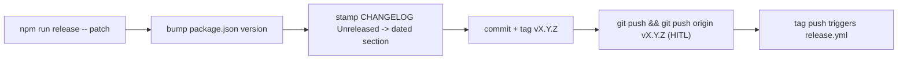

# Deployment

OMP Studio ships as a desktop installer for macOS, Linux, and Windows. The
release flow is one local command that bumps the version and stamps the
changelog, then a tag push that triggers a GitHub Actions workflow to build,
smoke-test, package, and publish. There is no code-signing or notarization yet;
macOS builds are unsigned.

## The one-command release prep

`npm run release -- <version|patch|minor|major>` runs
`scripts/release.mjs`, which:

1. Resolves the next version. `patch`/`minor`/`major` bump the current
   `package.json` version; an explicit `X.Y.Z` is used verbatim.
2. Stamps the `## [Unreleased]` section of `CHANGELOG.md` into a dated
   `## [version] - YYYY-MM-DD` section, inserts a fresh empty `## [Unreleased]`
   above it, and rewrites the link-reference footer (`[Unreleased]` and
   `[version]` compare/tag links).
3. Commits `package.json` and `CHANGELOG.md` with `release: vX.Y.Z`.
4. Tags `vX.Y.Z` (annotated).

It refuses to run on a dirty tree, warns when off `main`, and fails when the tag
already exists. `--dry-run` prints the bump and a release-notes preview (via
`extractSection` from `scripts/changelog.mjs`) without writing or tagging. The
script intentionally does not push; a human runs
`git push && git push origin vX.Y.Z` to trigger the publish workflow (HITL).

## The release workflow

Pushing a `v*` tag triggers `.github/workflows/release.yml`. A `build` matrix
runs on `macos-latest`, `ubuntu-latest`, and `windows-latest` (no `fail-fast`,
so one OS's failure does not cancel the others):

1. **Verify the tag matches `package.json`.** The workflow reads
   `require('./package.json').version` and compares it to the tag (minus the
   leading `v`). A mismatch fails the job, so a release is never cut from a
   mismatched source tree.
2. **Install + build.** `npm ci` then `npm run build` (electron-vite -> `out/`).
3. **Smoke-test the packaged app** (Linux and macOS only; Windows headless GUI
   launch is impractical in CI). `electron-builder --dir --publish never`
   produces an unpacked build, then the app is launched with `OMP_STUDIO_SMOKE=1`
   under `xvfb-run` (Linux) or directly (macOS). The boot gate logs `smoke ok`
   once the renderer finishes loading; the job tails the log for that line and
   fails if it does not appear within 60 seconds. This catches a broken main
   process or renderer before installers are packaged.
4. **Package distributables.** `electron-builder --publish never` builds the
   per-OS installers into `release/`.
5. **Upload installers** as workflow artifacts (`*.dmg`, `*.AppImage`,
   `*.exe`).

A separate `publish` job runs after every `build` job passes. It downloads all
platform artifacts, extracts the release notes for the tag from `CHANGELOG.md`
via `scripts/changelog.mjs`, and cuts one GitHub Release titled
`OMP Studio vX.Y.Z` with those notes and every installer attached.

### The smoke boot gate

`OMP_STUDIO_SMOKE=1` is the hermetic boot probe. `src/main/index.ts` checks it
at window creation: `ready-to-show` suppresses `mainWindow.show()` and
`did-finish-load` logs `smoke ok` instead of opening the UI. The release
workflow and the e2e smoke suite both rely on it to confirm the packaged app
boots cleanly without a real `omp` or display. See
[Tooling](how-to-contribute/tooling.md) for the dev/test commands and
[Development workflow](how-to-contribute/development-workflow.md) for the branch
and PR cycle.

## The electron-builder config

The `build` block in `package.json` configures electron-builder:

| Field | Value | Purpose |
| --- | --- | --- |
| `appId` | `com.ompstudio.app` | The stable app identifier (also the `setAppUserModelId`). |
| `productName` | `OMP Studio` | The display name on installers and the macOS app bundle. |
| `directories.output` | `release` | Where installers and unpacked builds land. |
| `files` | `out/**/*`, `package.json` | Only the electron-vite output and the manifest ship. |
| `asarUnpack` | `**/node_modules/node-pty/**` | `node-pty` is a native addon; it must stay on disk outside the asar so its `.node` file and `spawn-helper` binary load. |
| `mac.target` | `dmg` for `arm64` and `x64` | macOS disk image for both arches. |
| `mac.category` | `public.app-category.developer-tools` | App Store category. |
| `linux.target` | `AppImage` | Single-file Linux executable. |
| `win.target` | `nsis` | Windows NSIS installer. |

The build runs as `npm run dist` (or `npm run dist:mac` for macOS only), which
chains `electron-vite build && electron-builder`. The `node-pty` unpacking
matters: the terminal is opt-in, but the addon has to load for an opted-in
`terminal:create` to work in a packaged app. The `postinstall` hook
(`scripts/ensure-node-pty-exec.mjs`) restores the executable bit on the
`spawn-helper` binary that some install paths strip; without it,
`terminal:create` fails at spawn with `posix_spawnp failed.` See
[Pitfalls and danger zones](background/pitfalls.md) for that failure mode.

## CI

`.github/workflows/ci.yml` gates every push to `main` and every PR:

- **`gate`** (Node 20 and 22, `ELECTRON_SKIP_BINARY_DOWNLOAD=1`): Biome check,
  typecheck (node + web), `bun test`, `npm run test:ui` (Vitest), and
  `npm run build`. It never launches the app, so it skips the Electron binary
  download to stay fast.
- **`e2e-smoke`** (Ubuntu only): installs Electron system libraries, restores
  the setuid bit on `chrome-sandbox`, builds, and runs the hermetic Playwright
  `_electron` smoke under `xvfb-run`. The smoke points `OMP_BINARY` and
  `GH_BINARY` at an unresolvable path so no real `omp` or `gh` is required and
  no child process or model turn is ever spawned. Live paid e2e is gated behind
  `STUDIO_E2E_LIVE=1` and never runs in CI.

A green CI is the prerequisite for a release tag, but CI does not itself
publish; only the `release.yml` workflow on a tag does.

## macOS code-signing and notarization

macOS builds are unsigned. The `mac` block sets no `identity`, `notarize`, or
hardened-runtime options, so the produced `.dmg` opens with the standard
Gatekeeper warning on first launch and the user must right-click -> Open (or
approve in System Settings) to run it. Signing and notarization are deferred
until a distribution channel needs them; until then, the installers are
developer-built artifacts.
