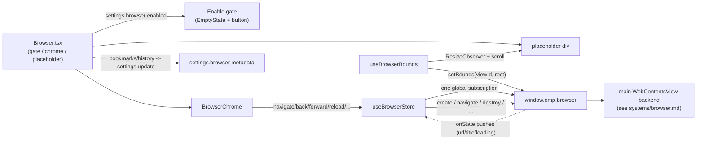

# Browser

The browser is the opt-in embedded web panel. The renderer renders only the
chrome (tab strip, navigation buttons, an editable address bar, bookmarks and
history dropdowns) and an empty placeholder div; the actual web page is a
main-owned, sandboxed `WebContentsView` overlaid on top of that placeholder's
rect. The capability is OFF by default (`settings.browser.enabled`), and the
enable gate states plainly that it loads untrusted remote content in a separate
sandboxed view and is not a "secure" browser. This page covers the renderer
side; the `WebContentsView` backend and the security boundary live in
[`../systems/browser.md`](../systems/browser.md).

## Purpose

Let the user open web pages inside the OMP Studio window without weakening the
privileged renderer's CSP. The renderer never loads remote content; it only
measures where the page should go and forwards navigation intents to main, which
owns the sandboxed view that draws the page.

## Directory layout

```text
src/renderer/src/
  views/Browser.tsx                        the view: enable gate, chrome, placeholder, metadata persistence
  components/browser/
    BrowserChrome.tsx                      tab strip, nav buttons, editable address bar, bookmarks/history comboboxes
    useBrowserBounds.ts                    streams the placeholder rect to browser.setBounds
  store/browser.ts                         renderer store: one global onState subscription, nav state, history, control forwarding
src/shared/
  ipc.ts                                   BrowserBookmark, BrowserHistoryEntry, browser settings block, browser bridge surface
```

## Key abstractions

| Abstraction | File | Role |
| --- | --- | --- |
| `Browser` view | `src/renderer/src/views/Browser.tsx` | Enable gate, mounts `BrowserChrome` + the placeholder div, owns bookmarks/history persistence, and the lifecycle (subscribe, create the first blank tab, destroy all on unmount). |
| `BrowserChrome` | `src/renderer/src/components/browser/BrowserChrome.tsx` | Tab strip (create/switch/close), back/forward/reload/open-external/devtools/bookmark/clear buttons, an editable address `<input>` plus Go, and bookmarks + history `Combobox` dropdowns. |
| `toUrl` | `src/renderer/src/components/browser/BrowserChrome.tsx` | Coerces omnibox input into a loadable URL. Promotes a bare host (`example.com`) to `https://`, accepts explicit `http(s)://`, and rejects other schemes with user-facing copy before they reach IPC. |
| `useBrowserBounds` | `src/renderer/src/components/browser/useBrowserBounds.ts` | `ResizeObserver` plus window `resize` and capture-phase `scroll` listeners that push the placeholder's window-relative rect to `window.omp.browser.setBounds`. No-op when `viewId` is null. |
| `useBrowserStore` | `src/renderer/src/store/browser.ts` | One global `onState` subscription. Holds `viewId`, `state`, `tabs`, deduped `history`, and forwards `create`/`navigate`/`back`/`forward`/`reload`/`openDevTools`/`openExternal`/`destroy` to `window.omp.browser.*`. |
| `BrowserBounds` | `src/renderer/src/store/browser.ts` | Window-relative rect (`x`, `y`, `width`, `height`) in DIP, which equals CSS pixels here since the renderer fills the `BrowserWindow` content area. |
| `BrowserBookmark` / `BrowserHistoryEntry` | `src/shared/ipc.ts` | Persisted metadata under `settings.browser.bookmarks` / `settings.browser.history` (url, title, timestamp). |

## How it works

The view reads `settings.browser.enabled`. When disabled it renders an
`EmptyState` whose copy states the model plainly: turning it on loads untrusted
remote web pages inside a separate, sandboxed view with its own ephemeral
session, isolated from the app, your files, and the OMP bridge, but it can still
reach the internet and run whatever any web page can; it is not a hardened or
"secure" browser. The "Enable embedded browser" button flips
`settings.browser.enabled` through `useSettingsStore.update`.

When enabled, a `useLayoutEffect` runs the lifecycle: it calls
`ensureSubscribed()` to register the single global `onState` listener, creates
the first blank tab once the placeholder has a measurable rect, and on unmount
(or when the capability is turned off) calls `destroyAll()` and `teardown()` to
destroy every view and release the subscription.



### Chrome and the omnibox

`BrowserChrome` mirrors the store's `tabs` and `state`. The tab strip creates,
switches, and closes tabs. The toolbar has back/forward/reload (spin while
loading), open-current-page-externally, open DevTools, bookmark/unbookmark, and
clear-metadata buttons, then an editable address `<input>` with a Go submit.

The address input owns free-text navigation because the `Combobox` primitive can
only select from a fixed option list, and a browser must navigate to URLs that
are not in history yet. Submitting runs the input through `toUrl`: explicit
`http(s)://` is accepted as-is, a bare host is promoted to `https://`, and any
other scheme is rejected with "Blocked scheme" copy before it reaches IPC. The
bookmarks and history dropdowns are `Combobox`es; selecting one adopts its URL
into the address bar and navigates. The address bar mirrors the committed URL
but never clobers an in-progress edit, and a tab switch always adopts the new
active tab's URL.

### Bounds streaming

The `WebContentsView` lives in main's content layer, not the DOM, so the
renderer is the only thing that knows where the placeholder ends up after
layout, a window resize, or any ancestor scroll. `useBrowserBounds` reports the
initial rect, then re-reports on a `ResizeObserver` of the placeholder, a window
`resize`, and a capture-phase window `scroll` (capture so a scroll on any
ancestor, not just window, re-measures). Bounds are viewport coordinates from
`getBoundingClientRect()`, which map 1:1 onto `setBounds` because the renderer
fills the `BrowserWindow` content area.

### State reduction and tab switching

The store's `_applyState` reduces each `onState` push (`url`, `title`,
`loading`, `canGoBack`, `canGoForward`, `error`) into the active `state`,
upserts the tab metadata, and appends the URL to a deduped `history` capped at
`HISTORY_CAP` (50). It ignores pushes for ids not in `tabs`, so stale events
from closed or foreign views never resurrect tab metadata. `switchTo` hides the
outgoing view with `HIDDEN_BOUNDS` and restores the cached `_states[id]` for the
new active tab. `close` destroys the view and reselects a neighbor. `create`
guards against stale returns with a `_createToken` bumped by `teardown` and
`destroyAll`, so a create that races an unmount destroys the view it gets back
instead of adopting it.

### Bookmarks and history persistence

The view persists bookmarks and history into `settings.browser` through a
serialized `updateBrowserMetadata` queue (each write awaits the previous). On
each `state` change it records a `BrowserHistoryEntry` (deduped by URL, capped
at 50) unless that URL was just cleared. `mergeHistory` joins the persisted
entries with the store's transient visited-URL list to back the omnibox
dropdown, and "Clear metadata" wipes both the persisted settings and the local
history while tracking cleared URLs locally so they do not re-persist before the
settings update lands.

## Integration points

- **The `WebContentsView` backend, `BrowserViewManager`, sandbox configuration,
  and the navigation security boundary** are in
  [`../systems/browser.md`](../systems/browser.md). This page covers only the
  renderer surface.
- **Security boundary** (separate sandboxed view, ephemeral in-memory session,
  http(s)-only, no preload/Node/OMP bridge) is in
  [`../security.md`](../security.md).
- **Settings persistence** for `settings.browser` (versioned schema, pessimistic
  `update`) is in [`../systems/settings-service.md`](../systems/settings-service.md).
- **The `BrowserBookmark`, `BrowserHistoryEntry`, and browser bridge types** are
  part of the frozen IPC contract in
  [`../primitives/ipc-contract.md`](../primitives/ipc-contract.md).

## Entry points for modification

- **Gate copy**: the `EmptyState` hint and button label in
  `src/renderer/src/views/Browser.tsx`.
- **Omnibox URL coercion**: `toUrl` in
  `src/renderer/src/components/browser/BrowserChrome.tsx` (scheme allow-list,
  bare-host promotion).
- **Bounds reporting cadence**: the listeners in
  `src/renderer/src/components/browser/useBrowserBounds.ts` (add or remove
  re-measurement sources).
- **History cap or dedup**: `HISTORY_CAP` and `_applyState` in
  `src/renderer/src/store/browser.ts`; the persisted-history cap (50) and
  `mergeHistory` in `src/renderer/src/views/Browser.tsx`.
- **Chrome buttons**: the toolbar in
  `src/renderer/src/components/browser/BrowserChrome.tsx`.

## Key source files

| File | Purpose |
| --- | --- |
| `src/renderer/src/views/Browser.tsx` | The view: enable gate, chrome + placeholder, metadata persistence, lifecycle. |
| `src/renderer/src/components/browser/BrowserChrome.tsx` | Tab strip, nav buttons, editable address bar, bookmarks/history comboboxes, `toUrl`. |
| `src/renderer/src/components/browser/useBrowserBounds.ts` | Streams the placeholder rect to `browser.setBounds` on layout/resize/scroll. |
| `src/renderer/src/store/browser.ts` | Renderer store: one global `onState` subscription, nav state, deduped history, control forwarding. |
| `src/shared/ipc.ts` | `BrowserBookmark`, `BrowserHistoryEntry`, the `settings.browser` block, and the `window.omp.browser` bridge surface. |
