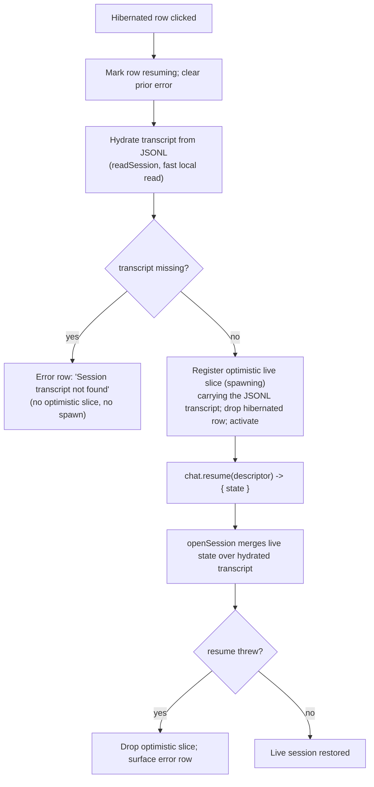

# Session management

A chat session has a lifecycle: it spawns from a workspace, streams turns, can
be hibernated (child disposed, transcript kept) and resumed later, or closed
(deleted from the open list). The left rail lists every open and hibernated
session grouped by workspace, and the per-session actions menu operates on the
JSONL transcript (rename, export, reveal, archive, delete) without rewriting
it. This page covers the session list, the actions menu, stats, compaction, and
the resume/hibernate/hydrate paths.

## Purpose

Let the user run many chats at once, switch between them without killing any,
resume a hibernated chat after a restart, and manage the on-disk transcript
through a single actions menu. Keep the live/hibernated distinction honest: a
hibernated row has no child, a failed resume surfaces an error row instead of a
fabricated transcript, and closing a session never touches another open child.

## Directory layout

```
src/renderer/src/
├── components/chat/
│   ├── SessionList.tsx          # left-rail session index (live + hibernated)
│   ├── SessionStatsPanel.tsx    # usage panel + header context chip
│   └── CompactDialog.tsx        # manual context-compaction modal
├── components/session/
│   ├── SessionActionsMenu.tsx   # rename/delete/archive/reveal/exportHtml menu
│   └── RenameSessionDialog.tsx  # session rename modal
└── store/
    ├── chat.ts                  # start / openSession / closeSession / resume / loadOpenSessions
    └── approvals.ts             # per-session approval policy (set at spawn/resume)
```

## Key abstractions

| Abstraction | File | One line |
| --- | --- | --- |
| `OpenSessionDescriptor` | `src/shared/ipc.ts` | Persisted descriptor for an open chat; `sessionFile` is the durable resume token. |
| `HibernatedSession` | `src/renderer/src/store/chat.ts` | A persisted-but-not-live descriptor with optional `resuming` / `error`. |
| `LiveSessionSummary` | `src/renderer/src/store/chat.ts` | Message-free summary for shell chrome subscriptions. |
| `deriveSessionBadgeKind` | `src/renderer/src/store/session-reducer.ts` | Headline status kind (ready / starting / streaming / needs-approval / error / exited / …). |
| `groupSessionsByWorkspace` | `src/renderer/src/components/chat/SessionList.tsx` | Group live + hibernated ids by cwd; selected workspace first. |
| `SessionActionsMenu` | `src/renderer/src/components/session/SessionActionsMenu.tsx` | Shared overflow menu for live rows and the historical Sessions view. |
| `SessionStats` | `src/shared/rpc.ts` | Permissive `get_session_stats` snapshot (tokens / cost / contextUsage). |

## How it works

### The session list

`SessionList` is the left-rail Chats surface (AGE-632, grouped by workspace in
AGE-807). It subscribes shallowly to id-to-cwd maps for live and hibernated
sessions, so the container only re-renders when sessions open, close, or move
workspace; each row subscribes to its own slice for live status updates
(including background sessions). `groupSessionsByWorkspace` groups ids by cwd,
sorts the selected workspace's group first, then the rest in label order, with
cwd-less sessions under `Other` last.

Live rows (`SessionListRow`) show a workspace Live Dot (hue = identity, fill =
session status), the row title (`alias` > `sessionName` > cwd basename), one
mono meta line (model, live/recency, context %), and a text badge for the
states the dot cannot express (`needs-approval`, `needs-input`, `error`,
`exited`, `starting`). The actions menu and a close button appear on hover.
Clicking a row calls `setActiveSession`; closing calls `closeSessionWithConfirm`
(prompts before discarding a mid-stream turn). Hibernated rows
(`HibernatedListRow`) are muted, carry a `done` dot, and resume on click; a
failed resume becomes a disabled error row with Retry / Remove.

The list is one Tab stop with roving tabindex: Up/Down move focus between rows,
Enter/Space activate, Home/End jump. A footer legend decodes the Live-Dot fills
(live, idle, done).

### Session actions menu

`SessionActionsMenu` is the shared overflow menu used by both the live
`SessionList` rows and the historical Sessions detail header. Each caller
passes a `target` describing the session; the menu adapts which actions it
shows. Every file action routes through `window.omp.session.*` on the JSONL
path:

- **Rename** — a studio display alias keyed by the JSONL path; never rewrites
  the transcript. `RenameSessionDialog` sets it; an empty name clears the alias.
- **Close** — live only; disposes the child, transcript untouched (Close is not
  Delete). Delegated via `onClose` so the rail's streaming-confirm stays the
  single close path.
- **Export** — `session.exportHtml` then reveals the produced file.
- **Reveal** — host file manager.
- **Archive / Unarchive** — historical only; moves the JSONL between roots.
- **Delete** — confirm, then OS trash (recoverable). On a live session the
  child is disposed first so the file is no longer held open.

Progress and errors surface as toasts, never a blocking spinner. The dropdown
renders through a portal so it is never clipped by the rail's scroll container.
A rename from a live row patches the slice's `alias` immediately via `onChanged`.

### Session stats

`SessionStatsPanel` and the `ContextMeterChip` both read the active session's
permissive `SessionStats` snapshot (tokens / cost / contextUsage plus unknown
future keys) and slice-level fields (message count, queued follow-ups,
compaction state). Only fields actually present are rendered, so an empty or
unknown stats snapshot degrades gracefully instead of showing zeros. Stats
refresh on turn end and after compaction (driven by the store); the panel adds
a manual refresh button. The context meter bar fill escalates as the window
fills (accent under 70%, warn at 70%, danger at 90%). The compact header chip
shows a tiny usage bar plus token/cost when known.

### Compaction

`CompactDialog` is the manual context-compaction modal, opened from the Usage
panel's `Compact…` button. Compaction summarizes the session's context to
reclaim window space; it changes only what the agent keeps in context, never
the on-disk JSONL. Optional instructions steer how the summary is written. The
store marks the slice `compacting` for the duration of the `chat.compact` call,
then refreshes state and stats once omp reports completion. The `isCompacting`
slice flag tracks omp's auto-compaction frames (the `auto_compaction_*` events)
separately from the manual `compacting` flag.

### Resume / hibernate

Closing a session (`chat.close`) disposes the child; the on-disk transcript is
untouched. Best-effort so a failed IPC still drops the slice. The other open
children keep their subscriptions and keep streaming, so closing one never
touches another.

Resuming a hibernated session (`resumeSession`) is a three-step path:



The hydrate step is what makes a resumed session show its history instantly:
`readSession` reads the JSONL first, the store registers an optimistic live
slice (status `spawning`) carrying the hydrated transcript, and the pane mounts
before the child spawns. `openSession` then seeds from the authoritative resume
state and keeps `messages: hydrated` until a live `get_messages` replaces it,
so the transcript never flashes empty. `readSession` degrades to an empty
placeholder (no throw) when the file is missing or unreadable, so a deleted
JSONL is detected from the result and surfaced as an honest error row, never a
fabricated transcript. The spawn-time approval policy is mirrored onto the
approval store so the header chip reflects the resumed child's policy.

### Boot restore (D3r)

`loadOpenSessions` runs on boot. It opens the global subscription first so a
resumed child's frames route the moment it spawns, then unions the live
registry list (`chat.list`) with the persisted `settings.openSessions`,
deduped by studio session id (the registry entry wins). Any descriptor without
a live slice is registered as a hibernated row. No child is auto-spawned. The
main-side `SessionRegistry.hydrate` seeds the registry with the persisted
descriptors as hibernated records (no live child) so `chat:list` surfaces them
and the first `resume` / `persist` preserves them.

### Removing a hibernated row

`removeHibernated` drops a hibernated or errored descriptor from the open list
permanently: `chat.dispose` removes the record from the registry and re-persists
settings, so it does not reappear on the next boot. This is distinct from
`chat.close`, which would only hibernate it.

## Integration points

- **Chat store**: `start`, `openSession`, `closeSession`, `resumeSession`,
  `loadOpenSessions`, `removeHibernated`, `refreshStats`, `compact`. See
  `src/renderer/src/store/chat.ts`.
- **Session store (on-disk)**: `readSession`, `session.rename` /
  `session.delete` / `session.archive` / `session.reveal` /
  `session.exportHtml`. See
  [`../systems/session-store.md`](../../systems/session-store.md).
- **Settings**: `openSessions` persistence and the workspace list. See
  [`../systems/settings-service.md`](../../systems/settings-service.md).
- **RPC bridge**: `chat.create`, `chat.resume`, `chat.close`, `chat.list`,
  `chat.dispose`, `chat.compact`, `chat.getSessionStats`. See
  [`../systems/rpc-bridge.md`](../../systems/rpc-bridge.md).
- **Approvals**: the spawn-time policy is mirrored onto the approval store on
  create and resume. See [`approvals.md`](approvals.md).
- **Shell layout**: the session list lives in the left rail; the dock lives at
  the rail's bottom. See [`../shell-layout.md`](../shell-layout.md).

## Entry points for modification

- Add a session-list row affordance: edit `SessionList.tsx` or
  `src/renderer/src/components/session/SessionActionsMenu.tsx`.
- Add a stats field: extend `SessionStats` in `src/shared/rpc.ts` and render it
  in `SessionStatsPanel.tsx`.
- Change the resume path: edit `resumeSession` / `loadOpenSessions` /
  `openSession` in `src/renderer/src/store/chat.ts`.
- Add a session action: add it to `SessionActionsMenu` and the
  `window.omp.session.*` surface in `src/shared/ipc.ts`.

## Key source files

| File | Purpose |
| --- | --- |
| `src/renderer/src/components/chat/SessionList.tsx` | The left-rail session index: workspace grouping, live and hibernated rows, roving tabindex, status legend. |
| `src/renderer/src/components/chat/SessionStatsPanel.tsx` | Usage panel and the header context-meter chip; reads `SessionStats` permissively. |
| `src/renderer/src/components/chat/CompactDialog.tsx` | Manual context-compaction modal. |
| `src/renderer/src/components/session/SessionActionsMenu.tsx` | Shared rename/close/export/reveal/archive/delete menu. |
| `src/renderer/src/components/session/RenameSessionDialog.tsx` | Session rename modal (studio alias, no JSONL rewrite). |
| `src/renderer/src/store/chat.ts` | Session lifecycle: start, openSession, closeSession, resume, loadOpenSessions, removeHibernated, stats, compact. |
| `src/renderer/src/store/session-reducer.ts` | `deriveSessionBadgeKind`, `sessionStatus`, `LiveSessionState`. |
| `src/shared/ipc.ts` | `OpenSessionDescriptor`, the `OmpApi.chat` lifecycle surface. |
| `src/main/omp/registry.ts` | `SessionRegistry`: live child set, hibernate, dispose, `hydrate`. |
