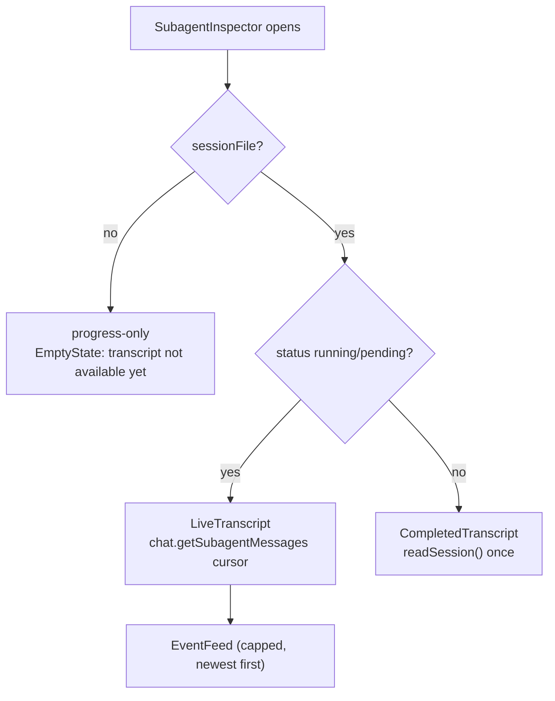

# Subagent drill-in

When `omp` delegates work to a subagent, the chat session streams
`subagent_lifecycle`, `subagent_progress`, and `subagent_event` frames. OMP
Studio turns those into a live hierarchy of subagents in the left-rail dock and
a first-class drill-in view that pops a subagent's transcript into the center
pane in place of the main chat.

## Purpose

Show every subagent a session has spawned, nested by who spawned whom, with a
live progress ticker per node. Let the user drill into any subagent to read its
full transcript and watch its live event feed while it runs, then fall back to a
one-shot read of its on-disk session file once it completes. Keep the live
telemetry cheap: the bridge subscribes at `events` level only for the active
session, and the inspector tails the subagent's JSONL incrementally instead of
re-reading the whole file.

## Directory layout

```
src/renderer/src/
├── components/chat/
│   ├── SubagentTree.tsx        # per-session subagent hierarchy + ticker
│   └── SubagentInspector.tsx   # drill-in transcript + live event feed
├── components/transcript/
│   └── TranscriptView.tsx      # shared transcript renderer used by the inspector
├── store/
│   ├── chat.ts                 # inspector cursor pump + frame routing
│   └── session-reducer.ts      # SubagentLiveState reduction from nested frames
└── views/Chat.tsx              # swaps the center pane to the inspector
```

## Key abstractions

| Abstraction | File | One line |
| --- | --- | --- |
| `SubagentLiveState` | `src/renderer/src/store/session-reducer.ts` | Per-subagent `progress` snapshot + capped `events` ring. |
| `SubagentInspectorState` | `src/renderer/src/store/chat.ts` | Live drill-in transcript buffer: `cursor`, `messages`, `live`, `started`. |
| `buildSubagentTree` | `src/renderer/src/components/chat/SubagentTree.tsx` | Nest a flat snapshot roster into a tree by `parentToolCallId`. |
| `subagentLabel` | `src/renderer/src/components/chat/SubagentTree.tsx` | Best human label for a subagent row / inspector header. |
| `SubagentMessagesResult` | `src/shared/rpc.ts` | Paginated live transcript cursor: `entries`, `messages`, `nextByte`, `reset`. |
| `SubagentSnapshot` | `src/shared/rpc.ts` | Richer superset of `SubagentInfo` returned by `get_subagents`. |

## How it works

### Frame reduction

The reducer handles three nested subagent frames. `subagent_progress` overwrites
the latest `progress` snapshot for the subagent id (taken from
`payload.progress`). `subagent_event` appends the child RPC frame
(`payload.event`) to a capped ring (most recent 200, oldest dropped).
`subagent_lifecycle` is signal-only: the store reacts by fetching a fresh
`get_subagents` snapshot and feeding it back through `studioFrame.subagents`,
which also prunes `subagentEvents` for ids no longer in the roster.

Both live fields live in `LiveSessionState.subagentEvents` keyed by subagent id,
as `SubagentLiveState`. They are ephemeral and die with the slice.

### The tree

`SubagentTree` renders the active session's subagents (it reads
`useActiveSession`). `buildSubagentTree` nests the flat snapshot roster into a
real tree: a subagent whose `parentToolCallId` was emitted by another subagent
nests under it. To resolve the parent, the builder scans each child's reduced
event log for `tool_execution_*` frames and records which subagent emitted each
tool-call id. Calls made by the session itself never match a subagent, so those
subagents become roots. Unresolvable links (the spawning frame aged out of the
capped buffer) also fall back to root, so no subagent is ever dropped. Siblings
sort by `index`.

Each node shows the agent label (`subagentLabel` distils a concise title from
the verbose assignment prompt, dropping the `Complete the assignment…`
boilerplate and preferring the first clause of a `# Target` section), its
source and status badges, and (when running) a live `NodeTicker` driven by the
reduced `AgentProgress` (last intent, current tool, tool count, token count).
Disclosure uses the shared `Collapsible` primitive. The Eye action calls
`onInspect` to open the inspector; the split action calls `onOpenInPane` to open
it in a new pane, and arms a drag grip (AGE-777) so the row can be dragged into
a split target.

### The inspector

`ChatSession` in `src/renderer/src/views/Chat.tsx` reads
`inspectedSubagent` from the store, scoped to its own session (AGE-801): only
the pane rendering the session that requested the drill-in swaps its transcript
for `SubagentInspector`. The inspector's Back button calls
`setInspectedSubagent(null)`.

`SubagentInspector` is a full-height center pane with a header bar (Back, label,
source and status badges, agent id, and an `Open in Sessions` action that hands
the `sessionFile` to the existing `focusSession` plumbing). Below the header it
renders a `ProgressDetail` (the reduced `AgentProgress`) and then the
transcript, degrading honestly per the subagent's state:



- No `sessionFile` -> progress-only: the ticker and feed, plus an EmptyState
  explaining the subagent has not written a session file yet.
- Completed with a file -> `CompletedTranscript` reads the JSONL once via
  `window.omp.readSession(sessionFile)`. `readSession` degrades to an empty
  placeholder rather than throwing, so an empty or failed read surfaces an
  EmptyState, never a blank pane.
- Live with a file -> `LiveTranscript` tails the subagent's JSONL through the
  store's inspector cursor pump.

### Incremental transcript tailing

The live path is event-driven, not polled. `LiveTranscript` calls
`openSubagentInspector(sessionId, subagentId, { sessionFile, live: true })` on
mount, which seeds the cursor in the store and does an immediate first read so
history shows before the next frame. The store's `_handleFrame` watches
incoming `subagent_progress` / `subagent_event` frames; when the open inspector
is watching the live subagent that the frame is about, it calls
`_pumpSubagentMessages`, which issues a `chat.getSubagentMessages` read from
`cursor` and appends `messages`, advancing `cursor` to `nextByte`. A `reset`
result clears and restarts the buffer (session-file rotation).

The pump is single-flight: only one `getSubagentMessages` read runs at a time,
and a frame that lands mid-read re-pumps once it finishes so the final bytes
are never missed. The buffer is capped to the most recent 1000 messages. The
inspector's live feed (`EventFeed`) shows the capped child RPC frames newest
first.

`getSubagentMessages` returns `{ sessionFile, fromByte, nextByte, reset,
entries, messages }`: `nextByte` resumes incremental tailing, `reset` signals
file rotation, and both raw `entries` and parsed `messages` are returned. The
renderer prefers the parsed `messages` and normalizes each through
`normalizeMessageContent`.

### The `set_subagent_subscription` cost-control knob

At `ready` the bridge sends `set_subagent_subscription { level: "events" }` so
subagent telemetry streams with no further request. The
`chat.setSubagentSubscription` IPC and `OmpRpcSession.setSubagentSubscription`
expose a per-session level so the host can scope `events` to the active session
and drop background sessions to `off`. The command is optional (the ready
handler already subscribes at `events`), so it degrades silently on an omp
build that predates the setter.

### Fallback to `readSession` on completion

Once a subagent completes (`status` leaves `running` / `pending`), the
inspector's `live` gate flips false and `CompletedTranscript` takes over,
reading the session file once. The store's cursor pump stops (`insp.live` is
false), so no further `getSubagentMessages` reads are issued for that
subagent.

## Integration points

- **Chat store**: `openSubagentInspector` / `closeSubagentInspector` /
  `_pumpSubagentMessages` in `src/renderer/src/store/chat.ts`.
- **Reducer**: `SubagentLiveState` reduction in
  `src/renderer/src/store/session-reducer.ts`.
- **RPC bridge**: `get_subagents`, `get_subagent_messages`,
  `set_subagent_subscription`, and the `subagent_*` event frames. See
  [`../systems/rpc-bridge.md`](../../systems/rpc-bridge.md).
- **Transcript renderer**: `TranscriptView` is shared with the Sessions view.
  See [`transcript.md`](transcript.md).
- **Sessions view**: the `Open in Sessions` action hands the `sessionFile` to
  `focusSession`. See [`../systems/session-store.md`](../../systems/session-store.md).
- **Shell layout**: the split action opens the inspector in a new pane. See
  [`../shell-layout.md`](../shell-layout.md).

## Entry points for modification

- Change the tree nesting or labels: edit `buildSubagentTree` and
  `subagentLabel` in `src/renderer/src/components/chat/SubagentTree.tsx`.
- Change the live transcript tailing: edit `openSubagentInspector` /
  `_pumpSubagentMessages` in `src/renderer/src/store/chat.ts`.
- Change how nested frames reduce: edit the `subagent_progress` /
  `subagent_event` cases in `src/renderer/src/store/session-reducer.ts`.
- Change the inspector's degradation matrix: edit
  `src/renderer/src/components/chat/SubagentInspector.tsx`.

## Key source files

| File | Purpose |
| --- | --- |
| `src/renderer/src/components/chat/SubagentTree.tsx` | The per-session subagent hierarchy, nesting, and live ticker. |
| `src/renderer/src/components/chat/SubagentInspector.tsx` | The drill-in view: header, progress detail, transcript, live event feed. |
| `src/renderer/src/components/transcript/TranscriptView.tsx` | Shared transcript renderer the inspector uses. |
| `src/renderer/src/store/chat.ts` | `SubagentInspectorState`, the cursor pump, frame-to-inspector routing. |
| `src/renderer/src/store/session-reducer.ts` | `SubagentLiveState` reduction from nested `subagent_*` frames. |
| `src/renderer/src/views/Chat.tsx` | Swaps the center pane to `SubagentInspector` when `inspectedSubagent` is set. |
| `src/main/omp/rpc-session.ts` | `getSubagents`, `getSubagentMessages`, `setSubagentSubscription`. |
| `src/shared/rpc.ts` | `SubagentSnapshot`, `AgentProgress`, `SubagentMessagesResult`, the subagent frame types. |
