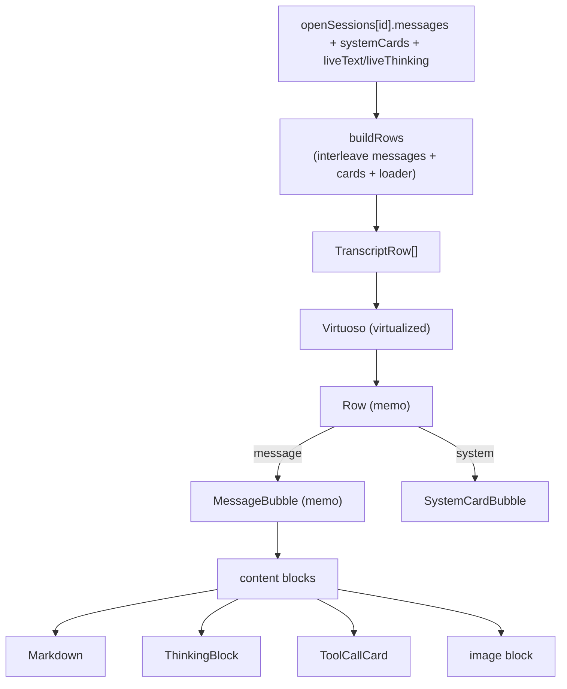

# Transcript

The transcript is the scrollable column of messages for one chat session. It
renders the reconciled `OmpMessage[]` from the store, interleaves slash-command
system cards at their captured positions, and appends a live streaming bubble
while the agent responds. Each assistant turn is decomposed into content blocks
(text, thinking, tool calls, images), so a single message can mix prose,
reasoning, and live tool execution.

## Purpose

Render a session's message log faithfully and cheaply. Faithfully means every
content block type has a dedicated component, tool calls show live status while
they run, and the markdown is GitHub-flavored with syntax highlighting.
Cheaply means the list is virtualized, rows are memoized, and the reducer
normalizes message content once at the ingestion boundary so render sites never
re-guard.

## Directory layout

```
src/renderer/src/
├── components/chat/
│   ├── MessageList.tsx          # virtualized transcript column
│   ├── MessageScroller.tsx      # right-edge navigation trail of tick marks
│   ├── messageScrollerBuckets.ts # pure bucketing of message ids into ticks
│   ├── useMessageVisibility.ts  # IntersectionObserver row-visibility tracking
│   ├── MessageBubble.tsx        # one message -> content blocks
│   ├── ToolCallCard.tsx         # one tool call + result, with live status
│   ├── Markdown.tsx             # react-markdown + rehype-highlight renderer
│   ├── ThinkingBlock.tsx        # collapsible reasoning block
│   ├── TodoPanel.tsx            # plan phases + status-iconed tasks
│   └── SystemCardBubble.tsx     # inline slash-command system cards
└── components/transcript/
    ├── TranscriptView.tsx       # shared transcript renderer (sessions + inspector)
    └── ActivityRail.tsx         # right-column run timeline of tool steps
```

## Key abstractions

| Abstraction | File | One line |
| --- | --- | --- |
| `TranscriptRow` | `src/renderer/src/components/chat/MessageList.tsx` | A union of `message`, `system`, and `loader` rows the list virtualizes. |
| `ContentBlock` | `src/shared/rpc.ts` | The content model: `text`, `thinking`, `toolCall`, `image`, plus a loose tail. |
| `toContentBlocks` | `src/renderer/src/store/session-reducer.ts` | Coerce `string \| ContentBlock[] \| undefined` into `ContentBlock[]`. |
| `normalizeMessageContent` | `src/renderer/src/store/session-reducer.ts` | Stamp `content: ContentBlock[]` on a message at every ingestion boundary. |
| `SystemCard` | `src/renderer/src/store/session-reducer.ts` | Inline notice from a slash-command side channel, anchored to a transcript position. |
| `ActivityStep` | `src/renderer/src/components/transcript/ActivityRail.tsx` | One derived tool-step node for the run timeline. |
| `MessageScroller` | `src/renderer/src/components/chat/MessageScroller.tsx` | The right-edge trail of clickable tick marks for jumping through a long transcript. |
| `useMessageVisibility` | `src/renderer/src/components/chat/useMessageVisibility.ts` | Tracks which transcript rows intersect the scroll container; yields `currentAnchorId` and `visibleMessageIds`. |
| `bucketMessageIds` | `src/renderer/src/components/chat/messageScrollerBuckets.ts` | Evenly buckets message ids into at most 50 ticks when the transcript is dense. |
| `editDiff` | `src/renderer/src/components/chat/ToolCallCard.tsx` | Derive an edit card's `+N / -M` summary and diff preview. |

## How it works

`MessageList` reads the session's `messages`, `systemCards`, `liveText` /
`liveThinking`, `activeTool`, and `status` through `useSession`. It builds a
flat `TranscriptRow[]` via `buildRows`: each non-`toolResult` message becomes a
`message` row, system cards interleave at their captured `afterCount` position,
and a `loader` row appends while streaming. A live streaming bubble (synthesized
from `liveText` / `liveThinking`) appears when the session is streaming, the
last message is not an assistant turn, and there is live content to show.

The list is virtualized with `react-virtuoso` (`Virtuoso`), with
`followOutput` keeping it pinned to the bottom unless the user scrolled up
(`atBottomThreshold` 80). Each row is a memoized `Row` component; `MessageBubble`
itself is `memo`-wrapped with an `areEqual` that compares the message reference,
streaming/session-running flags, the workspace color, and a `toolResultsVersion`
signature, so a row only re-renders when something it actually depends on
changes.



### Message navigation trail (AGE-774)

Long transcripts get a `MessageScroller` rail: a vertical column of horizontal
tick marks pinned to the right edge of the list (a
`nav[aria-label="Message position"]`), one tick per message or message group.
Clicking a tick jumps the transcript there; the tick for the topmost visible
message widens and brightens as you scroll.

Three pieces cooperate, all in `src/renderer/src/components/chat/`:

- `useMessageVisibility.ts` watches the scroll container with an
  `IntersectionObserver` plus a `MutationObserver`. The mutation observer
  matters because the list is virtualized: rows mount and unmount as you
  scroll, so it re-walks the container on DOM changes, observing newly mounted
  rows and dropping departed ones. Rows are tagged with a
  `data-message-anchor` attribute (`MESSAGE_ANCHOR_ATTR`) by `MessageList`'s
  `Row`. The hook returns `currentAnchorId` (topmost visible row in transcript
  order) and `visibleMessageIds`, with identity bailouts so frequent observer
  callbacks never drive a render loop.
- `messageScrollerBuckets.ts` is the pure layer: `bucketMessageIds` maps ids
  1:1 to ticks up to `MESSAGE_SCROLLER_BUCKET_THRESHOLD` (50) messages, then
  evenly buckets beyond that so the trail is capped at 50 ticks; a bucket's
  click target is its first message. `bucketForAnchor` maps the current anchor
  back to the active tick. Unit-tested in
  `src/renderer/src/components/chat/messageScrollerBuckets.test.ts`.
- `MessageScroller.tsx` renders the ticks and decides visibility: the trail
  only appears with at least 10 messages
  (`MESSAGE_SCROLLER_MIN_MESSAGES`) and content at least twice the viewport
  height, re-checked via a `ResizeObserver` on the scroll root and its content
  wrapper (so a streaming message that grows the content can reveal the trail).

`MessageList` wires it up: it captures Virtuoso's scroll element through the
callback-only `scrollerRef`, and tick clicks go through
`virtuosoRef.scrollToIndex` rather than a DOM query, because virtualization
means the target row may not be mounted. Bottom-follow while streaming is
unaffected; the trail is a presentation-only overlay. The behavior is locked
by tests in `src/renderer/src/components/chat/MessageList.test.tsx` and
`src/renderer/src/components/chat/useMessageVisibility.test.tsx`, and a demo
recording scenario exists at `e2e/demo/scenarios/message-scroller.mjs` (see
[Tooling](../../how-to-contribute/tooling.md)).

### Content-block model

Every message's `content` is normalized to `ContentBlock[]` at the ingestion
boundary (`normalizeMessageContent` runs on snapshot frames, optimistic user
appends, resume hydration, and the subagent pump). `MessageBubble` calls
`toContentBlocks` to read the blocks. The block types are:

- `text` -> `Markdown`.
- `thinking` -> `ThinkingBlock`.
- `toolCall` -> `ToolCallCard`, resolved against the
  `Map<toolCallId, ToolResultMessage>` `MessageList` builds from the
  `toolResult` messages.
- `image` -> an `` rendered via `imageBlockSrc` (handles both base64
  `data` and pre-formed `image` URLs).

`toolResult` messages render nothing here; they are folded into their
`ToolCallCard` and looked up by `toolCallId`.

### The AGE-656 bare-string fix

omp emits text-only assistant turns with a plain-string `content`, and a
freshly-spawned subagent can emit a frame with `content` missing. Before AGE-656
the assistant branch called `message.content.map`, which threw
`content.map is not a function` and crashed the whole transcript through the
error boundary. The fix guards both at the reducer (`toContentBlocks` /
`normalizeMessageContent`, the single source of truth for the coercion) and at
the render site (`MessageBubble` calls `toContentBlocks` instead of mapping
directly). The render-side guard is locked by
`src/renderer/src/components/chat/MessageBubble.test.tsx`.

### Tool call cards

`ToolCallCard` is a 1px-bordered card whose header carries a status dot, a
wrench icon, a mono tool name, and (for edit-family tools) a `+N -M` edit
counter. Edit-family tools (`edit`, `ast_edit`, `write`, `str_replace`, and any
name containing `edit`) get a compact 2-line diff preview from `editDiff`,
which probes a known set of argument fields (`input`, `patch`, `diff`,
`content`, `new_str`, `text`) and parses unified-diff `+`/`-` lines. While the
session is streaming and a call has no result yet, the card borders in the
workspace color, pulses its header dot, and blinks a `running…` label. The
header expands to the full arguments and the matched result content. Non-edit
cards keep a muted one-line argument preview.

The `running` state is only animated while the session itself is streaming; a
result-less call in a closed or hibernated transcript reads as neutral, so
historical transcripts do not look stuck.

### Thinking blocks

`ThinkingBlock` is a collapsible reasoning block, default collapsed, with a
Brain glyph, a `Thinking` label, and an approximate token count derived from
text length (`length / 4`). The live streaming bubble puts a `thinking` block
before the `text` block, so in-progress reasoning shows above the in-progress
prose.

### Markdown

`Markdown` renders GitHub-flavored markdown with syntax highlighting via
`remark-gfm` and `rehype-highlight`. Links are intercepted and opened in the OS
browser through `window.omp.openExternal` (never navigating the renderer away).
Inline `code` without a language class gets a bordered mono pill; fenced code
with a language class keeps the `hljs` / `language-` classes from
`rehype-highlight`. The component is `memo`-wrapped.

### Todo panel

`TodoPanel` renders the agent's current plan from `todoPhases`: phases with
status-iconed tasks (`pending`, `in_progress`, `completed`, `dropped`).
Completed and dropped tasks are struck through. It reads the active session
through `useActiveSession` and lives in the left-rail dock (see
[`composer.md`](composer.md)).

### System cards

`SystemCardBubble` renders one `SystemCard` — the visible feedback for local
slash commands, which produce no `agent_end`. The reducer mints cards from
three side-channel frames:

- `command_output` -> preformatted text (e.g. `/help`).
- `session_info_update` -> a one-line `Renamed to "<name>"` note (and keeps
  `sessionName` in sync).
- `config_update` -> a `Model: … · thinking: …` note (and keeps `model` /
  `thinkingLevel` in sync).

Cards are anchored to the transcript position they arrived at (`afterCount` =
the number of visible, non-`toolResult` messages that preceded them), so they
interleave chronologically with messages rather than floating to the bottom.
`id` is a per-session monotonic key (no `Date.now` / random, so the reducer
stays pure), and the list is capped to the most recent 50.

### Activity rail

`ActivityRail` is a 248px right-column run timeline of tool steps (AGE-708),
toggled by the `TranscriptModeToggle` in the chat header. Steps are derived
purely from the already-flowing transcript: every assistant `toolCall` block
becomes a node, and its status comes from whichever completion signal is
available first — a reconciled `toolResult` message (authoritative, but only
after turn end), else the live `toolRuns` record the reducer keeps from the
`tool_execution_*` frames (so a step goes `done` / `running` mid-stream), else
`queued`. There is no session data model and nothing is persisted; the rail is
a presentation-only view. The Focused layout (the `MessageList`) is left
untouched.

### TranscriptView

`TranscriptView` is the shared transcript renderer extracted from the Sessions
history view so the Sessions browser and the subagent inspector render
transcripts identically. It is virtualized with `Virtuoso`, owns its own scroll
container, and supports a `focusIndex` that scrolls a message into view and
flashes it (the Sessions search jump). The subagent inspector omits `focusIndex`
and supplies its own empty-state copy. See
[`subagent-drill-in.md`](subagent-drill-in.md).

## Integration points

- **Chat store / reducer**: `MessageList` reads `messages`, `systemCards`,
  `liveText`, `liveThinking`, `activeTool`, `status`, and `toolRuns` through
  `useSession`. See `src/renderer/src/store/chat.ts` and
  `src/renderer/src/store/session-reducer.ts`.
- **RPC frames**: `message_update`, `tool_execution_*`, `agent_end` /
  `turn_end`, `command_output`, `session_info_update`, `config_update`,
  `auto_compaction_start` / `auto_compaction_end`. See
  [`../../primitives/rpc-protocol.md`](../../primitives/rpc-protocol.md).
- **External open**: markdown links go through `window.omp.openExternal`. See
  [`../systems/rpc-bridge.md`](../../systems/rpc-bridge.md).
- **Subagent inspector**: reuses `TranscriptView` for the drill-in transcript.
  See [`subagent-drill-in.md`](subagent-drill-in.md).

## Entry points for modification

- Add a content-block type: extend `ContentBlock` in `src/shared/rpc.ts`, handle
  it in `MessageBubble`, and make sure `toContentBlocks` passes it through.
- Add a tool-card behavior: edit `ToolCallCard` and `editDiff` in
  `src/renderer/src/components/chat/ToolCallCard.tsx`.
- Add a system-card kind: extend `SystemCardKind` and `appendSystemCard` in
  `src/renderer/src/store/session-reducer.ts`, then render it in
  `SystemCardBubble`.
- Add an activity-rail node source: edit `deriveActivitySteps` in
  `src/renderer/src/components/transcript/ActivityRail.tsx`.
- Tune the navigation trail: thresholds and bucketing live in
  `src/renderer/src/components/chat/messageScrollerBuckets.ts` and the
  constants at the top of
  `src/renderer/src/components/chat/MessageScroller.tsx`.

## Key source files

| File | Purpose |
| --- | --- |
| `src/renderer/src/components/chat/MessageList.tsx` | Virtualized transcript column; builds rows, interleaves system cards, appends the live bubble. |
| `src/renderer/src/components/chat/MessageScroller.tsx` | Right-edge navigation trail of tick marks for long transcripts. |
| `src/renderer/src/components/chat/messageScrollerBuckets.ts` | Pure bucketing of message ids into at most 50 ticks. |
| `src/renderer/src/components/chat/useMessageVisibility.ts` | IntersectionObserver/MutationObserver tracking of visible transcript rows. |
| `src/renderer/src/components/chat/MessageBubble.tsx` | Renders one message: user text/images or assistant content blocks. |
| `src/renderer/src/components/chat/ToolCallCard.tsx` | One tool call with live status, edit diff, expandable arguments and result. |
| `src/renderer/src/components/chat/Markdown.tsx` | GitHub-flavored markdown with syntax highlighting and external link interception. |
| `src/renderer/src/components/chat/ThinkingBlock.tsx` | Collapsible reasoning block with an approximate token count. |
| `src/renderer/src/components/chat/TodoPanel.tsx` | Plan phases with status-iconed tasks. |
| `src/renderer/src/components/chat/SystemCardBubble.tsx` | Inline slash-command system cards. |
| `src/renderer/src/components/transcript/TranscriptView.tsx` | Shared transcript renderer for the Sessions view and the subagent inspector. |
| `src/renderer/src/components/transcript/ActivityRail.tsx` | Derived right-column run timeline of tool steps. |
| `src/renderer/src/store/session-reducer.ts` | `toContentBlocks`, `normalizeMessageContent`, `SystemCard`, `ActivityRunState`. |
| `src/shared/rpc.ts` | `ContentBlock`, `OmpMessage`, `ToolCallBlock`, `ImageBlock`. |
