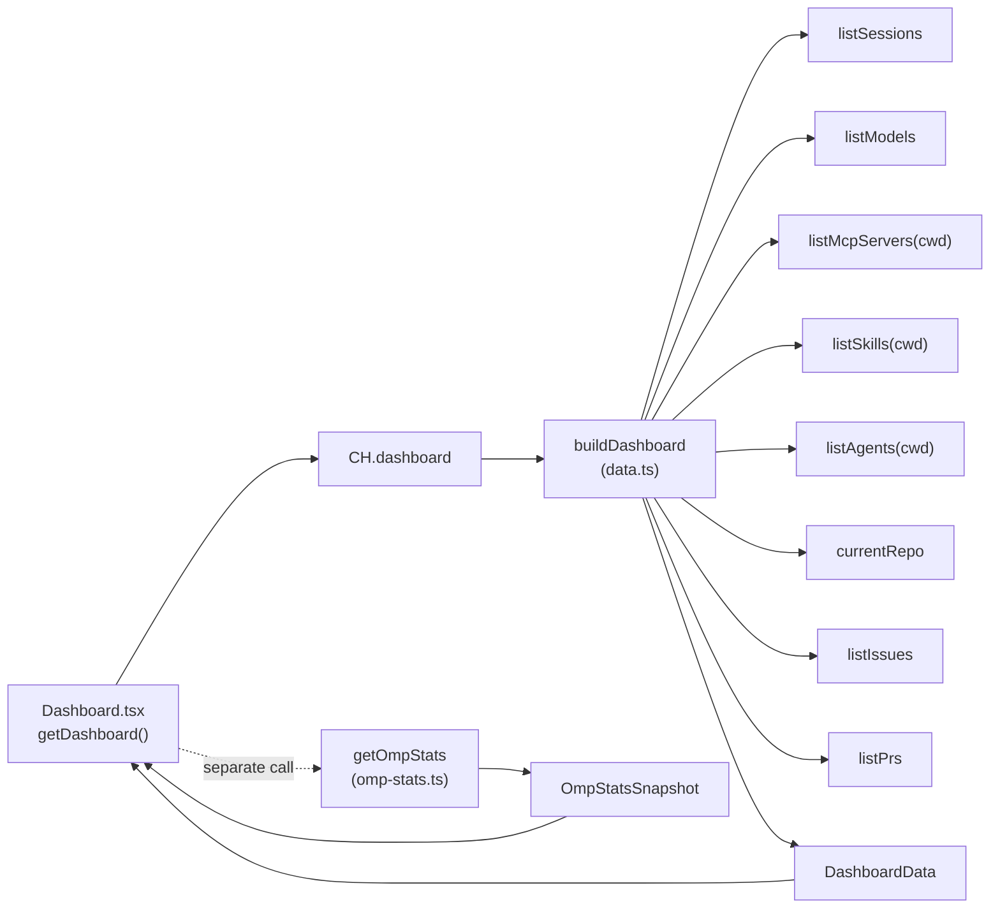

# Dashboard

The dashboard is the single-pane aggregate that opens by default (`route: "dashboard"` in `src/renderer/src/store/app.ts`). It pulls every read-only source the app knows about into one scrollable view: a row of stat cards, an OMP usage-stats panel, and lists for recent sessions, MCP servers, projects, and your assigned Linear issues. The aggregate itself is built in the main process by `buildDashboard` in `src/main/ipc/data.ts`, which fans out to the other data services in parallel and degrades gracefully when any source is missing.

## Directory layout

```text
src/renderer/src/views/
  Dashboard.tsx          the view (Stat cards, OmpStatsPanel, MyLinearIssuesPanel)
src/main/ipc/
  data.ts                buildDashboard — fan-out aggregate + registerDataIpc
src/main/services/
  omp-stats.ts           getOmpStats — omp stats --json -> OmpStatsSnapshot
  config-service.ts      listModels / listMcpServers / listSkills / listAgents
  session-store.ts       listSessions (sessions root)
  github.ts              currentRepo / listIssues / listPrs
src/shared/
  domain.ts              DashboardData, OmpStatsSnapshot, ProjectSessions
  ipc.ts                 CH.dashboard / CH.ompStats + OmpApi.getDashboard / getOmpStats
```

## Key abstractions

| Abstraction | File | Role |
| --- | --- | --- |
| `buildDashboard` | `src/main/ipc/data.ts` | Fan-out aggregate. Awaits sessions, models, mcp, skills, agents, repo, issues, and prs in parallel, each wrapped in `.catch(() => …)` so a missing source never breaks the whole. Groups sessions by project into `ProjectSessions[]`, counts providers from the model list, and returns `DashboardData`. |
| `DashboardData` | `src/shared/domain.ts` | The joined shape: `sessions` (total, recent 6, `byProject`), `models` (total, providers, default selector), `mcp` list, `skills`/`agents` counts, `github` (repo, openIssues, openPrs), and `generatedAt`. |
| `OmpStatsPanel` | `src/renderer/src/views/Dashboard.tsx` | The usage-stats section. Renders cost/request/error/cache metric cards, a token-usage-by-agent bar, a throughput SVG sparkline, and top-models/folders/cost breakdown lists. Backed by a separate `getOmpStats` call. |
| `MyLinearIssuesPanel` | `src/renderer/src/views/Dashboard.tsx` | A summary of issues assigned to you, read from the shared `useLinearStore`. Degrades to a connect prompt when Linear is not authenticated. |
| `getOmpStats` | `src/main/services/omp-stats.ts` | Shells out to `omp stats --json` (spooled output, 2MB cap, 30s timeout) and normalizes the shape into `OmpStatsSnapshot | null`. |

## How it works

The dashboard view makes two independent `window.omp` calls through `useAsync`: `getDashboard()` for the aggregate and `getOmpStats()` for the usage snapshot. Both reload together on the header refresh button and on a 30-second `setInterval`. Each section renders its own empty state when its slice is empty, so a missing GitHub repo or an unconfigured MCP list never blocks the rest of the page.

The aggregate is built server-side so the renderer never orchestrates the fan-out:



Every service call in `buildDashboard` is wrapped in `.catch(() => [])` or `.catch(() => null)`, so a failed `gh` invocation or a missing `omp` binary produces an empty GitHub block or zero model count rather than a failed dashboard. The OMP stats panel degrades to an "OMP stats unavailable" empty state when `getOmpStats` returns `null` (the hint notes the dashboard still works without stats).

### Project scoping

`buildDashboard` is called with `activeCwd()`, the resolver threaded from `src/main/index.ts` that returns the active workspace cwd (falling back to the most-recently-active chat session's cwd). `listMcpServers`, `listSkills`, and `listAgents` are project-scoped through it; `listSessions`, `listModels`, and the GitHub calls are not. See [Data services](../systems/data-services.md) for the resolver contract.

### Stats panel range filtering

`OmpStatsPanel` keeps a local range toggle (1h, 24h, 7d, 30d, 90d, All). The time/cost/model-performance series are windowed by `filterRowsByRange` against each row's `timestamp`, and `rollupSeries` re-sums requests, failures, and cost across the visible window so the metric cards reflect the selected range. The throughput chart is a hand-rolled SVG polyline over the last 24 points of the windowed `timeSeries`, with red tick marks for buckets that had errors. The metric formatters (`formatCost`, `formatMillis`, `formatCompactNumber`, `formatPercent`) render an em-dash placeholder when a field is absent, so a stats snapshot that omits a metric never shows `undefined`.

## Integration points

- **Stat cards link out**: "View all" on recent sessions opens the Sessions panel (`setOpenPanel("sessions")`); "Open" on Linear issues opens the Linear panel. Each recent-session row opens the Sessions panel rather than a specific transcript, since the sessions browser owns the detail view. See [Sessions browser](sessions-browser.md).
- **MCP, Projects, and Models counts** are read-only summaries here; the full browsers live at [MCP servers](mcp-servers.md) and [Models and providers](models-and-providers.md).
- **My Linear issues** reuses `useLinearStore` (`src/renderer/src/store/linear.ts`), the same store the Linear view drives. Only one view mounts at a time, so refreshing the issue list here never races the full view.
- **Stats sourcing and the CLI runner** are covered in [Data services](../systems/data-services.md); the overall process model is in [Architecture](../overview/architecture.md).

## Entry points for modification

- Add a new aggregate field: extend `DashboardData` in `src/shared/domain.ts`, add the service call to `buildDashboard` in `src/main/ipc/data.ts` (wrapped in `.catch`), and render it in `src/renderer/src/views/Dashboard.tsx`.
- Add a stats breakdown chart: the `OmpStatsPanel` sub-components (`NativeBreakdownList`, `AgentUsagePanel`, `ThroughputChart`, `RecentModelActivity`) are all local to `Dashboard.tsx` and read from the already-loaded `OmpStatsSnapshot`.
- Change the refresh cadence: the `setInterval(reloadAll, 30_000)` in `Dashboard.tsx`.

## Key source files

| File | Purpose |
| --- | --- |
| `src/renderer/src/views/Dashboard.tsx` | The view: stat cards, `OmpStatsPanel`, recent sessions, MCP, projects, `MyLinearIssuesPanel`. |
| `src/main/ipc/data.ts` | `buildDashboard` fan-out aggregate and `registerDataIpc`. |
| `src/main/services/omp-stats.ts` | `getOmpStats`: `omp stats --json` to `OmpStatsSnapshot`. |
| `src/shared/domain.ts` | `DashboardData`, `OmpStatsSnapshot`, `ProjectSessions`, `OmpStatsBreakdown`. |
| `src/shared/ipc.ts` | `CH.dashboard` / `CH.ompStats` channels and `OmpApi.getDashboard` / `getOmpStats`. |
