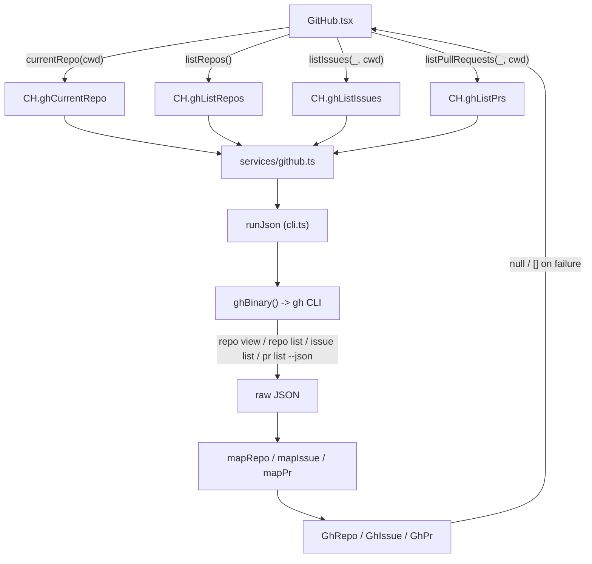

# GitHub

The GitHub panel is a read-only browser for the repositories, issues, and pull requests the `gh` CLI can see. It shells out to `gh` with `--json` from the main process, maps the raw output into the `GhRepo` / `GhIssue` / `GhPr` domain types, and renders a header for the current repository plus three tabs: Repos, Issues, and PRs. Every row opens its GitHub URL in the system browser through `window.omp.openExternal`. When `gh` is missing or unauthenticated, every call degrades to `null` or `[]` so the panel shows empty states instead of errors.

## Purpose

Surface the GitHub context around the active workspace, the user's owned repositories, and the issues and PRs of the selected project, without reimplementing any GitHub API client. All network and auth goes through the user's existing `gh` login; Studio never holds a GitHub token.

## Directory layout

```text
src/renderer/src/
├── views/
│   └── GitHub.tsx              the panel: header + Repos/Issues/PRs tabs
└── store/
    └── app.ts                  selectedProject (cwd scope for issues/PRs)
src/main/services/
  ├── github.ts                 currentRepo / listRepos / listIssues / listPrs
  └── cli.ts                    runCli / runJson (spawn + JSON parse, never throws)
src/main/ipc/
  └── data.ts                   gh:* handlers + buildDashboard GitHub slice
src/main/
  └── paths.ts                  ghBinary() (GH_BINARY override + path probe)
src/shared/
  ├── domain.ts                 GhRepo, GhIssue, GhPr
  └── ipc.ts                    CH.gh* channels + OmpApi.github
```

## Key abstractions

| Abstraction | File | Role |
| --- | --- | --- |
| `currentRepo` | `src/main/services/github.ts` | `gh repo view --json <fields>,defaultBranchRef` scoped to a `cwd`; maps to `GhRepo \| null`. Returns `null` when the cwd is not a git repo or `gh` is unavailable. |
| `listRepos` | `src/main/services/github.ts` | `gh repo list --json <fields> --limit 30`; maps to `GhRepo[]`. Owned-by-the-authed-user repos, not project-scoped. |
| `listIssues` | `src/main/services/github.ts` | `gh issue list [--repo <repo>] --json <fields> --limit 30` scoped to a `cwd`; maps to `GhIssue[]`. |
| `listPrs` | `src/main/services/github.ts` | `gh pr list [--repo <repo>] --json <fields> --limit 30` scoped to a `cwd`; maps to `GhPr[]`. |
| `GhRepo` | `src/shared/domain.ts` | `nameWithOwner`, `name`, `description`, `isPrivate`, `url`, optional `defaultBranch`, `stargazerCount`, `updatedAt`, `primaryLanguage`. |
| `GhIssue` | `src/shared/domain.ts` | `number`, `title`, `state`, `url`, `author`, `createdAt`, `updatedAt`, `labels`, optional `comments` count. |
| `GhPr` | `src/shared/domain.ts` | `number`, `title`, `state`, `url`, `author`, `createdAt`, `updatedAt`, `isDraft`, `labels`, optional `headRefName` / `baseRefName`. |
| `runJson` | `src/main/services/cli.ts` | Spawns a CLI, collects stdout, and parses the first JSON payload (skipping human preludes such as extension warnings). Returns `null` on a non-zero exit, missing payload, or invalid JSON; never throws. |
| `ghBinary` | `src/main/paths.ts` | Resolves the `gh` binary: `GH_BINARY` override wins, then probes `/opt/homebrew/bin/gh` and `/usr/local/bin/gh`, then falls back to bare `gh`. |

## How it works

The main process owns every `gh` invocation. The renderer only calls the typed `window.omp.github.*` surface, which forwards to the `CH.gh*` handlers in `src/main/ipc/data.ts`. Each handler delegates to `src/main/services/github.ts`, which builds an args vector, calls `runJson(ghBinary(), args, { cwd })`, and maps the raw wire shapes into the strict domain types with per-field `??` defaults so a missing field can never produce `undefined`.



`runJson` never throws across the IPC boundary. A spawn failure, a non-zero exit (for example `gh` not authenticated, or the cwd not inside a git repo), a timeout, or invalid JSON all resolve to `null` for single-result calls (`currentRepo`) and `[]` for list calls (`listRepos`, `listIssues`, `listPrs`). The renderer's `useAsync` hooks then render the matching empty state (no repositories, no issues, no pull requests, or a fallback "GitHub" header when `currentRepo` returns `null`).

### Current repo and project scoping

The header calls `window.omp.github.currentRepo(selectedProject ?? undefined)`, re-running on a header reload (a local `nonce` state) and whenever `selectedProject` changes. `selectedProject` lives in the app store and is set by the directory picker (`window.omp.pickDirectory()`). The Issues and PRs tabs are scoped the same way: they call `listIssues(undefined, selectedProject)` / `listPullRequests(undefined, selectedProject)`, and when no project is selected they show a "No project selected" empty state with a "Choose project" action rather than querying. The `cwd` passed to `gh` is what makes `gh issue list` / `gh pr list` resolve the right repository from the working directory's git remote. The Repos tab is not project-scoped; `listRepos` runs against `process.cwd()` and lists repos owned by the authenticated user.

### Field selection

Each `gh` call pins a fixed field set through `--json` so the mapping is stable across `gh` versions that may add fields: `REPO_FIELDS` (nameWithOwner, name, description, isPrivate, url, stargazerCount, updatedAt, primaryLanguage, plus `defaultBranchRef` for `currentRepo`), `ISSUE_FIELDS` (number, title, state, url, author, createdAt, updatedAt, labels, comments), and `PR_FIELDS` (number, title, state, url, author, createdAt, updatedAt, isDraft, labels, headRefName, baseRefName). The `comments` field on issues is normalized to a count whether `gh` returns a number or an array.

### Dashboard slice

`buildDashboard` in `src/main/ipc/data.ts` calls `currentRepo()`, `listIssues()`, and `listPrs()` in parallel (each wrapped in `.catch`) to populate the dashboard's GitHub block (the current repo, open issue count, and open PR count). See [Dashboard](dashboard.md).

## Integration points

- **The `gh` CLI prerequisite and `GH_BINARY` override** are covered in [Getting started](../overview/getting-started.md); the CLI runner and graceful degradation are covered in [Data services](../systems/data-services.md).
- **The `gh:*` channels and `OmpApi.github` surface** are documented in [IPC contract](../primitives/ipc-contract.md); the domain types are in [Domain types](../primitives/domain-types.md).
- **External links** from every row go through `window.omp.openExternal`, which drops non-http(s) URLs and routes to the OS browser via `safeOpenExternal` (see [Paths and logging](../systems/paths-and-logging.md)).
- **Dashboard** shows the current repo plus open issue and PR counts as a summary; see [Dashboard](dashboard.md).

## Entry points for modification

- **Add a field to a GitHub type**: extend the raw interface and the `--json` field constant in `src/main/services/github.ts`, add the field to the domain type in `src/shared/domain.ts`, and render it in `src/renderer/src/views/GitHub.tsx`.
- **Change the list limit**: the `--limit 30` is hardcoded in `listRepos`, `listIssues`, and `listPrs` in `src/main/services/github.ts`.
- **Add a new GitHub tab**: add a service function in `src/main/services/github.ts`, a channel in `src/shared/ipc.ts` plus an `OmpApi.github` method, a handler in `src/main/ipc/data.ts`, an entry to `TABS`, and a tab component in `src/renderer/src/views/GitHub.tsx`.
- **Re-scope Issues/PRs to a workspace cwd instead of `selectedProject`**: thread the active workspace cwd through the handlers the way `listSkills` does (see [Data services](../systems/data-services.md)).

## Key source files

| File | Purpose |
| --- | --- |
| `src/renderer/src/views/GitHub.tsx` | The panel: current-repo header, Repos/Issues/PRs tabs, row rendering, external-link opens. |
| `src/main/services/github.ts` | `currentRepo`, `listRepos`, `listIssues`, `listPrs`, raw-to-domain mappers, `--json` field constants. |
| `src/main/services/cli.ts` | `runCli` and `runJson`: spawn, collect, parse JSON, never throw. |
| `src/main/paths.ts` | `ghBinary()` (`GH_BINARY` override + path probe) and `augmentedEnv()`. |
| `src/main/ipc/data.ts` | `CH.gh*` handlers and the `buildDashboard` GitHub slice. |
| `src/shared/domain.ts` | `GhRepo`, `GhIssue`, `GhPr`. |
| `src/shared/ipc.ts` | `CH.ghCurrentRepo` / `CH.ghListRepos` / `CH.ghListIssues` / `CH.ghListPrs` and `OmpApi.github`. |
