# Global search

Global search is the `Cmd/Ctrl+Shift+F` overlay that searches three sources at
once and folds them into one keyboard-navigable list: quick-jump routes, open
live sessions (in memory), and historical on-disk transcripts. Selecting a
transcript hit opens the Sessions browser scrolled to that message. This page
covers the renderer overlay and the shared text helpers. The historical scan
runs in the main process and is documented in
[`../systems/session-store.md`](../systems/session-store.md); the Sessions
browser it opens is in [`sessions-browser.md`](sessions-browser.md).

## Purpose

Give the user one chord that reaches anything: a destination page, an open chat,
or a message buried in a past session. The overlay is mounted only while open so
its search state resets on each invocation and no IPC fires when it is closed.

## How it works

`GlobalSearch` in `src/renderer/src/components/search/GlobalSearch.tsx` is always
rendered from `App` but reads its open flag from the ui store
(`useUiStore.searchOpen`), so the single global shortcut manager in
`src/renderer/src/lib/useShortcuts.ts` owns the `Cmd/Ctrl+Shift+F` chord. No
per-component keydown listener lives here. While open, a freshly mounted
`GlobalSearchOverlay` runs the search.

```mermaid
flowchart TD
  Query["query (150ms debounce)"]
  Query --> Routes["routeResults<br/>(RAIL_ENTRIES filtered by label)"]
  Query --> Live["liveResults<br/>(searchLiveSessions over openSessions)"]
  Query --> Hist["historyResults<br/>(window.omp.searchSessions, IPC)"]
  Routes --> Flat["flat results list"]
  Live --> Flat
  Hist --> Flat
  Flat --> Activate{"activate"}
  Activate -->|route| Panel["setOpenPanel(route)"]
  Activate -->|live session| Chat["openChat(sessionId)"]
  Activate -->|history hit| Focus["focusSession(path, messageIndex)"]
  Focus --> Sessions["Sessions rail panel opens, scrolled to the message"]
```

The three result kinds are tagged into one `FlatResult` union and concatenated
in a stable section order: `Go to` (routes), `Live sessions`, then `Transcript
matches`. Each section header renders once at the first row of its kind. The
active index resets to the top whenever the result set changes shape, `ArrowUp`
/ `ArrowDown` move a single selection across the whole flat list, `Enter` or
click activates, and `Esc` closes.

### Route results

With or without a query, the `Go to` section lists `RAIL_ENTRIES` from
`src/renderer/src/lib/nav-registry.ts` (the right-rail destinations), filtered by
a case-insensitive label substring when there is a query. Activating a route
calls `useShellStore.setOpenPanel(route)`, the same action the right icon rail
uses, so search and rail open the same panel.

### Live session results

Live results come from `searchLiveSessions` in
`src/renderer/src/lib/searchText.ts`, which scans the in-memory transcripts of
every open session (`useChatStore.openSessions`) and returns at most one hit per
session, the first matching message. With no query, every open session surfaces
as a quick switcher entry (read from the cold `sessionSummaries`, so the overlay
never subscribes to hot transcript maps). Activating a live hit calls
`openChat(sessionId)`, focusing that chat in the center.

### Historical transcript results

Historical hits come from `window.omp.searchSessions(query)`, an IPC call into
the main-process session store that scans on-disk session transcripts and
returns `SessionSearchHit[]` (snippet plus highlight ranges, the session path,
the message index, the role, and the updated time). The call is debounced 150ms
and wrapped in `useAsync`, and the result is tagged with the query that produced
it so stale data is never shown or activated while a newer query loads. A failed
scan surfaces as an explicit error notice rather than reading as "no matches".
Activating a history hit calls `useAppStore.focusSession({ path, messageIndex })`,
which sets the pending focus and opens the Sessions rail panel; the Sessions
view consumes the focus once and scrolls to that message. See
[`sessions-browser.md`](sessions-browser.md).

## Snippet and highlight rendering

`searchText.ts` is pure and DOM-free so it runs under `bun test` without a
bundler. `messageText` concatenates the text blocks of a message (matching the
main-process scan, which excludes tool-call arguments and image payloads).
`findRanges` collects up to 12 occurrence ranges of the lowercased needle.
`buildSnippet` windows a snippet around the first match with 60 characters of
context on each side, flattens control whitespace 1:1 (length-preserving so
offsets stay exact), re-bases the match ranges to the snippet string, and adds
ellipsis prefixes/suffixes when the window is clipped.

`Highlight` in `src/renderer/src/components/search/Highlight.tsx` renders a
string with the given `TextRange[]` ranges wrapped in `<mark>`. Ranges are
sorted, clamped, and merged via a monotonic cursor so the output never
double-wraps or drops characters. Empty ranges render as plain text. The live
result snippet and the history result snippet both render through `Highlight`,
so in-memory and on-disk matches look identical.

## Key abstractions

| Abstraction | File | Role |
| --- | --- | --- |
| `GlobalSearch` / `GlobalSearchOverlay` | `src/renderer/src/components/search/GlobalSearch.tsx` | The always-mounted wrapper and the mounted-only-while-open overlay body. Owns query, selection, and the three result lists. |
| `FlatResult` | `src/renderer/src/components/search/GlobalSearch.tsx` | The tagged union (`route` / `live` / `history`) that backs the flat keyboard-navigable list. |
| `searchSessions` | `src/shared/domain.ts` (type), `src/main/services/session-store.ts` (impl) | The IPC scan over on-disk transcripts, returning `SessionSearchHit[]`. Reached through `window.omp.searchSessions`. |
| `SessionSearchHit` | `src/shared/domain.ts` | One on-disk match: the session ref (`{ path, title, cwd?, updatedAt }`), `messageIndex`, `role`, `snippet`, and `ranges`. |
| `searchLiveSessions` / `LiveSessionHit` | `src/renderer/src/lib/searchText.ts` | Pure in-memory scan over open sessions; one hit per session (first matching message, or a title-only fallback with `messageIndex: -1`). |
| `messageText` / `findRanges` / `buildSnippet` | `src/renderer/src/lib/searchText.ts` | Pure text helpers shared with the Sessions transcript-hit view; mirror the main-process snippet/range math. |
| `TextRange` | `src/renderer/src/lib/searchText.ts` | `{ start, end }` offset pair into a string. |
| `Highlight` | `src/renderer/src/components/search/Highlight.tsx` | Renders `text` with `ranges` wrapped in `<mark>`, sorted/clamped/merged. |
| `focusSession` | `src/renderer/src/store/app.ts` | Sets the pending `SessionFocus` and opens the Sessions rail panel; consumed once by the Sessions view. |
| `useDebouncedValue` / `useAsync` | `src/renderer/src/lib/useDebouncedValue.ts`, `src/renderer/src/lib/useAsync.ts` | The 150ms query debounce and the async IPC wrapper with stale-data suppression. |

## Integration points

- **The Sessions browser** that consumes `focusSession` and scrolls to the
  matched message is in [`sessions-browser.md`](sessions-browser.md).
- **The session search backend** (`searchSessions`, the on-disk scanner, the
  snippet/range math on the main side) is in
  [`../systems/session-store.md`](../systems/session-store.md).
- **The keyboard shortcut** that opens this overlay (`Cmd/Ctrl+Shift+F`) and the
  navigation palette (`Cmd/Ctrl+K`) are in [`navigation.md`](navigation.md).
- **The right rail destinations** that the `Go to` section jumps to are in
  [`navigation.md`](navigation.md).

## Key source files

| File | Purpose |
| --- | --- |
| `src/renderer/src/components/search/GlobalSearch.tsx` | The overlay: query input, three result lists, keyboard navigation, activation routing. |
| `src/renderer/src/components/search/Highlight.tsx` | The `<mark>`-wrapped range renderer. |
| `src/renderer/src/lib/searchText.ts` | Pure text-search helpers: `messageText`, `findRanges`, `buildSnippet`, `searchLiveSessions`. |
| `src/renderer/src/store/app.ts` | `focusSession` / `SessionFocus`, which opens the Sessions panel at a message. |
| `src/shared/domain.ts` | `SessionSearchHit`, the on-disk hit shape. |
| `src/main/services/session-store.ts` | The `searchSessions` implementation (main process). |
