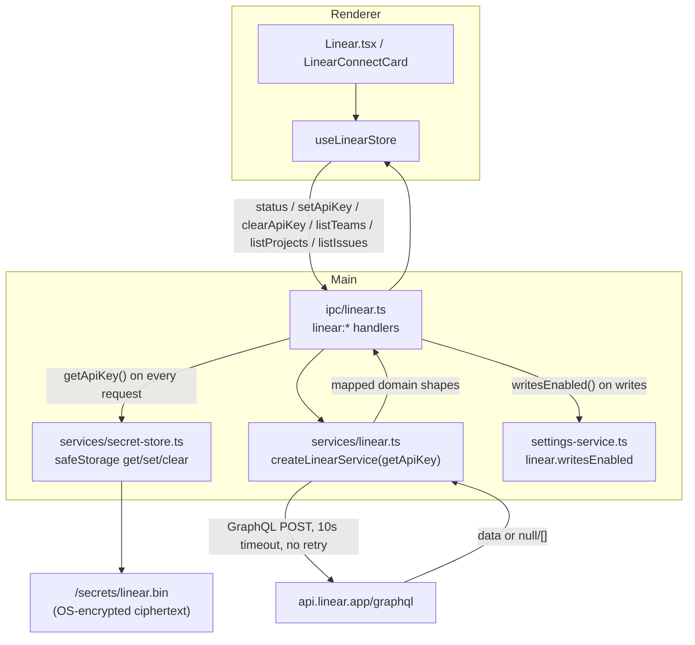

# Linear

The Linear panel browses the teams, projects, and issues your Linear account can see, and opens any issue in Linear through the system browser. The renderer never talks to `api.linear.app` and never holds the API key: all Linear HTTP runs in the main process over Node's global `fetch`, and the key is stored as OS-keychain ciphertext via `safeStorage`. Reads are the v2 default; optional issue and comment CRUD is gated behind `settings.linear.writesEnabled` (off by default). When no validated key is present, the whole view collapses to a connect card that is also reused by the Settings Integrations panel, and a "My Linear issues" summary on the dashboard shares the same store.

## Purpose

Give a native browse surface for Linear issues, projects, and teams inside Studio, with team/scope/project filters and a backend-scoped issue query, while keeping the API key and every network call strictly in the main process. The renderer only drives a Zustand store of mapped, non-secret domain shapes.

## Directory layout

```text
src/renderer/src/
├── views/
│   └── Linear.tsx              the browse view (filters + grouped issue list)
├── components/linear/
│   └── LinearConnectCard.tsx   connect/disconnect form (reused by Settings)
└── store/
    └── linear.ts               useLinearStore (status, teams, projects, issues)
src/main/services/
  ├── linear.ts                 createLinearService (GraphQL over fetch, no retry)
  └── secret-store.ts           safeStorage keychain get/set/clear (cross-link)
src/main/ipc/
  └── linear.ts                 linear:* handlers, safeStorage wiring, writes gate
src/shared/
  ├── domain.ts                 LinearStatusInfo, LinearViewer, LinearTeam, LinearProjectInfo, LinearIssue
  └── ipc.ts                    CH.linear* channels + OmpApi.linear (optional CRUD)
```

## Key abstractions

| Abstraction | File | Role |
| --- | --- | --- |
| `useLinearStore` | `src/renderer/src/store/linear.ts` | Zustand store holding `status`, `teams`, `projects`, `issues`, and loading/error flags. Every bridge call degrades to `[]` / `unauthenticated` rather than throwing. The API key is never held here. |
| `LinearConnectCard` | `src/renderer/src/components/linear/LinearConnectCard.tsx` | The single connect/disconnect surface. Forwards a typed key once to `linear.setApiKey` and clears the field on submit; shows connected identity and a disconnect button when authenticated. Reused by the Linear view and Settings. |
| `createLinearService` | `src/main/services/linear.ts` | Builds a `LinearService` bound to an injected `getApiKey` getter. Runs GraphQL against `https://api.linear.app/graphql` over the process-global `fetch` with a 10s `AbortController` timeout and no retry. Returns `null` / `[]` on any failure. |
| `LinearService` | `src/main/services/linear.ts` | The service interface: `viewer`, `teams`, `projects`, `issues`, `issue`, plus write methods `createIssue`, `updateIssue`, `createComment` (callers gate the writes). |
| `LinearStatusInfo` | `src/shared/domain.ts` | `status` (`authenticated`, `unauthenticated`, `error`), optional `viewer`, and `writesEnabled` (read fresh from settings on every status call). |
| `LinearViewer` | `src/shared/domain.ts` | `id`, `name`, optional `email`, optional `organization`. |
| `LinearTeam` / `LinearProjectInfo` / `LinearIssue` | `src/shared/domain.ts` | The mapped browse shapes. `LinearIssue` carries `identifier`, `title`, `url`, `state { name, type }`, optional `priority`, optional `assignee` / `team` / `project`, and `updatedAt` / `createdAt`. |
| `registerLinearIpc` | `src/main/ipc/linear.ts` | Wires the `linear:*` handlers, injects the `safeStorage`-backed key getter into the service, validates a new key before persisting, caches the `viewer` probe, and gates writes behind `settings.linear.writesEnabled`. |

## How it works

The Linear integration is split so the network and the key stay in main while the UI stays in the renderer. The renderer store only ever calls `window.omp.linear.*`; the key crosses the boundary exactly once, on connect, and is never read back into the renderer.



### The key boundary

The API key is stored as OS-keychain ciphertext by `src/main/services/secret-store.ts` (`safeStorage.encryptString` -> `<userData>/secrets/linear.bin`, mode `0600`; in-memory-only fallback when OS encryption is unavailable, never plaintext on disk). The store is documented in [Secret store](../systems/secret-store.md) and the boundary it sits on is in [Security](../security.md). The plain-node Linear service (`services/linear.ts`) imports no Electron; it receives the decrypted key through an injected `getApiKey: () => Promise<string | null>` getter. The only place the `safeStorage` wiring happens is `src/main/ipc/linear.ts`, which builds the service with `createLinearService(async () => getSecret("linear"))`. The getter is resolved on every request, so a key set or cleared mid-session is picked up immediately.

`setApiKey` validates a candidate before persisting: it builds a one-off service bound to `async () => candidate`, probes `viewer{}`, and only calls `setSecret` when the probe succeeds. An invalid or network-unreachable key is never stored. `clearApiKey` calls `clearSecret` and resets the cached probe. The renderer store's `connect` forwards the key once and retains nothing; `disconnect` asks main to delete the key and resets all Linear state locally.

### HTTP in main

Every request goes through one `query` helper in `services/linear.ts`: resolve the key, `POST` the GraphQL document with `Authorization: <key>` (the raw key, not a `Bearer` token, because Linear rejects the `Bearer ` prefix for API keys) and `Content-Type: application/json`, abort after `REQUEST_TIMEOUT_MS` (10s), and return `json.data` or `null`. Any failure, a missing key, a network error, an abort/timeout, a non-2xx HTTP, GraphQL `errors`, or invalid JSON degrades to `null` (or `[]` for list methods). Nothing throws across IPC. There is no retry. The renderer CSP stays `connect-src 'self'` because the renderer never fetches `api.linear.app` directly, so `api.linear.app` must not be added to the CSP.

### Reads and the browse view

When authenticated, the Linear view loads teams, projects (re-scoped when the team filter changes), and issues (re-run on team or scope change). The issue query is backend-scoped: `loadIssues({ teamId, assignedToMe })` forwards the filters to `linear.issues`, which builds a Linear `IssueFilter` (`team.id.eq` and/or `assignee.isMe.eq`). The project filter is applied client-side over the loaded issues. Issues are grouped by workflow state (keyed by `state.type:state.name`, since state names can be renamed), sorted within each group by the selected mode (recently updated, priority, created, or issue key), and each row opens `issue.url` through `window.omp.openExternal`. Priority and state map to badge tones; the state dot uses a pulsing amber for started, a filled iris for completed, and an outlined dot for everything else.

### The writes gate

Reads (`status`, `listTeams`, `listProjects`, `listIssues`, `getIssue`) are always allowed. The optional write surface, `createIssue`, `updateIssue`, and `createComment`, is gated behind `settings.linear.writesEnabled` in `src/main/ipc/linear.ts`. When disabled (the default), the handlers hard-return a no-op (`null` / `false`) without touching Linear. When enabled, they delegate to the service's mutation methods, which reuse the same `ISSUE_FIELDS` selection and `mapIssue` mapper as the reads. On the `OmpApi.linear` type the write methods are marked optional (`createIssue?`, `updateIssue?`, `createComment?`) to reflect that they are present only when writes are enabled. The Settings Integrations panel shows the current state as an "enabled" or "read-only" badge; the toggle persists through `settings:update` and is read fresh on every status call (and every write attempt) since it can be toggled at any time.

## Integration points

- **The keychain that holds the key** is documented in [Secret store](../systems/secret-store.md); the security boundary (key never in settings JSON, HTTP never in the renderer) is in [Security](../security.md).
- **The `linear:*` channels and the `OmpApi.linear` surface** (including the optional CRUD methods) are in [IPC contract](../primitives/ipc-contract.md); the domain types are in [Domain types](../primitives/domain-types.md).
- **Dashboard** shows a "My Linear issues" summary that reuses `useLinearStore`; see [Dashboard](dashboard.md). Only one view mounts at a time, so refreshing issues there never races this view.
- **Settings Integrations** mounts `LinearConnectCard`, the default-team picker, and the writes-enabled badge; see [Settings service](../systems/settings-service.md) for `settings.linear`.

## Entry points for modification

- **Add a read query**: add a GraphQL document and method to `LinearService` in `src/main/services/linear.ts`, add the domain type to `src/shared/domain.ts`, add a channel and `OmpApi.linear` method in `src/shared/ipc.ts`, register the handler in `src/main/ipc/linear.ts`, and call it from `src/renderer/src/store/linear.ts`.
- **Enable a new write**: add the mutation to `LinearService`, wire a gated handler in `src/main/ipc/linear.ts` (behind `writesEnabled()`), and add the optional method to `OmpApi.linear` in `src/shared/ipc.ts`.
- **Change the issue fields**: edit `ISSUE_FIELDS` in `src/main/services/linear.ts` and the matching fields on `LinearIssue` / `mapIssue` (reads and mutations share the same mapper, so they stay in lockstep).
- **Change the request timeout or add retry**: `REQUEST_TIMEOUT_MS` in `src/main/services/linear.ts`. The service deliberately does not retry; adding retry means deciding how to treat GraphQL `errors` versus network failures.
- **Add a filter or sort mode**: the filter/sort logic for the browse view is local to `src/renderer/src/views/Linear.tsx` (`groupIssuesByState`, `compareIssues`, the `SORT_OPTIONS` list).

## Key source files

| File | Purpose |
| --- | --- |
| `src/renderer/src/views/Linear.tsx` | The browse view: filters, grouped issue list, state dots, sort menu, connect-card fallback. |
| `src/renderer/src/store/linear.ts` | `useLinearStore`: status, teams, projects, issues, connect/disconnect, degrade-to-empty contract. |
| `src/renderer/src/components/linear/LinearConnectCard.tsx` | Connect/disconnect form, reused by the Linear view and Settings Integrations. |
| `src/main/services/linear.ts` | `createLinearService`: GraphQL over `fetch`, 10s timeout, no retry, raw-key auth, graceful degrade; reads and write mutations. |
| `src/main/ipc/linear.ts` | `linear:*` handlers, `safeStorage` key getter wiring, key validation, status caching, `writesEnabled` gate. |
| `src/main/services/secret-store.ts` | `getSecret` / `setSecret` / `clearSecret` backed by `safeStorage` (see [Secret store](../systems/secret-store.md)). |
| `src/shared/domain.ts` | `LinearStatusInfo`, `LinearViewer`, `LinearTeam`, `LinearProjectInfo`, `LinearIssue`, `LinearAuthStatus`. |
| `src/shared/ipc.ts` | `CH.linear*` channels and `OmpApi.linear` (optional CRUD methods). |
