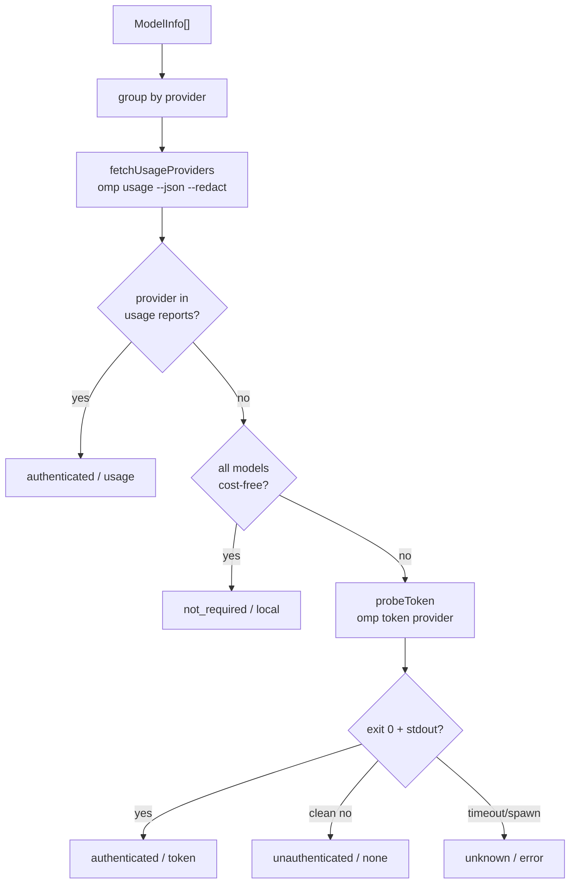

# Models and providers

The model catalog and provider auth status are the two read-only surfaces behind the chat composer's model picker. The catalog comes from `omp models --json`; the provider list is derived from that catalog plus a usage snapshot and count-only token probes. There is no dedicated browser view for these: the catalog is surfaced through `ModelControl` in the composer, and both feeds back the dashboard's model and provider counts.

## Key abstractions

| Abstraction | File | Role |
| --- | --- | --- |
| `listModels` | `src/main/services/config-service.ts` | Runs `omp models --json` through `runJson`, which parses from the first `{` (omp prints extension warnings before the payload). Returns `ModelInfo[]` (an alias for `AvailableModel`). |
| `listProviders` | `src/main/services/config-service.ts` | Groups models by `provider`, resolves auth status for each, and returns `ProviderInfo[]`. Cached for 60s (`PROVIDER_CACHE_TTL_MS`). |
| `detectProviderAuth` | `src/main/services/config-service.ts` | The auth-resolution core. Groups models, fetches `omp usage --json --redact`, marks cost-free providers as `not_required`, and count-only-probes the rest. Injectable `run` / `probe` deps for unit tests. |
| `ModelInfo` | `src/shared/domain.ts` | An alias for `AvailableModel`: `provider`, `id`, `selector`, `name`, `contextWindow`, `maxTokens`, `reasoning`, `thinking`, `input`, `cost`. |
| `ProviderInfo` | `src/shared/domain.ts` | `id`, `name`, `authStatus` (`authenticated`, `unauthenticated`, `not_required`, or `unknown`), `authSource` (`usage`, `token`, `local`, `none`, or `error`), a legacy `authenticated` boolean, and `modelCount`. |
| `ModelControl` | `src/renderer/src/components/chat/ModelControl.tsx` | The compact model-picker chip in the composer. Loads `listModels` once, shows the active model name, and opens a searchable listbox. Picking a model reports `(provider, id)`. |

## How it works

### Model catalog

`listModels` shells out to `omp models --json`. `runJson` (in `src/main/services/cli.ts`) runs the CLI and `parseJsonOutput` scans stdout for the first `{` or `[` and bracket-matches to its end, so the extension warnings omp prints before the JSON payload are skipped. A non-zero exit, missing payload, or invalid JSON returns `null`, which becomes `[]`. Each entry maps to `AvailableModel` (`provider`, `id`, `selector`, `name`, `contextWindow`, `maxTokens`, `reasoning`, `thinking`, `input`, `cost`); the `cost` block carries per-million-token `input`, `output`, `cacheRead`, and `cacheWrite` rates.

### Provider auth detection

`detectProviderAuth(models)` builds the provider list from the catalog and resolves auth status per provider. A provider is any distinct `model.provider` value; `modelCount` is the group size.

The three resolution paths, in priority order:

1. **`usage`**: `fetchUsageProviders` runs `omp usage --json --redact` and collects every `provider` named in the reports. Those are authenticated accounts, so they get `authStatus: "authenticated"`, `authSource: "usage"`. A failed `usage` call returns an empty set so detection falls through to per-provider probing.
2. **`local`**: a provider whose every model is cost-free (`isCostFreeProvider` checks that all of `input`, `output`, `cacheRead`, `cacheWrite` are zero or absent) needs no credential. It gets `authStatus: "not_required"`, `authSource: "local"`.
3. **`token`**: the remaining providers get a count-only `probeToken` call to `omp token <provider>`. The probe (via `probeCredential` in `src/main/services/cli.ts`) reports only the exit code and whether stdout produced any bytes; the bytes are discarded the instant they arrive and never accumulated, stored, or logged. A clean exit with stdout means `authenticated` / `token`; a clean exit without stdout means `unauthenticated` / `none`; a timeout or spawn failure (exit code < 0) is too ambiguous to call a negative, so it degrades to `unknown` / `error`.

`listProviders` wraps `detectProviderAuth(await listModels())` and caches the result for 60 seconds, because spawning `omp` for the usage and token probes is not free.

### ModelControl in the composer

`ModelControl` loads the catalog once via `useAsync(() => window.omp.listModels(), [])` and renders a compact chip showing the active model's name (from the live session's `RpcModel`). The active model carries no `selector`, so it is matched back to the loaded list by `(provider, id)` to mark the current row. Opening the chip shows a searchable listbox built on the `Popover` primitive; picking a model calls `onChange(provider, id)`, which the composer forwards as a `set_model` command over the RPC bridge. See [Composer](chat/composer.md).

## Integration points

- **Backend, IPC wiring, and the CLI runner** are covered in [Data services](../systems/data-services.md); the count-only credential probe is documented there too.
- **The model picker** (`ModelControl`) is part of the composer; see [Composer](chat/composer.md).
- **Dashboard** shows model and provider counts and the default selector; see [Dashboard](dashboard.md).
- **Domain types** (`ModelInfo`, `ProviderInfo`, `ProviderAuthStatus`) are documented in [Domain types](../primitives/domain-types.md).

## Key source files

| File | Purpose |
| --- | --- |
| `src/main/services/config-service.ts` | `listModels`, `listProviders`, `detectProviderAuth`, `isCostFreeProvider`, `probeToken`. |
| `src/main/services/cli.ts` | `runJson`, `parseJsonOutput`, `probeCredential` (count-only). |
| `src/renderer/src/components/chat/ModelControl.tsx` | The composer model picker chip and listbox. |
| `src/shared/domain.ts` | `ModelInfo` (alias for `AvailableModel`), `ProviderInfo`, `ProviderAuthStatus`. |
| `src/shared/rpc.ts` | `AvailableModel`, `ModelCost`, `RpcModel`. |
| `src/main/ipc/data.ts` | `CH.listModels` / `CH.listProviders` handlers. |
