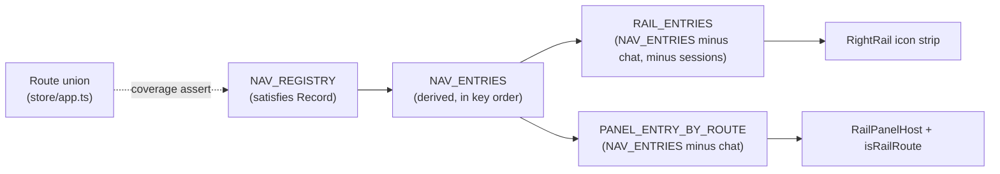

# Navigation and shortcuts

OMP Studio has 12 navigation destinations, a command palette for jumping between
workspaces and sessions, a global full-text search, and one global keyboard
shortcut manager that owns every studio chord. This page covers the `Route`
union, the nav registry, the `Cmd/Ctrl+K` navigation palette, and the shortcut
manager. The shell that hosts these destinations is in
[`shell-layout.md`](shell-layout.md).

## Purpose

Make every destination reachable from the keyboard and keep the route set and
its presentation in one place. Adding a destination is a single registry entry,
not three parallel array edits, and the `Route` union and the registry cannot
silently diverge because the registry is a `satisfies Record<Route, …>` coverage
assert.

## The Route union

`Route` in `src/renderer/src/store/app.ts` is the source of truth for the set of
shell destinations:

```text
dashboard · chat · sessions · skills · mcp · agents · github · linear ·
terminal · browser · changes · settings
```

`chat` is the primary center surface, reached from the sidebar's New chat and
session list, never the right rail. Every other route is railable (rendered in
the right icon rail and its overlay panel). `sessions` is panel-renderable but
not pinned to the rail icon strip; it is opened programmatically by
`focusSession` (from global search) and from the sidebar.

## The nav registry

`src/renderer/src/lib/nav-registry.ts` collapses what used to be three parallel
arrays (`Sidebar.tsx`'s `NAV`, `App.tsx`'s `VIEWS`, and the `Route` union) into
one registry. `NAV_REGISTRY` is a `satisfies Record<Route, Omit<NavEntry,
"route">>`, so a route added to the union without a registry entry (or vice
versa) fails to typecheck. `NAV_ENTRIES` is derived from it in key order.



Each `NavEntry` carries the route key, a sidebar label, a `lucide-react` icon,
the view component the shell mounts, and an optional `NavGroup` (`core`,
`tools`, `integrations`). `RAIL_ENTRIES` is `NAV_ENTRIES` filtered to non-primary
and non-`sessions` (the 10 rail icons). `PANEL_ENTRY_BY_ROUTE` is every
non-primary entry (11, including `sessions`), used by `railEntry(route)` and
`isRailRoute(route)` to decide what the `RailPanelHost` can render.

## The navigation palette

`NavPalette` in `src/renderer/src/components/nav/NavPalette.tsx` is the
`Cmd/Ctrl+K` overlay. It is a distinct surface from global search (full-text) and
the slash-command palette (commands). The open flag lives in the ui store
(`useUiStore.navPaletteOpen`) so the single shortcut manager drives it. While
open, a freshly mounted overlay lists two groups:

- **Workspaces** — built by `workspaceNavItems` from
  `settings.workspaces`, ordered like the switcher (pinned, then recent), each
  row led by an identity Live Dot. Selecting a workspace calls
  `setSelectedProject(cwd)` + `recordWorkspace(cwd)`, the same effect as the
  sidebar switcher.
- **Recent sessions** — built by `sessionNavItems` from the live
  `openSessions` and the hibernated `hibernatedSessions`, newest first, each row
  led by a status Live Dot (running/idle/done). Selecting a live session calls
  `openChat(id)`; selecting a hibernated one calls `resumeSession(id)`.

`ArrowUp`/`ArrowDown` move one selection across both groups, `Enter` or click
jumps, `Esc` closes. The pure data and filtering (`workspaceNavItems`,
`sessionNavItems`, `filterWorkspaceItems`, `filterSessionItems`) live in
`src/renderer/src/lib/nav-palette.ts`, kept free of React/store imports so the
grouping, status derivation, and substring filter are unit-testable from plain
inputs.

## The global shortcut manager

`useShortcuts` in `src/renderer/src/lib/useShortcuts.ts` is wired once from
`App`, so there is exactly one window `keydown` listener for studio chords. The
per-component listeners that used to own `Cmd+K`, `Cmd+W`, and `Cmd+Shift+P` were
removed and routed through here plus the ui store so nothing double-fires.

| Chord | Action |
| --- | --- |
| `Cmd/Ctrl+T` or `N` | New chat |
| `Cmd/Ctrl+W` | Close the active session (confirms if streaming) |
| `Cmd/Ctrl+1`..`9` | Switch to the Nth open live session |
| `Cmd/Ctrl+B` | Toggle the left sidebar (collapses/expands the shell split) |
| `Cmd/Ctrl+K` | Toggle the navigation palette |
| `Cmd/Ctrl+Shift+F` | Toggle global search |
| `Cmd/Ctrl+Shift+P` | Toggle the slash-command palette (consumed by the active composer) |
| `Esc` | Close the topmost soft overlay (nav palette, then global search) |

Two guards keep chords safe. While focus is in a text-entry field
(`input`/`textarea`/`contenteditable`), the app chords are suppressed so a chord
pressed mid-draft never discards the user's typing; only `Esc` acts from a field,
closing the topmost overlay. While a blocking modal (approval, compact, rename,
confirm, danger) owns the screen, the chords are suppressed so a reflexive press
never mutates sessions behind a safety prompt. The soft overlays (global search,
the nav palette) are `aria-modal` but tagged `data-search-overlay` /
`data-nav-overlay` and excluded from the blocking check, so the chords may still
toggle them.

## Nav order and hide preferences

The sidebar nav order and overflow are persisted in `settings.layout` as
`navOrder` (ordered route ids) and `navHidden` (route ids hidden into the
overflow). The pure helpers in `src/renderer/src/lib/layout.ts` resolve them:
`orderedNavEntries` lays out persisted `navOrder` first (only ids that still
exist, de-duplicated), then any registry entries the stored order did not
mention in registry order, so adding a `Route` never drops it from the nav.
`resolveNav` splits the result into visible and hidden lists plus the full
ordered route list (the reorder basis). `reorder` is the pure array move used by
drag-to-reorder. These helpers and the `navOrder`/`navHidden` fields are
forward-compatible: a newly added destination appears in registry order without
dropping any persisted entry. The settings schema and persistence are in
[`../systems/settings-service.md`](../systems/settings-service.md).

## Key abstractions

| Abstraction | File | Role |
| --- | --- | --- |
| `Route` | `src/renderer/src/store/app.ts` | The 12-destination union; the coverage anchor for the nav registry. |
| `NavEntry` / `NAV_ENTRIES` | `src/renderer/src/lib/nav-registry.ts` | One destination's route + label + icon + view + group; the derived full list. |
| `RAIL_ENTRIES` | `src/renderer/src/lib/nav-registry.ts` | The right-rail icon list (non-primary, non-`sessions`). |
| `railEntry` / `isRailRoute` | `src/renderer/src/lib/nav-registry.ts` | Lookup for the `RailPanelHost` and a guard for persisted `rightPanelId`. |
| `NavPalette` | `src/renderer/src/components/nav/NavPalette.tsx` | The `Cmd/Ctrl+K` overlay: Workspaces + Recent sessions, keyboard-navigable. |
| `workspaceNavItems` / `sessionNavItems` / `filter*` | `src/renderer/src/lib/nav-palette.ts` | Pure data + filtering for the palette, unit-testable without React. |
| `useShortcuts` | `src/renderer/src/lib/useShortcuts.ts` | The single global shortcut manager; owns every studio chord and the Esc overlay close. |
| `orderedNavEntries` / `resolveNav` / `reorder` | `src/renderer/src/lib/layout.ts` | Pure nav order/hide resolution and the array move; forward-compatible with new routes. |
| `navOrder` / `navHidden` | `src/shared/ipc.ts` (`LayoutSettings`) | Persisted nav order and hidden-overflow route ids. |

## Integration points

- **The shell layout** that hosts the sidebar, the center pane tree, and the
  right icon rail is in [`shell-layout.md`](shell-layout.md).
- **Global search** (`Cmd/Ctrl+Shift+F`), which jumps to routes and transcript
  hits, is in [`global-search.md`](global-search.md).
- **The slash-command palette** (`Cmd/Ctrl+Shift+P`) is part of the chat
  composer; see [`chat/index.md`](chat/index.md).
- **The workspaces** the nav palette jumps to are in
  [`workspaces.md`](workspaces.md).
- **Settings persistence** for `navOrder`/`navHidden` and `rightPanelId` is in
  [`../systems/settings-service.md`](../systems/settings-service.md).

## Key source files

| File | Purpose |
| --- | --- |
| `src/renderer/src/store/app.ts` | `Route` union, `setRoute`, `focusSession`. |
| `src/renderer/src/lib/nav-registry.ts` | `NAV_REGISTRY`, `NAV_ENTRIES`, `RAIL_ENTRIES`, `railEntry`, `isRailRoute`. |
| `src/renderer/src/components/nav/NavPalette.tsx` | The `Cmd/Ctrl+K` navigation palette overlay. |
| `src/renderer/src/lib/nav-palette.ts` | Pure palette data + filtering (workspaces, sessions). |
| `src/renderer/src/lib/useShortcuts.ts` | The single global keyboard-shortcut manager. |
| `src/renderer/src/lib/layout.ts` | `orderedNavEntries`, `resolveNav`, `reorder` (nav order/hide helpers). |
| `src/shared/ipc.ts` | `LayoutSettings.navOrder` / `navHidden`. |
