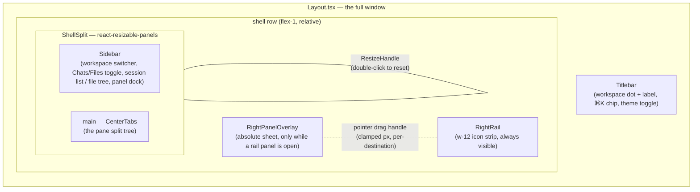
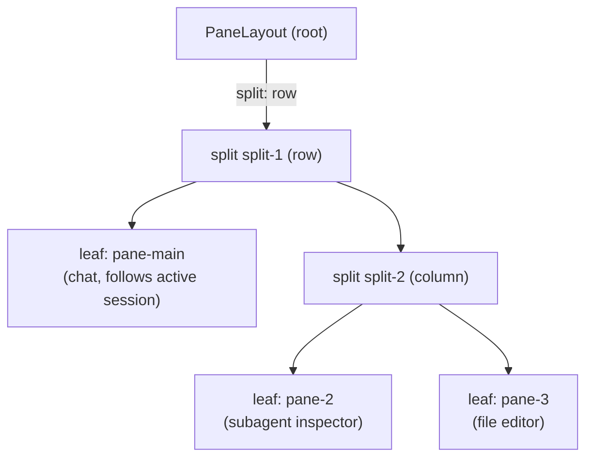

# Shell layout

The OMP Studio window is a three-region shell: a left sidebar, a center pane
tree, and a right icon rail with an expandable overlay panel. Every region is
resizable and rearrangeable, and the whole layout is persisted in
`settings.layout` through a debounced writer so a drag coalesces into one
settings update. This page covers the renderer shell chrome and the pane model.
The chat surfaces hosted inside panes are in
[`chat/index.md`](chat/index.md); the workspace switcher that lives in the
sidebar is in [`workspaces.md`](workspaces.md); the settings persistence that
backs every split and width is in
[`../systems/settings-service.md`](../systems/settings-service.md).

## Purpose

Keep one native window usable across many concurrent chats, file edits, and
subagent inspections. The center hosts up to eight independent panes in a split
tree (a chat transcript, a file editor, or a subagent inspector each). The
sidebar holds the session list and the workspace file tree. The right rail opens
app-level tool panels (Dashboard, Skills, MCP, Agents, Terminal, Browser,
Changes, GitHub, Linear, Settings). The right rail and its panels are global app
chrome, one `openPanelId` per window, not per pane, because several destinations
are backed by main-process singletons (one `BrowserViewManager`, one terminal
registry) that would alias across panes.

## Shell regions

`Layout.tsx` renders the titlebar, then the shell row. The shell row is a
`ShellSplit` (the stable sidebar | main pair) with the `RightRail` pinned to the
far right and, while a rail panel is open, a `RightPanelOverlay` sheet layered
absolutely over the main area. Opening or closing a tool never remounts or
resizes the center subtree, because the overlay is a separate absolute layer
rather than a third panel in the split.

## The pane model

The center is `CenterTabs`, which renders the split tree held in the pane store.
A pane is one independent surface: a chat transcript (optionally pinned to one
session), a file editor, or a subagent inspector. Panes are keyed by an opaque
`paneId` and laid out by `PaneLayout`, a recursive tree of leaves and splits, so
up to eight panes can nest horizontal and vertical splits without re-modeling
later. The default state is exactly one chat pane that follows the global active
session, so single-pane behavior is unchanged until a second pane opens.

The main pane (`MAIN_PANE_ID = "pane-main"`) is permanent shell chrome. It keeps
the legacy center tab strip: an always-present Chat tab plus one tab per open
file, all mounted and toggled with the native `hidden` attribute so a live chat
keeps streaming and each editor keeps its cursor, scroll, and undo across
switches. Extra panes never grow a tab strip; their content is fixed at open
time, and once a second pane exists every pane grows a slim header (title +
close) that doubles as the drag handle for re-docking.

## Key abstractions

| Abstraction | File | Role |
| --- | --- | --- |
| `PaneEntry` | `src/renderer/src/store/panes.ts` | One pane: `{ id, kind: "chat" \| "file" \| "subagent", sessionId?, path?, subagentId? }`. A chat pane with `sessionId` unset follows the global active session; set pins it. File panes carry a workspace-relative `path`; subagent panes carry the parent `sessionId` and `subagentId`. |
| `PaneLayout` | `src/renderer/src/store/panes.ts` | The split tree: `{ kind: "leaf", paneId }` or `{ kind: "split", splitId, direction: "row" \| "column", children: PaneLayout[], weights: number[] }`. Weights are child panel percentages, normalized to sum to 100. |
| `PaneEdge` | `src/renderer/src/store/panes.ts` | `"left" \| "right" \| "top" \| "bottom"`, the edge a docked pane lands on relative to its target. Left/right dock in a row split, top/bottom in a column split. |
| `MAX_PANES` | `src/renderer/src/store/panes.ts` | `8`, the hard ceiling on simultaneously open panes. `openPane` returns `null` at the cap; `openPaneWithFeedback` turns that into a toast. |
| `MAIN_PANE_ID` | `src/renderer/src/store/panes.ts` | `"pane-main"`, the default always-present chat pane. It owns the legacy file tab strip and has no close button. |
| `openPanelId` | `src/renderer/src/store/shell.ts` | The open right-rail destination `Route`, or `null` when collapsed. Global, one per window, persisted as `settings.layout.rightPanelId` and hydrated once at boot. |
| `SidebarMode` | `src/renderer/src/store/shell.ts` | `"chats" \| "files"`, which surface the left sidebar shows: the session list or the workspace file tree. |

## How it works

### Sidebar | main split

`ShellSplit` in `src/renderer/src/components/Layout.tsx` is a
`react-resizable-panels` `PanelGroup` with a sidebar panel (collapsible,
clamped to 12-32% of the shell) and a main panel (min 30%). The divider is a
`ResizeHandle` with a double-click-to-reset affordance that imperatively calls
`groupRef.setLayout(defaults)` and persists the default split. The sidebar
content is unmounted while collapsed so its scroll width does not read as
horizontal overflow; a floating `PanelLeftOpen` button expands it again. The
shell store owns an imperative `sidebarToggleHandler` bridge registered by
`ShellSplit` so `Cmd/Ctrl+B` and the sidebar's own collapse button drive the
same `react-resizable-panels` collapse/expand.

### Center pane tree

`CenterTabs` reads `usePaneStore((s) => s.layout)` and renders it through
`PaneTree`. A leaf becomes a `PaneView`; a split becomes a nested
`PanelGroup` with a `ResizeHandle` between each pair of children. Each split's
`onLayout` weights are persisted back through `setSplitWeights`, and the
handle's double-click resets the split to equal children both in the live
`PanelGroup` (imperative `setLayout`) and in the store (`resetSplitWeights`).

Each pane carries its own `AppErrorBoundary` so a crash inside one pane never
blanks its siblings. Panes are drop targets for two drag kinds: a subagent
dragged from the Subagent tree (opens its inspector docked at the hovered edge)
and another pane dragged by its header (re-docks it at the hovered edge). The
hovered half is previewed by an overlay; self-drops are ignored. Closing a pane
only removes the pane; the underlying session is never disposed unless the user
explicitly closes the session itself, and the last remaining pane can never be
closed.

The pane store deliberately holds only ids, never session state. Pane hosts
subscribe to this store (cold, tiny) while each transcript pane subscribes to
its own session slice via `useSession(sessionId)` (hot). That keeps the model
compatible with the hot/cold session-state split: adding a pane never widens
what any other pane re-renders on.

### Right icon rail and overlay

The right icon rail is `RightRail`, a fixed `w-12` (48px) strip that lists
`RAIL_ENTRIES` (the 12 `Route` destinations minus the primary `chat` surface and
minus `sessions`, which stays panel-renderable without a pinned icon). Clicking
an icon calls `togglePanel(route)` on the shell store, which flips `openPanelId`
and persists it. The active icon is highlighted with an accent bar.

While `openPanelId` is set, `Layout` renders `RightPanelOverlay`, an absolute
sheet layered over the main area. Its width is a per-destination pixel value:
the stored `settings.layout.rightPanelWidthsPx[route]` if present, else a
per-route default from `defaultRightPanelWidthPx` (lists 460px, dense 600px,
wide 720px), clamped by `clampRightPanelWidthPx` to leave at least 360px of
center guard. A pointer drag handle on the sheet's left edge resizes it and
persists the new width on every move. The sheet's content is `RailPanelHost`,
which mounts the destination's view component straight from the nav registry
(the same view the old sidebar nav used to route to) behind a close button and a
local Esc handler that yields to any nested overlay.

### Layout persistence

Every layout write funnels through `useSettingsStore.setLayout`, a debounced
(~250ms trailing edge) writer in `src/renderer/src/store/settings.ts`.
Successive patches merge by key, so a continuous resize or reorder drag becomes
one pessimistic `settings:update` that persists and then adopts the canonical
settings main returns. The app never uses `react-resizable-panels`' own
`autoSaveId`/localStorage; `settings.layout` is the single source of truth.

`usePersistedPanelLayout` in
`src/renderer/src/components/layout/usePersistedPanelLayout.ts` bridges a
`PanelGroup` to that persistence: it captures the persisted sizes once at mount
(consumers key on "settings loaded" so it remounts once after the async settings
load), wires `onLayout` to the debounced writer, and exposes a `reset` that
imperatively restores the default split and persists it. `Layout` keys
`ShellSplit` on `settingsLoaded` so the sidebar split captures persisted widths
exactly once.

The `LayoutSettings` shape in `src/shared/ipc.ts` carries every persisted piece:
`sidebarWidthPct`/`sidebarCollapsed`, `navOrder`/`navHidden` (the sidebar nav
order and overflow), `chatRailWidthPct`/`chatRailCollapsed`/`chatRailPanels`
(the per-session chat right rail inside the Chat view), `rightPanelId` (the open
rail destination), and `rightPanelWidthsPx` (per-destination overlay widths).
The chat right rail is a chat-surface concern and is covered in
[`chat/index.md`](chat/index.md); the settings schema and migration are in
[`../systems/settings-service.md`](../systems/settings-service.md).

## Pane store actions

| Action | File | Role |
| --- | --- | --- |
| `openPane` | `src/renderer/src/store/panes.ts` | Open a new pane beside `besideId` (or the focused pane), splitting in `direction`; `position` places it before or after. Returns the new `paneId`, or `null` at the `MAX_PANES` cap or when the result would push a pane below the effective 10% minimum. Dedupes: a second file pane for an already-open path, or a second inspector for the same subagent, focuses the existing pane instead. |
| `replacePane` | `src/renderer/src/store/panes.ts` | Swap an existing pane's content in place (same `paneId`, same layout slot), used by a subagent pane's "Back" to show the parent session's transcript. |
| `setPaneSession` | `src/renderer/src/store/panes.ts` | Point a chat pane at a session (pin), or unset to follow the active one. |
| `movePane` | `src/renderer/src/store/panes.ts` | Re-dock an existing pane against a target's edge (the AGE-806 drag). The source leaf is removed first (collapsing its old split) and the moved pane takes focus. No-ops on self-drops and unknown ids; content is never lost. |
| `closePane` | `src/renderer/src/store/panes.ts` | Close a pane and collapse its split. The last remaining pane can never be closed. |
| `setSplitWeights` / `resetSplitWeights` | `src/renderer/src/store/panes.ts` | Persist live child percentages for a split, or restore equal-sized children. Both reject layouts that would push a pane below the effective minimum. |
| `focusPane` | `src/renderer/src/store/panes.ts` | Set the focused pane that owns keyboard focus and receives pane-scoped commands. |

The pane-opening UX glue lives in
`src/renderer/src/components/shell/pane-actions.ts`. `openPaneWithFeedback` is
the single place the `MAX_PANES` cap becomes a user-visible toast, so every
affordance that opens a pane routes through it. The same file owns the drag
contracts: `SUBAGENT_DRAG_MIME` and `PANE_DRAG_MIME` plus their
(de)serializers, and `dropEdgeFor` which picks the dock edge from the pointer
offset within a pane's rect.

## Integration points

- **Chat surfaces hosted in panes** (the `ChatWorkspace`, the composer, the
  subagent inspector) are in [`chat/index.md`](chat/index.md).
- **The workspace switcher** in the sidebar, which sets the cwd new chats target,
  is in [`workspaces.md`](workspaces.md).
- **The 12 navigation destinations** and the keyboard shortcuts that move
  between them are in [`navigation.md`](navigation.md).
- **Settings persistence** (the versioned schema, the pessimistic `update`, the
  debounced `setLayout`) is in
  [`../systems/settings-service.md`](../systems/settings-service.md).
- **The architecture overview** that situates the renderer shell in the process
  model is in [`../overview/architecture.md`](../overview/architecture.md).

## Key source files

| File | Purpose |
| --- | --- |
| `src/renderer/src/components/Layout.tsx` | The window shell: titlebar, `ShellSplit` (sidebar \| main), `RightPanelOverlay`, `RightRail`, settings hydration. |
| `src/renderer/src/components/Sidebar.tsx` | The left sidebar: workspace switcher, Chats/Files toggle, session list / file tree, panel dock. |
| `src/renderer/src/components/shell/CenterTabs.tsx` | The center pane host: `PaneTree`/`PaneView`, the main pane's tab strip, pane headers and drop targets. |
| `src/renderer/src/components/shell/RightRail.tsx` | The far-right icon strip; toggles `openPanelId`. |
| `src/renderer/src/components/shell/RailPanelHost.tsx` | The overlay sheet body: header + close + the destination's view from the nav registry. |
| `src/renderer/src/components/shell/pane-actions.ts` | `openPaneWithFeedback`, the subagent and pane drag contracts, `dropEdgeFor`. |
| `src/renderer/src/store/panes.ts` | The pane model: `PaneEntry`, `PaneLayout`, `MAX_PANES`, and the open/replace/move/close/weight actions. |
| `src/renderer/src/store/shell.ts` | The global shell state: `openPanelId`, `sidebarMode`, the sidebar toggle bridge. |
| `src/renderer/src/components/layout/ResizeHandle.tsx` | The `react-resizable-panels` handle wrapper with cockpit styling and double-click-to-reset. |
| `src/renderer/src/components/layout/usePersistedPanelLayout.ts` | Bridges a `PanelGroup` to the settings-owned, debounced layout persistence. |
| `src/renderer/src/lib/layout.ts` | Pure layout helpers: width constants/clamps, `roundPct`, `reorder`, `orderedNavEntries`, `resolveNav`. |
| `src/shared/ipc.ts` | `LayoutSettings`, the persisted layout shape. |
