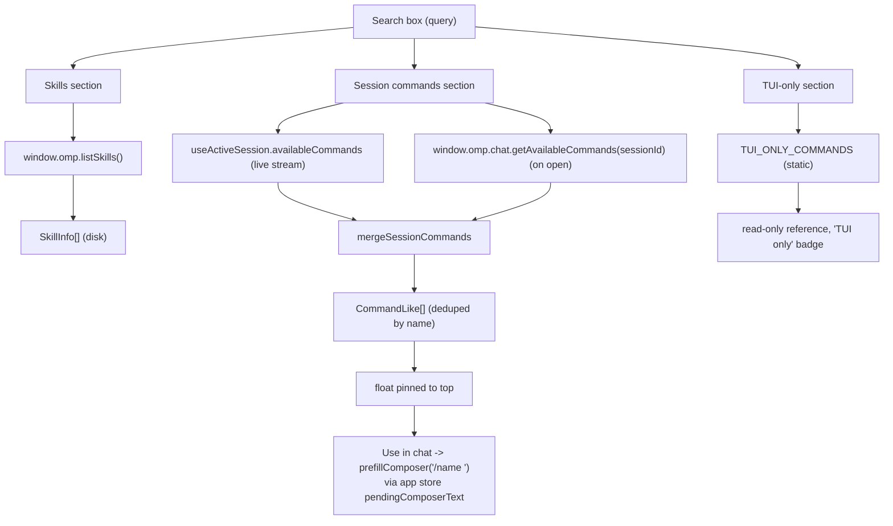

# Skills and commands

The Skills & Commands panel brings three related inventories into one view behind a single search box: the disk skills `omp` discovers, the slash commands the active chat session advertises, and a static reference of TUI-only commands that exist only in the `omp` terminal client. Each section is a `Collapsible` that shares the filter input at the top, so one query narrows all three at once. The view is read-only apart from pinning session commands and sending one into the chat composer.

## Purpose

Give one place to answer "what can this agent do right now": see which `SKILL.md` bundles are loaded from disk, which slash commands the live session publishes, and which commands are TUI-only (and therefore not sendable from Studio chat). Bridge the disk-based skill catalog and the runtime command stream without conflating them, and route a chosen command back into the composer with a single click.

## Directory layout

```text
src/renderer/src/
├── views/
│   └── Skills.tsx              the panel: three Collapsibles + shared search
├── lib/
│   ├── slash-commands.ts       pure command helpers (name, insert text, filter)
│   └── tui-commands.ts         curated TUI_ONLY_COMMANDS reference (tan/omfg/tree)
└── store/
    ├── app.ts                  prefillComposer / pendingComposerText
    ├── chat.ts                 useActiveSession (live availableCommands)
    └── settings.ts             togglePinnedCommand -> settings.ui.pinnedCommands
src/main/services/
  └── config-service.ts         listSkills (disk discovery) + skillRoots
src/main/ipc/
  └── data.ts                   CH.listSkills handler (resolveCwd)
src/shared/
  ├── domain.ts                 SkillInfo
  ├── rpc.ts                    AvailableCommand, AvailableSlashCommand
  └── ipc.ts                    CH.listSkills, chat.getAvailableCommands
```

## Key abstractions

| Abstraction | File | Role |
| --- | --- | --- |
| `SkillInfo` | `src/shared/domain.ts` | One disk skill: `name`, `description`, `path` (absolute path to the `SKILL.md`), and `source` (`builtin`, `user`, `project`, `claude`, or `managed`). |
| `listSkills` | `src/main/services/config-service.ts` | Walks the ordered skill roots (builtin workflow-kit, managed, user home, project walk-up), parses each `SKILL.md` frontmatter, dedups by name (later sources overwrite earlier), and returns `SkillInfo[]`. |
| `AvailableCommand` | `src/shared/rpc.ts` | The live shape `omp` streams in `available_commands_update` frames: a bare `name` (no leading slash) and an optional `description`, plus any extra fields. |
| `AvailableSlashCommand` | `src/shared/rpc.ts` | The richer snapshot returned by `get_available_commands`: `name`, optional `aliases`, `description`, `input.hint`, `subcommands`, and a `source` (`builtin`, `skill`, `extension`, `custom`, `mcp_prompt`, or `file`) used for source chips in the slash palette. |
| `CommandLike` | `src/renderer/src/lib/slash-commands.ts` | The minimal shape the shared helpers need (`name`, optional `description`). Both live and snapshot commands satisfy it, so the palette and this view share one insert/filter convention. |
| `TUI_ONLY_COMMANDS` | `src/renderer/src/lib/tui-commands.ts` | A hand-curated, stable list of `omp` TUI commands (`tan`, `omfg`, `tree`) that never arrive over `available_commands_update`. Rendered read-only and badged "TUI only". |

## How it works

The view holds one `query` string and feeds it to three independent sections. Each section derives its filtered list with `useMemo` from its own source.



### Skills (disk)

The first `Collapsible` calls `window.omp.listSkills()` once through `useAsync` and re-runs it on the header reload button. `listSkills` in `src/main/services/config-service.ts` builds an ordered list of roots via `skillRoots(cwd, home)` and scans each for `SKILL.md` files with `findFiles` (capped at a per-root `maxDepth`). Roots, lowest precedence first, so later sources overwrite on name collision:

1. `builtin` — the bundled workflow-kit at `<agentDir>/workflow-kit` (deep recursion, `maxDepth: 6`).
2. `managed` — auto-learned skills at the exact `<agentDir>/managed-skills` subpath (never a broad `agentDir()` scan, which also holds sessions, blobs, and the SQLite DBs).
3. `user` — `~/.agents/skills` and `~/.agent/skills`.
4. `claude` — `~/.claude/skills`.
5. `project` — `.agents/skills` and `.agent/skills` walked up from `cwd` (up to 5 ancestors, farthest first so the nearest dir wins), plus `<cwd>/.claude/skills`.

A `seen` set skips any root already classified, so when `cwd` is nested under home the walk-up cannot re-add the user `~/.agents`/`~/.agent` dirs as `source: "project"` and clobber the correct `user` entries. Each `SKILL.md` is parsed by the shared `parseFrontmatter` (column-0 YAML scalars only); `name` falls back to the parent directory name and `description` defaults to empty. The `cwd` is threaded from the active workspace through the `CH.listSkills` handler's `resolveCwd` in `src/main/ipc/data.ts` (see [Data services](../systems/data-services.md)). Each skill renders as a `Card` with a `source` badge (`project` -> accent, `user` -> success, others -> muted).

### Session commands

The second `Collapsible` shows the slash commands the active session advertises. It merges two sources into one deduped list keyed by bare name (`mergeSessionCommands`):

- **Live stream** — `useActiveSession((s) => s?.availableCommands)`, the `AvailableCommand[]` the session reducer populates from `available_commands_update` frames (see [Transcript](chat/transcript.md) and [Session management](chat/session-management.md)).
- **On-open snapshot** — `window.omp.chat.getAvailableCommands(activeSessionId)`, fetched once through `useAsync` keyed on `activeSessionId`. This returns the richer `AvailableSlashCommand[]` and augments descriptions for names the live stream has not delivered yet.

Live order is kept; the snapshot only fills in descriptions and appends unseen names. The merged list is filtered by `filterCommands` (case-insensitive substring on name then description, leading slash on the query ignored), then stable-sorted to float pinned commands to the top. Pinned names live in `settings.ui.pinnedCommands` and are toggled by `togglePinnedCommand` in the settings store (persisted through `settings:update`). The "Use in chat" button calls `prefillComposer(commandInsertText(cmd))` on the app store, which sets `route: "chat"` and `pendingComposerText` to `/<name> ` (always slash-prefixed with a trailing space, so commands that take arguments stay typeable immediately). The composer consumes that prefill on mount; see [Composer](chat/composer.md) for the slash palette and the `pendingComposerText` handoff.

When no session is loaded (`activeSessionId` is `null`), the section shows an explicit "No session loaded" empty state instead of a stale or empty list.

### TUI-only commands

The third `Collapsible` (closed by default) renders `TUI_ONLY_COMMANDS` from `src/renderer/src/lib/tui-commands.ts` as a read-only reference. These are interactive-mode commands of the `omp` terminal client (`tan`, `omfg`, `tree`); they are not disk `SKILL.md` skills and not live Studio slash commands, so they never arrive over `available_commands_update`. Each row is badged "TUI only — not available in Studio" so the entries are visible-but-clearly-non-actionable rather than silently absent. The set is curated by hand in `tui-commands.ts`; new entries are added there, not discovered at runtime.

## Integration points

- **Skills discovery and the `resolveCwd` workspace threading** are covered in [Data services](../systems/data-services.md); the `SkillInfo` domain type is in [Domain types](../primitives/domain-types.md).
- **The slash palette and `pendingComposerText`** (where "Use in chat" lands) are covered in [Composer](chat/composer.md). The shared `commandInsertText` / `commandName` / `filterCommands` helpers in `src/renderer/src/lib/slash-commands.ts` keep this view and the palette on one convention.
- **The `chat.getAvailableCommands` channel and the `available_commands_update` frame** are part of the RPC contract in [IPC contract](../primitives/ipc-contract.md) and [RPC bridge](../systems/rpc-bridge.md).
- **Pinned commands persist** through the settings store into `settings.ui.pinnedCommands`; see [Settings service](../systems/settings-service.md) for the schema.

## Entry points for modification

- **Add a disk-skill source**: extend `skillRoots` in `src/main/services/config-service.ts` with a new `SkillRoot` (path, `source` tag, `maxDepth`), then add the tag to the `SkillInfo["source"]` union in `src/shared/domain.ts` and the badge tone map in `src/renderer/src/views/Skills.tsx`.
- **Surface command `source` chips in this view**: `mergeSessionCommands` currently keeps only `name` + `description`; carry `source` from the `AvailableSlashCommand` snapshot onto the `CommandLike` and render a chip per row (the palette already does this).
- **Add a TUI-only command**: append an entry to `TUI_ONLY_COMMANDS` in `src/renderer/src/lib/tui-commands.ts`. The set is hand-curated; only add commands confirmed to be TUI-only.
- **Change how "Use in chat" prefills**: `commandInsertText` in `src/renderer/src/lib/slash-commands.ts` builds the inserted text; `prefillComposer` in `src/renderer/src/store/app.ts` is the route + prefill handoff.

## Key source files

| File | Purpose |
| --- | --- |
| `src/renderer/src/views/Skills.tsx` | The panel: three `Collapsible` sections, shared search, `mergeSessionCommands`, pin and "Use in chat" wiring. |
| `src/renderer/src/lib/slash-commands.ts` | Pure helpers: `commandName`, `commandInsertText`, `filterCommands`, `clampIndex`, `moveIndex`. Shared with the slash palette. |
| `src/renderer/src/lib/tui-commands.ts` | `TUI_ONLY_COMMANDS` curated reference (`tan`, `omfg`, `tree`). |
| `src/main/services/config-service.ts` | `listSkills`, `skillRoots`, `collectSkills`, `parseFrontmatter`, `findFiles`. |
| `src/main/ipc/data.ts` | `CH.listSkills` handler with `resolveCwd`. |
| `src/shared/domain.ts` | `SkillInfo`. |
| `src/shared/rpc.ts` | `AvailableCommand`, `AvailableSlashCommand`, `AvailableCommandSource`. |
| `src/shared/ipc.ts` | `CH.listSkills`, `chat.getAvailableCommands`, `OmpApi.listSkills`. |
