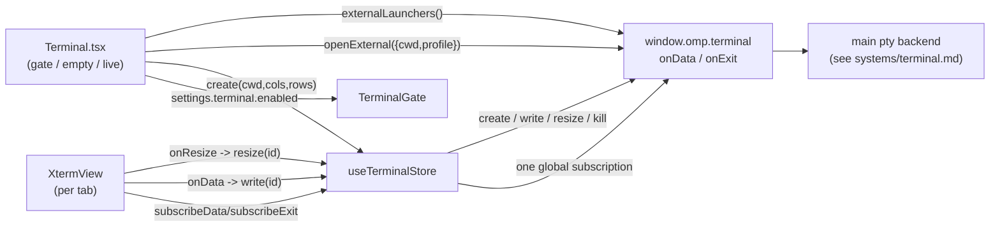

# Terminal

The terminal is the opt-in embedded shell panel. It is a real pty running at the
user's full account privilege, OFF by default (`settings.terminal.enabled`), and
gated behind an honest first-run acknowledgement that never calls the capability
"safe" or "secure". When enabled, the renderer mounts an xterm.js surface wired
to a main-process pty and forwards keystrokes, output, and resize over the
`window.omp.terminal.*` bridge. This page covers the renderer side; the pty
backend, the `TerminalRegistry`, and the external launchers live in
[`../systems/terminal.md`](../systems/terminal.md).

## Purpose

Give the user a real local shell inside the OMP Studio window, scoped to the
active workspace cwd, without understating what that means. The gate makes the
risk explicit (full user privilege, not sandboxed, can read/change/delete files
and reach the network), and the capability stays off until the user accepts it.

## Directory layout

```text
src/renderer/src/
  views/Terminal.tsx                       the view: gate / empty / live, tab strip, external open
  components/terminal/
    TerminalGate.tsx                       first-run acknowledgement modal (flips settings.terminal.enabled)
    XtermView.tsx                          xterm.js Terminal + FitAddon attached to one pty id
  store/terminal.ts                        renderer store: one global subscription, lifecycle, per-id sinks
src/shared/
  ipc.ts                                   TerminalSettings, ExternalTerminalLauncherInfo, terminal bridge surface
```

## Key abstractions

| Abstraction | File | Role |
| --- | --- | --- |
| `Terminal` view | `src/renderer/src/views/Terminal.tsx` | Picks gate / empty / live, owns the per-workspace tab strip, the "New terminal" and "Open external" affordances, and the restart flow after a shell exits. |
| `TerminalGate` | `src/renderer/src/components/terminal/TerminalGate.tsx` | Blocking `ModalShell` shown while `settings.terminal.enabled` is false. Copy states plainly that the shell is real, runs at full user privilege, is not sandboxed, and is killed when Studio quits. Enable flips the setting through the pessimistic `update`. |
| `XtermView` | `src/renderer/src/components/terminal/XtermView.tsx` | One xterm.js `Terminal` + `FitAddon` attached to a single pty `id`. Streams output straight into the xterm buffer, forwards genuine keystrokes back to the pty, re-fits on resize, and re-themes on light/dark toggle. Unmounting disposes the xterm instance only; it does not kill the pty. |
| `useTerminalStore` | `src/renderer/src/store/terminal.ts` | One global `onData`/`onExit` subscription routing frames to per-id sinks. Owns `create`/`write`/`resize`/`dispose` and a bounded detached buffer for output that arrives before a sink attaches. Holds no process handle. |
| `TerminalEntry` | `src/renderer/src/store/terminal.ts` | Coarse, render-worthy lifecycle for one open terminal (`id`, `cwd`, `shell`, `createdAt`, `exited`, `exitCode`). The pty byte stream is never reduced into React state. |
| `TerminalSettings` | `src/shared/ipc.ts` | `{ enabled, maxConcurrent, defaultTarget?: "built-in" | "external", externalProfile? }`. All fields optional except `enabled`; defaults are floors applied in the gate and the Settings panel. |
| `ExternalTerminalLauncherInfo` | `src/shared/ipc.ts` | `{ profile, label, available, kind, detectedPath?, reason? }` describing one external terminal app the view can open as a separate process. |

## How it works

The view reads `settings.terminal.enabled` and `app.selectedProject` (the active
workspace cwd) and chooses one of four body states:

1. **Disabled** — an inert `EmptyState` backdrop with the `TerminalGate` modal
   layered on top. The gate is the only path to enabling; it writes
   `terminal.enabled: true` (plus floor defaults for `maxConcurrent`,
   `defaultTarget`, `externalProfile`) through `useSettingsStore.update`.
2. **No workspace** — "No workspace selected" empty state. With no cwd there is
   no valid directory to spawn in, so the view refuses rather than starting a
   pty that would fail.
3. **Enabled, no tabs** — when `defaultTarget` is `built-in` (the default), the
   view auto-starts the first tab for the workspace once per cwd. When
   `defaultTarget` is `external`, it waits for the user to open an external app
   or click "New terminal".
4. **Live** — the tab strip plus one `XtermView` per open terminal, with the
   active tab visible and the rest mounted but hidden.

`spawnTerminal` calls `store.create(cwd, 80, 24)`, which forwards to
`window.omp.terminal.create` and records a `TerminalEntry`. The store rejects
propagate to the view so it can show the honest reason (capability disabled,
concurrency cap hit, non-existent cwd) instead of a silently blank terminal.



### Output, input, and the global subscription

The pty byte stream is far too hot to push through React state, so the store
never funnels output through `set`. `ensureSubscribed` registers one global
`onData` listener that routes each `{ id, data }` frame to the live sinks for
that id. When no sink is attached yet (the shell's initial prompt often emits
before `create()` resolves and the view subscribes), the store holds a bounded
tail in `dataBuffers` capped at `MAX_DETACHED_BUFFER_CHARS` (64 KB) and flushes
it in arrival order when `subscribeData` attaches. `onExit` marks the entry
`exited` with the recorded `exitCode` and fires any exit sinks (immediately, if
the pty raced ahead of the subscribe).

`XtermView` owns the input direction. The xterm `onData` callback (genuine
keystrokes in this view only, never agent output) calls `store.write(id, data)`,
which fire-and-forwards to `window.omp.terminal.write`. A `ResizeObserver`
re-fits the xterm and forwards `cols`/`rows` through `store.resize`. A
`MutationObserver` on the document element's `class` re-reads the xterm theme
from the app's CSS variables when light/dark toggles. Closing a tab calls
`store.dispose(id)`, which kills the pty and drops the sinks, buffers, and entry.

### External terminals

When `defaultTarget` is `external`, or when the user clicks "Open external", the
view calls `window.omp.terminal.externalLaunchers()` to list the apps main
detected, then `openExternal({ cwd, profile })` to launch one as a separate
process. The preferred launcher is resolved from `externalProfile` (`system`
falls back to the first available app). The view never embeds or controls the
external app's renderer; it only spawns it at the workspace cwd. See
[`../systems/terminal.md`](../systems/terminal.md) for the launcher backends.

## Integration points

- **Pty backend, `TerminalRegistry`, external launchers** are documented in
  [`../systems/terminal.md`](../systems/terminal.md). This page covers only the
  renderer surface.
- **Security boundary** (real shell at full user privilege, agent frames never
  write to pty input, killed on quit) is in [`../security.md`](../security.md).
- **Settings persistence** (versioned schema, pessimistic `update`, secure
  defaults) is in [`../systems/settings-service.md`](../systems/settings-service.md).
- **The `TerminalSettings`, `ExternalTerminalLauncherInfo`, and terminal bridge
  types** are part of the frozen IPC contract in
  [`../primitives/ipc-contract.md`](../primitives/ipc-contract.md).
- **The workspace cwd** the terminal scopes itself to comes from
  `app.selectedProject`; see [Workspaces](workspaces.md).

## Entry points for modification

- **Gate copy or enable defaults**: `src/renderer/src/components/terminal/TerminalGate.tsx`
  (the `enable` action and the modal body), mirrored by the danger confirm in
  `TerminalPanel` in `src/renderer/src/views/Settings.tsx`.
- **xterm appearance**: font family, `scrollback`, and the theme channel mapping
  in `readXtermTheme` in `src/renderer/src/components/terminal/XtermView.tsx`.
- **Detached buffer cap or concurrency**: `MAX_DETACHED_BUFFER_CHARS` in
  `src/renderer/src/store/terminal.ts`, and `maxConcurrent` (1-32) in the
  `TerminalPanel` field in `src/renderer/src/views/Settings.tsx`.
- **External profile set**: the `ExternalTerminalProfile` union and the
  `TERMINAL_TARGETS` / `EXTERNAL_TERMINAL_PROFILES` option lists in
  `src/shared/ipc.ts` and `src/renderer/src/views/Settings.tsx`.

## Key source files

| File | Purpose |
| --- | --- |
| `src/renderer/src/views/Terminal.tsx` | The view: gate / empty / live, per-workspace tab strip, external open, restart affordance. |
| `src/renderer/src/components/terminal/TerminalGate.tsx` | First-run acknowledgement modal; flips `settings.terminal.enabled`. |
| `src/renderer/src/components/terminal/XtermView.tsx` | xterm.js surface attached to one pty id; streams output, forwards keystrokes, resizes, re-themes. |
| `src/renderer/src/store/terminal.ts` | Renderer store: one global `onData`/`onExit` subscription, `create`/`write`/`resize`/`dispose`, per-id sinks, bounded detached buffer. |
| `src/shared/ipc.ts` | `TerminalSettings`, `ExternalTerminalLauncherInfo`, `ExternalTerminalProfile`, and the `window.omp.terminal` bridge surface. |
