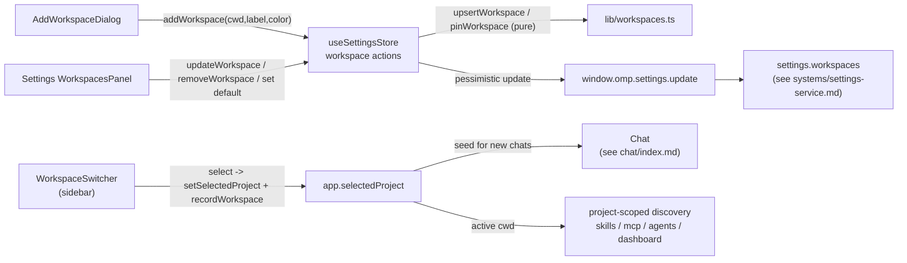

# Workspaces

Workspaces are first-class project roots. The sidebar switcher, an add dialog,
and the Settings Workspaces panel all operate on the same persisted
`settings.workspaces` list, and selecting a workspace points new chats at its
`cwd` and bumps its recency. Live sessions keep their own `cwd`; selecting or
adding a workspace spawns nothing. This page covers the renderer side; settings
persistence (the versioned schema, the pessimistic `update`, the v2 migration
from `recentProjects`) is in [`../systems/settings-service.md`](../systems/settings-service.md).

## Purpose

Make a project directory a deliberate, managed entity rather than a transient
recent. The user pins the projects they live in, labels and colors them, and
re-points the cwd when a repo moves. The active workspace then threads through
project-scoped discovery (skills, MCP servers, agents, dashboard) so the
browsers reflect the project the user is actually working in.

## Directory layout

```text
src/renderer/src/
  components/workspace/
    WorkspaceSwitcher.tsx                 sidebar checkout hero + switcher popover
    AddWorkspaceDialog.tsx                pick-directory + optional label/color dialog
    WorkspaceColor.tsx                    Live Dot + swatch picker
  lib/workspaces.ts                       pure helpers: projectLabel, upsertWorkspace, pinWorkspace, sortWorkspaces, colors
  store/settings.ts                       recordWorkspace / addWorkspace / removeWorkspace / updateWorkspace actions
  views/Settings.tsx                      WorkspacesPanel + WorkspaceRow (pin, set-default, edit, re-point, remove, color)
src/shared/
  ipc.ts                                  Workspace, WorkspaceColorKey, WORKSPACE_COLOR_KEYS
```

## Key abstractions

| Abstraction | File | Role |
| --- | --- | --- |
| `WorkspaceSwitcher` | `src/renderer/src/components/workspace/WorkspaceSwitcher.tsx` | Sidebar checkout hero (workspace label, then git branch, then worktree chip) and a `Menu` popover listing pinned workspaces, then recents, then "Add workspace…" and "Manage workspaces…". Selecting calls `setSelectedProject` + `recordWorkspace`. |
| `AddWorkspaceDialog` | `src/renderer/src/components/workspace/AddWorkspaceDialog.tsx` | `ModalShell` with a directory pick (`window.omp.pickDirectory`), an optional label override, and an optional color. Submit calls `addWorkspace` then `setSelectedProject`. Adding selects but spawns nothing. |
| `WorkspacesPanel` / `WorkspaceRow` | `src/renderer/src/views/Settings.tsx` | The Settings Workspaces panel: per-row pin, set-default, edit label, re-point cwd, remove, and color picker. |
| `useSettingsStore` workspace actions | `src/renderer/src/store/settings.ts` | `recordWorkspace`, `addWorkspace`, `removeWorkspace`, `updateWorkspace`. All funnel through the pessimistic `update` (persist + adopt canonical settings). |
| `projectLabel` | `src/renderer/src/lib/workspaces.ts` | Derives a display label from a directory path's basename. Pure. |
| `upsertWorkspace` | `src/renderer/src/lib/workspaces.ts` | Insert-or-refresh by `cwd`. An existing entry keeps its stable `id` and `pinned`, refreshes `lastUsedAt`, and adopts an explicit label override; a new `cwd` gets a fresh uuid and is prepended. Collision-heals duplicate cwds. Pure. |
| `pinWorkspace` | `src/renderer/src/lib/workspaces.ts` | Sets the `pinned` flag on one `id`. Pure. |
| `sortWorkspaces` | `src/renderer/src/lib/workspaces.ts` | Pinned first, then most-recently-used (`lastUsedAt` sorts lexicographically). Stable, non-mutating. |
| `WORKSPACE_COLORS` / `workspaceColor` | `src/renderer/src/lib/workspaces.ts` | Curated swatch palette and the resolver from a `WorkspaceColorKey` to its renderer-only color value plus derived `glow` and `border` tokens (AGE-671/699). |
| `WorkspaceColorDot` / `WorkspaceColorPicker` | `src/renderer/src/components/workspace/WorkspaceColor.tsx` | The Live Dot (identity swatch, or status fills for running/idle/done) and the swatch picker reused by the add dialog and the manage row. |
| `Workspace` | `src/shared/ipc.ts` | `{ id, cwd, label, pinned, lastUsedAt, color? }`. The `id` survives label and cwd edits; `color` is a curated key, absent when unset. |
| `WORKSPACE_COLOR_KEYS` | `src/shared/ipc.ts` | The curated color key set (`slate`, `red`, `amber`, `green`, `teal`, `blue`, `violet`, `pink`) that main validates without importing renderer presentation. |

## How it works

The active workspace is `app.selectedProject` in
`src/renderer/src/store/app.ts`. Every workspace surface reads and writes the
same `settings.workspaces` array through `useSettingsStore`, and the pure
helpers in `src/renderer/src/lib/workspaces.ts` shape the list before it is
persisted.



### Sidebar switcher

`WorkspaceSwitcher` renders the sidebar's checkout hero: line 1 is the workspace
label (muted when a git branch line carries the hero role, prominent otherwise),
line 2 is the current branch (loaded from `window.omp.changes.workspaceInfo` and
refreshed on window focus), and line 3 is a worktree chip when the workspace is
a git checkout. The `Menu` popover lists pinned workspaces, then recents (capped
at `WORKSPACE_RECENTS_LIMIT`, 6), then "Add workspace…" and "Manage workspaces…".
Selecting a workspace calls `setSelectedProject(workspace.cwd)` (the seed for new
chats) and `recordWorkspace(workspace.cwd)` (bumps `lastUsedAt`). It never
touches live sessions and spawns nothing.

### Add dialog

`AddWorkspaceDialog` is a `ModalShell` with a directory pick button (calls
`window.omp.pickDirectory`), an optional label input whose placeholder is the
derived `projectLabel(cwd)`, and an optional `WorkspaceColorPicker`. Submit
calls `addWorkspace(cwd, label, color)` (which runs `upsertWorkspace` and
persists through `update`) then `setSelectedProject(cwd)`, and shows a success
toast. Adding selects the workspace but does not start a session.

### Settings panel

`WorkspacesPanel` lists workspaces sorted by `sortWorkspaces` (pinned first, then
recency). Each `WorkspaceRow` shows the color dot, label, `pinned`/`default`
badges, and the cwd, with actions to set default (`update({ defaultProject:
workspace.cwd })`), toggle pin (`updateWorkspace(id, { pinned })`), edit the
label inline, re-point the cwd via another directory pick, pick a color, and
remove. The "Add" button reuses `AddWorkspaceDialog`.

### Store actions and pure helpers

The four `useSettingsStore` actions all read the current settings, shape the
workspaces array with the pure helpers, and persist through the pessimistic
`update`:

- `recordWorkspace(cwd)` — `upsertWorkspace` to bump recency.
- `addWorkspace(cwd, label, color)` — `upsertWorkspace` with the label and color
  overrides.
- `removeWorkspace(id)` — drops the entry and clears `defaultProject` if it
  pointed at the removed cwd.
- `updateWorkspace(id, patch)` — applies `pinWorkspace` for the `pinned` flag
  and spreads the other fields. Re-pointing the cwd keeps the list unique
  (drops any other entry that now collides) and carries `defaultProject` with
  it so the default badge and new-chat seed stay accurate.

### Colors and the Live Dot

`WORKSPACE_COLOR_KEYS` is the frozen set of curated keys; `WORKSPACE_COLORS` in
`lib/workspaces.ts` maps each key to a display label and a fixed CSS color
value, and derives a `glow` (~0.55 alpha) and `border` (~0.28 alpha) token per
key so the Live Dot's pulse ring and keylines track the identity hue. The key is
what persists on the `Workspace`; the value is renderer-only. `WorkspaceColorDot`
renders the identity swatch (solid when a color is set, hollow ring when not),
or status fills (running with a pulsing glow ring, idle as a hollow ring, done
faded to 0.3) when a `status` is passed.

### Project-scoped discovery

Selecting a workspace sets `app.selectedProject`, which is the seed for new
chats (see [`chat/index.md`](chat/index.md)) and the `activeCwd` resolver that
main uses for project-scoped discovery. `listSkills`, `listMcpServers`,
`listAgents`, and the dashboard thread the active workspace cwd, falling back to
the most-recently-active chat session's cwd when no workspace is selected. See
[Dashboard](dashboard.md), [Skills and commands](skills-and-commands.md),
[MCP servers](mcp-servers.md), and [Bundled agents](agents.md) for the
downstream readers.

## Integration points

- **Settings persistence** (versioned schema, pessimistic `update`, v2 migration
  from `recentProjects` to `workspaces`) is in
  [`../systems/settings-service.md`](../systems/settings-service.md).
- **New chats target the workspace cwd** (`app.selectedProject` seeds the chat
  create); see [`chat/index.md`](chat/index.md).
- **Project-scoped discovery** that threads the active workspace cwd is covered
  in [Dashboard](dashboard.md), [Skills and commands](skills-and-commands.md),
  [MCP servers](mcp-servers.md), and [Bundled agents](agents.md).
- **The `Workspace`, `WorkspaceColorKey`, and `WORKSPACE_COLOR_KEYS` types** are
  part of the frozen IPC contract in
  [`../primitives/ipc-contract.md`](../primitives/ipc-contract.md).
- **The sidebar chrome** the switcher lives in is covered in
  [`../overview/architecture.md`](../overview/architecture.md).

## Entry points for modification

- **Curated color set**: `WORKSPACE_COLOR_KEYS` in `src/shared/ipc.ts` and the
  `WORKSPACE_COLORS` table (label, value, derived tokens) in
  `src/renderer/src/lib/workspaces.ts`.
- **Switcher recents cap**: `WORKSPACE_RECENTS_LIMIT` in
  `src/renderer/src/lib/workspaces.ts`.
- **Selection semantics**: `select` in
  `src/renderer/src/components/workspace/WorkspaceSwitcher.tsx` and
  `setSelectedProject` in `src/renderer/src/store/app.ts`.
- **Add-dialog fields**: `src/renderer/src/components/workspace/AddWorkspaceDialog.tsx`.
- **Manage-row actions**: `WorkspaceRow` in `src/renderer/src/views/Settings.tsx`
  and the four actions in `src/renderer/src/store/settings.ts`.

## Key source files

| File | Purpose |
| --- | --- |
| `src/renderer/src/components/workspace/WorkspaceSwitcher.tsx` | Sidebar checkout hero + switcher popover (pinned, recents, add, manage). |
| `src/renderer/src/components/workspace/AddWorkspaceDialog.tsx` | Pick-directory + optional label/color dialog; adds and selects. |
| `src/renderer/src/components/workspace/WorkspaceColor.tsx` | Live Dot (identity + status fills) and swatch picker. |
| `src/renderer/src/lib/workspaces.ts` | Pure helpers: `projectLabel`, `upsertWorkspace`, `pinWorkspace`, `sortWorkspaces`, `WORKSPACE_COLORS`. |
| `src/renderer/src/store/settings.ts` | `recordWorkspace`, `addWorkspace`, `removeWorkspace`, `updateWorkspace` actions. |
| `src/renderer/src/views/Settings.tsx` | `WorkspacesPanel` and `WorkspaceRow` (pin, set-default, edit, re-point, remove, color). |
| `src/shared/ipc.ts` | `Workspace`, `WorkspaceColorKey`, `WORKSPACE_COLOR_KEYS`. |
