# Development workflow

The branch, code, test, pull request, and release cycle for OMP Studio. See
[Contributing](index.md) for the entry point and
[Getting started](../overview/getting-started.md) for prerequisites and install.

## Worktree bootstrap

Every issue gets its own worktree under
`/private/tmp/omp-wt/<lowercase-issue-id>`. Before running any gate in a fresh
worktree, install dependencies.

1. Create the worktree on a branch that carries the `AGE-###` id:

   ```sh
   git worktree add /private/tmp/omp-wt/age-796 -b age-796-slice-title main
   ```

2. Install dependencies in the worktree. The `postinstall` hook runs
   `scripts/ensure-node-pty-exec.mjs` to restore the executable bit on the
   `node-pty` native addon:

   ```sh
   cd /private/tmp/omp-wt/age-796
   npm install
   ```

   This creates an untracked `node_modules/`. Do not commit it or any
   machine-local path. This is the explicit networked dependency-install step;
   cold caches may fetch packages.

The branch-name-carries-`AGE-###` convention is what lets the GitHub bridge link
the pull request to the Linear issue and close the issue on merge.

## Iterate

Run only the gates touching your change while you work. The full reference lives
in [Tooling](tooling.md) and [Testing](testing.md); the quick reference:

| Purpose | Command |
| --- | --- |
| Drift radar (session start) | `npm run sync-check` |
| Typecheck (node + web) | `npm run typecheck` |
| Lint + format check | `npm run check` |
| Renderer component tests | `npm run test:ui` |
| Node-side tests | `bun test` |
| RPC bridge test | `npm run test:rpc` |
| Build | `npm run build` |
| Hermetic e2e smoke | `npm run build && npm run test:e2e` |
| Demo recording (proof mp4) | `npm run build && npm run demo -- <scenario>` |

On headless Linux, wrap the e2e smoke and the demo recorder with
`xvfb-run -a`. `npm run sync-check` is a read-only radar for drifted branches,
stale worktrees, and open PR state; see [Tooling](tooling.md) for it and the
demo recorder.

## Open the pull request

Before opening the PR, run the full gate set on the worktree. The PR template at
`.github/pull_request_template.md` sets the shape:

- **Title**: `AGE-### — slice title`.
- **`Fixes AGE-###`** so the merge closes the Linear issue.
- **Summary**: one short paragraph covering what changed, why it belongs in the
  slice, and which repo it touches.
- **Changes**: the concrete changes.
- **Acceptance criteria**: map every Linear criterion to the implementation or
  artifact that satisfies it.
- **Proof**: the checks you ran and the observed evidence. Mark anything unrun
  with the blocker, not a vague excuse.
- **HITL / AFK**: whether the work needs a human in the loop, and the exact
  human-gated action if so (a credential, a paid turn, a browser or terminal
  action, an external write).
- **Review notes**: risks, tradeoffs, and the review lens requested.
  Security-boundary or credential work is called out here.

`.github/CODEOWNERS` assigns the maintainer as the default owner for every
path, so PRs route to them for review. The full contribution policy (issue
first, scoped diffs, the gate set) is written down in `CONTRIBUTING.md`.

## Release

Releases are cut from `main` and published by CI. The flow is one command plus a
tag push (see [Getting started](../overview/getting-started.md) and
[Deployment](../deployment.md) for the full version):

1. Bump the version and stamp the `CHANGELOG.md` `## [Unreleased]` section into a
   dated release section, then commit and tag `vX.Y.Z`:

   ```sh
   npm run release -- patch            # or minor, major, or an explicit X.Y.Z
   npm run release -- patch --dry-run  # preview the version + release notes
   ```

   `scripts/release.mjs` refuses to run on a dirty working tree or when the tag
   already exists, and warns if you are not on `main`.

2. Push the branch and the tag. The tag push triggers the Release workflow:

   ```sh
   git push && git push origin vX.Y.Z
   ```

`.github/workflows/release.yml` verifies `package.json`'s version matches the
tag, builds and smoke-tests the app on macOS, Linux, and Windows, packages
installers with electron-builder, and cuts one GitHub Release whose notes are the
matching `CHANGELOG.md` section (`scripts/changelog.mjs` extracts them). macOS
code-signing and notarization are deferred, so the macOS build is unsigned.

```mermaid
flowchart LR
  Issue["AGE-### issue"] --> WT["worktree<br/>/private/tmp/omp-wt/age-..."]
  WT --> Iter["iterate: run touching gates"]
  Iter --> Full["before PR: full gate set"]
  Full --> PR["PR: AGE-### title<br/>Fixes AGE-###"]
  PR --> Rev["review (CODEOWNERS)"]
  Rev --> Merge["merge to main"]
  Merge --> Rel["npm run release -- patch"]
  Rel --> Tag["git push origin vX.Y.Z"]
  Tag --> CI["release.yml"]
  CI --> Rel2["GitHub Release"]
```


