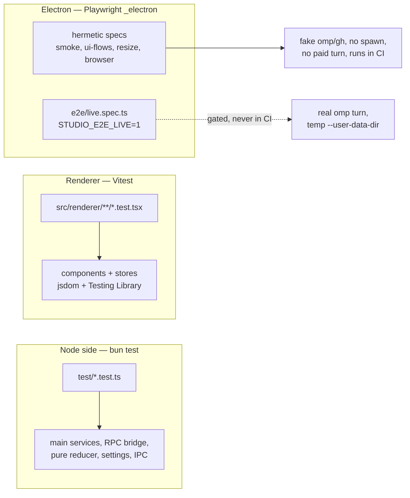

# Testing

OMP Studio has three test suites, one per process boundary plus an end-to-end
suite. Each owns a disjoint set of files, so no suite double-runs another. See
[Patterns and conventions](patterns-and-conventions.md) for the conventions the
tests mirror, and [Getting started](../overview/getting-started.md) for the
quick-start commands.



## Node-side suite (`bun test`)

Covers the main process: data services, the RPC bridge, the pure session
reducer, settings, and IPC handlers. Lives under `test/`.

- Runner: `bun test`. `bunfig.toml` pins `[test] root = "test"` so bun never
  walks `src/renderer` (Vitest owns that) or `e2e/` (Playwright owns that).
- The pure session reducer (`src/renderer/src/store/session-reducer.ts`) is
  tested here under `test/session-reducer.test.ts` because it imports only types
  (no React, no `window`, no zustand), so it runs without a DOM.
- The RPC bridge test (`test/rpc-bridge.test.ts`) drives the real installed
  `omp --mode rpc-ui` through `OmpRpcSession`. The handshake assertions
  (`whenReady`, `getData`, `getMessages`, lifecycle `exited`) cost nothing and
  run when `omp` is resolvable. `test/has-omp.ts` mirrors the
  `src/main/paths.ts` `ompBinary` resolution and verifies the binary exists, so
  the test skips on a clean CI runner. The live streaming prompt (a paid model
  call) is gated behind `RPC_LIVE=1`:

  ```sh
  npm run test:rpc                # handshake only (skips if no omp)
  RPC_LIVE=1 npm run test:rpc     # handshake + paid live turn
  ```

Run the whole node suite:

```sh
bun test
```

## Renderer component suite (Vitest)

Covers renderer components and stores. Lives under
`src/renderer/**/*.test.ts(x)`.

- Runner: `npm run test:ui` (Vitest). Config in `vitest.config.ts`.
- Environment: jsdom + Testing Library (`@testing-library/react`,
  `@testing-library/jest-dom`, `@testing-library/user-event`). Globals are on
  (`globals: true`), so `expect`, `vi`, and `afterEach` are available without
  imports.
- `vitest.setup.ts` registers the jest-dom matchers, unmounts every tree after
  each test (`cleanup()`), polyfills `Element.prototype.scrollIntoView` (jsdom
  omits it; the slash palette and select dialog call it), polyfills
  `Promise.withResolvers` for Node 20, and installs a minimal `window.omp` so
  importing stores never trips on an undefined global. Tests that assert bridge
  calls install their own spies on top.
- The Vitest `include` matches only `src/renderer/**/*.test.ts(x)`, and
  `restoreMocks: true` resets spies between cases. The aliases mirror
  `electron.vite.config.ts` (`@/*`, `@shared/*`) so imports resolve identically
  under test.

Run the renderer suite:

```sh
npm run test:ui
```

## End-to-end suite (Playwright `_electron`)

Launches the built app from `out/main/index.js` through Playwright's `_electron`
API, so the app must be built first. Config in `playwright.config.ts`:
`fullyParallel: false`, `workers: 1` (one Electron instance at a time),
`reporter: "list"` (no HTML server that would hang a headless run), and
`forbidOnly` in CI.

```sh
npm run build && npm run test:e2e
```

### Hermetic specs (run in CI)

The hermetic specs never start a chat, spawn `omp`/`gh`, or run a paid turn.
Each launches the built app with `OMP_BINARY` pointed at a fake or unresolvable
binary, `GH_BINARY` at an unresolvable path, and `PI_CODING_AGENT_DIR` at an
empty temp dir, so the data services hit their graceful-degrade path. The result
is identical whether or not `omp`/`gh` are installed.

- `e2e/smoke.spec.ts` boots the app, checks the window title, the sidebar
  navigation, the Dashboard, and that every browse view navigates without a
  renderer crash. It uses a fake `omp` that only answers `omp stats --json`.
- `e2e/ui-flows.spec.ts` (AGE-654) reuses the same hermetic bootstrap and
  exercises the polished shell: every rail destination owns exactly one
  canonical title heading, the terminal gate scrim frees the UI, the Files/Chats
  sidebar toggle, opening a file into CodeMirror, and the Cmd/Ctrl+K nav
  palette.
- `e2e/resize.spec.ts` (AGE-657) drives the window through a range of content
  sizes and the sidebar splitter to its minimum, asserting no horizontal
  scrollbar spills onto the document and nothing throws.
- `e2e/browser.spec.ts` exercises the embedded browser against a local `http`
  fixture server, with `browser.enabled` seeded on in the temp settings.

Electron needs a display server even for a smoke launch, so on headless Linux
wrap the command with `xvfb-run -a`:

```sh
xvfb-run -a npm run test:e2e
```

### Live specs (`STUDIO_E2E_LIVE=1`, never in CI)

`e2e/live.spec.ts` spends real `omp` model turns. Every `describe` calls
`test.skip(!LIVE, ...)` at the top, so `npm run test:e2e` and CI skip the whole
file. Unlike the hermetic specs, the live specs launch against the installed
`omp` (no `OMP_BINARY`/`GH_BINARY` overrides), isolate the studio's settings in
a temp `--user-data-dir`, run each chat in a throwaway project dir, and keep
prompts tiny to minimize spend. Scenarios: a real chat turn, D1 approval
approve/deny and input/select round-trips, D3 restart/resume, and D2
two-session concurrency.

```sh
npm run build && STUDIO_E2E_LIVE=1 npm run test:e2e
```

The smoke spec also carries one `STUDIO_E2E_LIVE`-gated test for saving a file
through the Files IPC, kept behind the same flag.

## Patterns

- **Graceful-degradation testing.** The hermetic e2e specs work because the data
  services degrade to `null`/`[]` when `omp`/`gh` are missing. Pointing the
  binaries at an unresolvable path exercises the same empty-state path the
  renderer hits on a machine without the CLIs. See
  [Patterns and conventions](patterns-and-conventions.md).
- **The pure reducer is tested without the DOM.**
  `src/renderer/src/store/session-reducer.ts` imports only types, so
  `test/session-reducer.test.ts` runs it under `bun test` with no React or
  jsdom. State shaping has one testable entry point.
- **Hermetic by default, paid behind a flag.** Anything that spends money or
  touches real auth (`RPC_LIVE=1`, `STUDIO_E2E_LIVE=1`) is skipped without the
  flag and never runs in CI. CI is the `gate` and `e2e-smoke` jobs in
  `.github/workflows/ci.yml`.
- **Right suite for the process.** Keep new tests in the suite that owns the
  process they exercise: node logic under `test/` (bun), renderer UI under
  `src/renderer/**/*.test.tsx` (Vitest), cross-process flows under `e2e/`
  (Playwright). See [Debugging](debugging.md) for the `--user-data-dir`
  isolation the live specs rely on.
