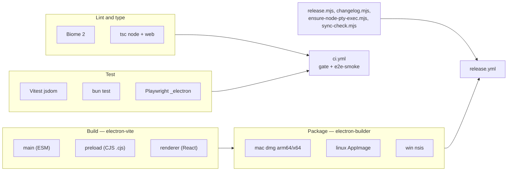

# Tooling

The build system, lint, test runners, packaging, and CI for OMP Studio. See
[Getting started](../overview/getting-started.md) for the quick-start commands
and [Deployment](../deployment.md) for the release and packaging process.



## electron-vite

`electron.vite.config.ts` drives three builds from one config:

- **Main** (`src/main/index.ts`): ESM, bundled into `out/main/index.js`.
  `externalizeDepsPlugin()` keeps `node-pty`, `@xterm/*`, and
  `@electron-toolkit/utils` as external requires.
- **Preload** (`src/preload/index.ts`): forced to CommonJS output
  (`format: "cjs"`, `entryFileNames: "[name].cjs"`, `inlineDynamicImports: true`)
  because sandboxed preload scripts cannot load ESM. Lands at
  `out/preload/index.cjs`.
- **Renderer** (`src/renderer/index.html`): Vite plus the React plugin, bundled
  into `out/renderer/`.

Path aliases are shared across all three builds: `@shared/*` resolves to
`src/shared/*` in every process, and `@/*` resolves to `src/renderer/src/*` in
the renderer only. The Vitest config mirrors these aliases so renderer component
imports resolve identically under test.

```sh
npm run dev     # electron-vite dev (hot reload)
npm run build   # electron-vite build -> out/
npm run start   # electron-vite preview (built app)
```

## Biome 2

Lint and format with a single tool. Config in `biome.json`: the `recommended`
preset, 2-space indent, double quotes, semicolons, trailing commas, `lineWidth`
80, and a handful of rules off (`useExhaustiveDependencies`,
`noNonNullAssertion`, `useButtonType`, `useTemplate`, `noArrayIndexKey`,
`noLabelWithoutControl`, `noUselessEmptyExport`, `useLiteralKeys`,
`noUnknownFunction`, `noUnknownAtRules`). VCS integration is on and reads the
gitignore. The CSS parser has `tailwindDirectives: true`, and
`assist.actions.source.organizeImports` is on.

```sh
npm run check    # biome check . (lint + format check)
npm run lint     # biome lint .
npm run format   # biome format --write .
```

## TypeScript

Two composite projects split the typecheck along the process boundary, so
process-specific types never leak into `src/shared`:

- `tsconfig.node.json` covers `src/main/**`, `src/preload/**`,
  `src/shared/**`, and `electron.vite.config.ts`. Target `ES2022`,
  `moduleResolution: Bundler`, `strict`, `noUnusedLocals`,
  `noUnusedParameters`, `noUncheckedIndexedAccess`. Path alias `@shared/*` only.
- `tsconfig.web.json` covers `src/renderer/**`, `src/shared/**`, and
  `src/preload/index.d.ts`. Target `ES2020`, `jsx: react-jsx`, DOM libs. Path
  aliases `@shared/*` and `@/*`.

`tsconfig.json` is a solution-style root that references both. Both projects
emit nothing (`noEmit: true`); the build is handled by electron-vite.

```sh
npm run typecheck          # tsc on node then web
npm run typecheck:node     # tsc -p tsconfig.node.json --noEmit
npm run typecheck:web      # tsc -p tsconfig.web.json --noEmit
```

## Test runners

- **Vitest** (`npm run test:ui`): renderer components under
  `src/renderer/**/*.test.ts(x)`, jsdom + Testing Library. Config in
  `vitest.config.ts`, setup in `vitest.setup.ts`. See [Testing](testing.md).
- **Bun test** (`bun test`): node-side tests under `test/`. `bunfig.toml` pins
  `[test] root = "test"` so bun stays off the renderer and e2e dirs. See
  [Testing](testing.md).
- **Playwright** (`npm run test:e2e`): `_electron` against the built app. Config
  in `playwright.config.ts`: `workers: 1`, `fullyParallel: false`,
  `reporter: "list"`, `forbidOnly` in CI. See [Testing](testing.md).

## Demo recorder

`npm run demo -- <scenario>` (AGE-838) records a hermetic proof video of the
built app: `e2e/demo/run.mjs` launches `out/main/index.js` through Playwright
`_electron`, seeds isolated fixtures via `e2e/demo/fixtures.mjs` (the same posture as the
e2e smoke: temp agent/userdata/workspace dirs, a fake `omp` that serves a
hibernated JSONL transcript back over rpc-ui, `gh` unresolvable), runs
the scenario's choreography while screenshotting the window in a loop, and
stitches an mp4 with ffmpeg. Frame capture is `page.screenshot`, so it works
identically on macOS and headless Linux (`xvfb-run -a`), with no
x11grab/avfoundation divergence.

Scenarios live under `e2e/demo/scenarios/` (one `.mjs` per scenario exporting
`seed` and `run`; `e2e/demo/scenarios/message-scroller.mjs` is the first).
Output lands in `test-results/demo/` by default, or wherever `DEMO_OUT`
points: the mp4 plus any keyframe PNGs the scenario saves via `ctx.shot()`.
Requires a fresh `npm run build` and ffmpeg on `PATH`.

```sh
npm run build && npm run demo -- message-scroller
DEMO_OUT=/tmp/artifacts xvfb-run -a npm run demo -- message-scroller  # headless
```

## electron-builder

Packaging config lives in the `build` block of `package.json`:

- `appId` `com.ompstudio.app`, `productName` `OMP Studio`, output to `release/`.
- `files` ships `out/**/*` and `package.json`.
- `asarUnpack` extracts `**/node_modules/node-pty/**` so the native addon loads
  from disk at runtime.
- **mac**: `dmg` for `arm64` and `x64`, category
  `public.app-category.developer-tools`. Code-signing and notarization are
  deferred, so the macOS build is unsigned.
- **linux**: `AppImage`, category `Development`.
- **win**: `nsis` installer.

```sh
npm run dist        # electron-vite build && electron-builder
npm run dist:dir    # unpacked dir (smoke packaging)
npm run dist:mac    # macOS only
```

Distributable packaging downloads platform Electron binaries, so it runs locally
or in the Release workflow rather than in the CI gate.

## Release scripts

- `scripts/release.mjs` is the one-command release prep. It bumps the version,
  stamps the `CHANGELOG.md` `## [Unreleased]` section into a dated
  `## [version]` section with link refs, commits, and tags `vX.Y.Z`. It refuses
  a dirty working tree or an existing tag, and warns off `main`. `--dry-run`
  previews the version and release notes without writing.
- `scripts/changelog.mjs` extracts one `## [version]` (or `## [Unreleased]`)
  section from `CHANGELOG.md` as the GitHub Release notes. The pure
  `extractSection` function is unit-tested under `test/changelog.test.ts`; the
  thin CLI exits non-zero when the section is missing, so CI fails loudly
  instead of publishing empty notes.
- `scripts/ensure-node-pty-exec.mjs` is the `postinstall` hook that restores the
  executable bit on `node-pty`'s `spawn-helper` binaries. Idempotent,
  best-effort, and never fails the install. See [Debugging](debugging.md).
- `scripts/sync-check.mjs` (`npm run sync-check`, AGE-835) is a read-only
  session-start drift radar: it classifies local branches against their
  upstreams (synced, gone-upstream, no-upstream), parses
  `git worktree list --porcelain` to flag missing or stale worktree paths, and
  checks open PR state via `gh` when available. It only prints findings and
  suggested cleanup commands, never mutates anything. The pure helpers
  (`classifyBranches`, `parseWorktrees`) are unit-tested in
  `test/sync-check.test.ts`.

## CI workflows

`.github/workflows/ci.yml` runs on every push to `main` and every pull request:

- **`gate`** (Node 20.x and 22.x, `ELECTRON_SKIP_BINARY_DOWNLOAD=1` so it never
  launches the app): Biome `check`, `typecheck`, `bun test` (`RPC_LIVE` unset so
  the paid bridge test skips), `test:ui`, and `build`.
- **`e2e-smoke`** (Node 20, real Electron binary): installs Electron system libs
  via `playwright install-deps`, restores the setuid bit on `chrome-sandbox`,
  builds, and runs `xvfb-run -a npm run test:e2e` (`STUDIO_E2E_LIVE`/`RPC_LIVE`
  unset, hermetic only).

`.github/workflows/release.yml` runs on a `v*` tag: it verifies the
`package.json` version matches the tag, builds and smoke-tests on
macOS/Linux/Windows (`OMP_STUDIO_SMOKE=1` boot gate), packages installers, and
cuts one GitHub Release whose notes are the matching `CHANGELOG.md` section.

Repository governance files live under `.github/`: `CODEOWNERS` routes every
PR to the maintainer for review, `pull_request_template.md` sets the PR packet
shape, and `ISSUE_TEMPLATE/` carries the bug/feature templates plus a
`config.yml` that points security reports at private advisories (see
[Security](../security.md)). The Factory Droid CI workflows (`droid.yml`,
`droid-review.yml`) were removed in AGE-837 (2026-07-06).

## Tailwind v3 and PostCSS

`tailwind.config.js` is `darkMode: "class"` and scans
`src/renderer/index.html` and `src/renderer/src/**/*.{ts,tsx}`. Semantic colors
(`bg`, `bg-raised`, `ink`, `ink-muted`, `accent`, `border`, `success`, `warn`,
`danger`, `diff-add`/`diff-remove`) are backed by CSS variables (space-separated
RGB channels) defined in `src/renderer/src/styles.css`, so `bg-bg`, `text-ink`,
`bg-accent/10`, and so on resolve through the active theme. `:root` is light,
`.dark` is dark. The identity is the graphite/iris v2 refresh (AGE-658). Custom
keyframes include `ompPulse` and `ompBlink` for the workspace live dot
(AGE-699).

`postcss.config.js` loads `tailwindcss` then `autoprefixer`. The Biome CSS
parser has `tailwindDirectives: true` so `@tailwind` directives lint cleanly.
