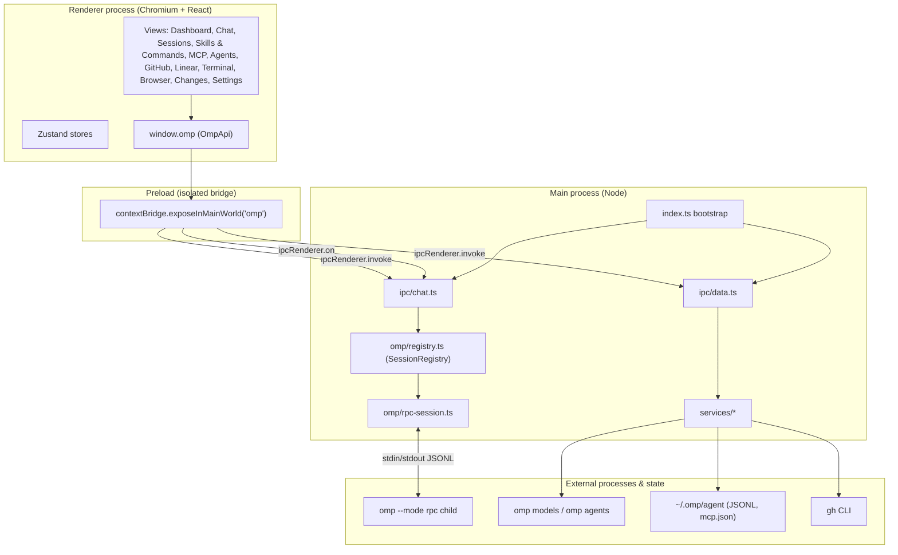
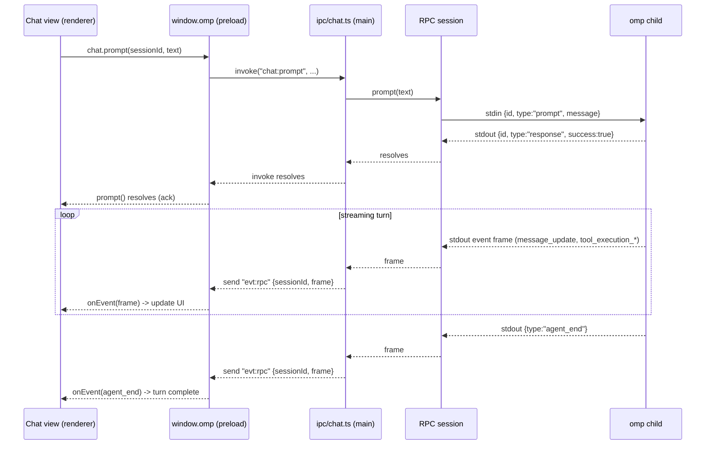

# Architecture

OMP Studio is an Electron desktop client for the `omp` coding-agent harness. This
page covers the process model, the RPC protocol bridge, the data services, the
shared type contract, and the IPC channel map. The authoritative long-form
version lives in [`docs/ARCHITECTURE.md`](docs/ARCHITECTURE.md).

## Process model

The app uses the standard Electron three-process model, plus the external
processes it controls.

- **Renderer** (`src/renderer`): a React 18 application, sandboxed from Node and
  Electron. It communicates with the backend only through the typed `window.omp`
  object. Routing between views is driven by a Zustand store
  (`src/renderer/src/store/app.ts`).
- **Preload** (`src/preload/index.ts`): runs with context isolation and exposes
  a single frozen `OmpApi` on `window.omp`. Every method is a thin forwarder to
  `ipcRenderer.invoke` (request/response) or a single-fan-out `ipcRenderer.on`
  subscription (events), keyed by the channel constants in `CH`.
- **Main** (`src/main/index.ts`): creates the `BrowserWindow`, registers the
  data, chat, settings, Linear, terminal, browser, files, and changes IPC
  handlers, and owns the `SessionRegistry`, `TerminalRegistry`, and
  `BrowserViewManager`. It is the only process that touches the filesystem,
  spawns child processes (`omp`, `gh`, pty shells), talks to `gh` and the Linear
  API, and hosts the embedded `WebContentsView` browser. All three registries are
  disposed on `window-all-closed` and `before-quit`.
- **External**: the `omp` binary (a long-lived `--mode rpc` child for chat, and
  one-shot for `omp models` / `omp agents unpack`), the on-disk `~/.omp/agent`
  state, the `gh` CLI, the Linear GraphQL API over HTTPS, per-terminal pty
  shells, and the sandboxed embedded browser's remote content.

`src/main/paths.ts` centralizes process boundaries with the host: `ompBinary()`
and `ghBinary()` probe common install locations (and honor the `OMP_BINARY`
override) so packaged apps with a minimal `PATH` still find their tools;
`agentDir()`, `sessionsDir()`, and `mcpConfigPath()` resolve the `omp` state
locations (honoring `PI_CODING_AGENT_DIR`); and `augmentedEnv()` builds a `PATH`
for spawned subprocesses.

### Renderer layout model

The center surface is a pane host. `src/renderer/src/components/shell/CenterTabs.tsx`
renders a split tree of up to 8 panes (`store/panes.ts`): chat (optionally pinned
to one session), file editor, or subagent inspector. The default is one chat pane
that follows the global active session. The right icon rail and its expandable
panels are global app chrome (one `openPanelId` in `store/shell.ts`), not
per-pane, because several rail destinations are backed by main-process
singletons. See [Shell layout](../features/shell-layout.md).

## The RPC protocol bridge

Chat is the one area where the main process holds long-lived state. Each chat
session corresponds to a dedicated `omp --mode rpc --cwd <dir>` child process,
created and tracked by `SessionRegistry` (`src/main/omp/registry.ts`) and driven
by a session wrapper (`src/main/omp/rpc-session.ts`). See
[RPC bridge](../systems/rpc-bridge.md) for the full protocol.

The protocol is newline-delimited JSON (JSONL) over the child's stdio:

- **Startup.** The bridge spawns the child and waits for the first stdout frame,
  `{"type":"ready"}`, before reporting the session ready.
- **Commands** (bridge to child, on stdin): `prompt`, `steer`, `follow_up`,
  `abort`, `get_state`, `get_messages`, `set_model`, `set_thinking_level`,
  `get_subagents`, `get_subagent_messages`, `set_subagent_subscription`,
  `get_available_commands`. Each carries an optional `id`.
- **Responses** (child to bridge): a `type:"response"` frame echoes the
  originating command `id` with `success` plus `data` or `error`. The bridge
  matches responses to pending commands by `id`.
- **Events** (child to bridge): frames without an `id` stream agent activity:
  `agent_start`, `agent_end`, `turn_start`/`turn_end`,
  `message_start`/`message_update`/`message_end`,
  `tool_execution_start`/`update`/`end`, `subagent_lifecycle`/`progress`/`event`,
  `available_commands_update`, and others.
- **Subagent telemetry is on by default.** At `ready` the bridge sends
  `set_subagent_subscription {level:"events"}`, so subagent frames stream for
  every session with no further request.
- **Auto-responding to UI requests.** `extension_ui_request` frames would
  otherwise block the agent waiting on interactive UI the desktop app does not
  surface. The bridge replies with safe defaults and ignores fire-and-forget UI
  frames.
- **Teardown.** Disposing a session closes the child's stdin, on which `omp`
  exits 0.

Every frame the bridge reads is forwarded to the renderer verbatim over the
`evt:rpc` channel (`{sessionId, frame}`); lifecycle transitions (`spawning`,
`ready`, `exited`, `error`) go over `evt:lifecycle`; UI requests over
`evt:ui-request`. The renderer reconstructs streaming chat state from this frame
stream in `src/renderer/src/store/chat.ts`, reducing each frame through the pure
`src/renderer/src/store/session-reducer.ts`.

### Chat prompt round-trip

## Data services and their sources

The read-only browsers are backed by services under `src/main/services`, invoked
through `src/main/ipc/data.ts`. Each service maps a host source into a domain
type from `src/shared/domain.ts` and degrades gracefully (returning `null`/`[]`
rather than throwing across IPC) when a source is missing. See
[Data services](../systems/data-services.md).

| Service | Source | Domain output |
| --- | --- | --- |
| Dashboard | aggregate of the services below | `DashboardData` |
| Sessions | `~/.omp/agent/sessions/<slug>/<ts>_<uuid>.jsonl` | `SessionSummary[]`, `SessionTranscript` |
| MCP servers | `~/.omp/agent/mcp.json` + project `./.mcp.json` | `McpServerInfo[]` |
| Skills | project + user `.agents`/`.agent`/`.claude` skill dirs, the bundled workflow-kit, and `~/.omp/agent/managed-skills` | `SkillInfo[]` |
| Agents | `omp agents unpack --json` (temp dir) + user/project `*.md` | `AgentInfo[]` |
| Models | `omp models --json` (parsed from the first `{`) | `ModelInfo[]` |
| Providers | grouped from the model catalog | `ProviderInfo[]` |
| OMP stats | `omp stats --json` | `OmpStatsSnapshot` |
| GitHub | `gh repo/issue/pr/repo list --json ...` | `GhRepo`, `GhIssue[]`, `GhPr[]` |
| Linear | Linear GraphQL API over HTTPS (main process only) | `LinearStatusInfo`, `LinearTeam[]`, `LinearProjectInfo[]`, `LinearIssue[]` |

### Stateful main-process subsystems

Beyond the read-only data services, the main process owns three stateful
subsystems and a secret store. Like the data services, they live entirely in
main, are reached only over typed IPC, and degrade instead of throwing.

| Module | Backing | Notes |
| --- | --- | --- |
| `services/secret-store.ts` | Electron `safeStorage` (OS keychain) | Generic get/set/clear; ciphertext to `<userData>/secrets/<name>.bin`. Backs the Linear API key. See [Secret store](../systems/secret-store.md). |
| `terminal/` | `node-pty` (`TerminalRegistry` + `PtySession`) | One `IPty` per terminal id; off by default; lazy-loaded. See [Terminal subsystem](../systems/terminal.md). |
| `browser/` | Electron `WebContentsView` (`BrowserViewManager`) | One isolated `WebContents` per tab; off by default. See [Browser subsystem](../systems/browser.md). |

## The shared type contract

`src/shared` is the single source of truth shared by all three processes and is
treated as frozen. See [Primitives](../primitives/index.md) for the type-level
reference.

- **`src/shared/rpc.ts`** — the `omp` RPC protocol surface: `ThinkingLevel`, the
  message/content-block model (`OmpMessage`, `ContentBlock`), `RpcState`,
  `RpcFrame` and its refinements, `AvailableModel`, `SubagentInfo`, todo types,
  and typed subagent telemetry.
- **`src/shared/domain.ts`** — app-level read-only types: `SessionSummary`,
  `SessionTranscript`, `McpServerInfo`, `SkillInfo`, `AgentInfo`, `ProviderInfo`,
  `ModelInfo`, the GitHub types, `DashboardData`, `OmpStatsSnapshot`, the Linear
  types, `TerminalInfo`, `BrowserViewState`, and the files/changes types.
- **`src/shared/ipc.ts`** — the channel map `CH` and the `OmpApi` interface that
  the preload implements and the renderer consumes, plus the chat payload types
  and the persisted settings shapes (`StudioSettingsV1`, the additive
  `StudioSettingsV2`).

Because the preload, main handlers, and renderer all import the same
definitions, the IPC surface stays in lockstep and is checked by
`npm run typecheck` (separate `tsconfig.node.json` and `tsconfig.web.json`
projects).

## IPC channel map

All channel names are defined once in `src/shared/ipc.ts` as `CH`. They divide
into request/response channels (`ipcMain.handle` / `ipcRenderer.invoke`) and
event channels (main to renderer pushes). The full table is in
[IPC contract](../primitives/ipc-contract.md) and the handlers are documented in
[IPC layer](../systems/ipc-layer.md). The high-level groups:

- `data:*` — read-only data services (dashboard, sessions, mcp, skills, agents,
  models, providers, ompStats, search, pickDirectory, openExternal).
- `data:sessions:*` — mutating session actions (rename, delete, archive,
  reveal, exportHtml).
- `gh:*` — GitHub (currentRepo, repos, issues, prs).
- `chat:*` — chat/RPC bridge (create, prompt, steer, followUp, abort, setModel,
  setThinking, getState, getMessages, getSubagents, dispose, list, resume,
  close, uiRespond, getSessionStats, compact, subagent + commands channels).
- `settings:*` — get / update.
- `linear:*` — status, setApiKey, clearApiKey, teams, projects, issues, issue,
  and optional CRUD gated behind `writesEnabled`.
- `terminal:*` — create, write, resize, kill, list, externalLaunchers,
  openExternal.
- `browser:*` — create, navigate, goBack, goForward, reload, openDevTools,
  openExternal, setBounds, destroy.
- `files:*` — readDir, readFile, writeFile.
- `changes:*` — status, workspaceInfo, diff.
- Events: `evt:rpc`, `evt:lifecycle`, `evt:ui-request`, `evt:terminal-data`,
  `evt:terminal-exit`, `evt:browser-state`.

## Security boundaries

- **Context isolation is on.** The renderer has no access to `ipcRenderer`,
  `require`, or Node built-ins. The preload publishes only the curated `OmpApi`.
- **No remote content in the privileged renderer.** It only loads the local
  bundle. External navigations are denied and routed to the OS browser via
  `shell.openExternal` (`src/main/external-open.ts`).
- **Content Security Policy.** `src/renderer/index.html` ships a restrictive CSP:
  `default-src 'self'`, `script-src 'self'`, `connect-src 'self'`.
- **The renderer cannot reach the host directly.** Filesystem, subprocess
  spawning, and shell commands all live in main behind the typed IPC surface.
- **Secrets stay out of settings.** The Linear API key is OS-keychain ciphertext
  via `safeStorage`, never in settings JSON.
- **The terminal is a real shell, off by default.** Agent frames never write to
  pty input.
- **The embedded browser is isolated, off by default.** Each tab is a separate
  sandboxed `WebContentsView` with no preload and an ephemeral in-memory session
  partition by default. The main renderer's CSP is unchanged.

See [Security](../security.md) for the full treatment.
