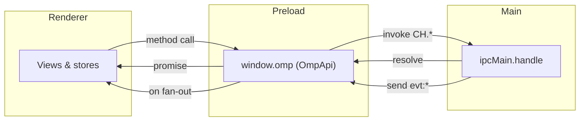

# IPC contract

`src/shared/ipc.ts` is the IPC contract between the renderer (via the preload
`window.omp` bridge) and the main process. Channel names live in the `CH`
constant; the typed surface lives in the `OmpApi` interface. The preload, the
main `ipcMain` handlers, and the renderer all import both, so the contract
stays in sync and `npm run typecheck` catches drift.

The handlers that implement these channels are documented in
[`../systems/ipc-layer.md`](../systems/ipc-layer.md). Settings persistence is
documented in [`../systems/settings-service.md`](../systems/settings-service.md).
This page is the channel map and the type reference.

## Channel directions



Request/response channels use `ipcRenderer.invoke` / `ipcMain.handle` (the
`data:*`, `gh:*`, `chat:*` commands, `settings:*`, `linear:*`, `terminal:*`,
`browser:*`, `files:*`, `changes:*` families). Event channels are
main-to-renderer pushes over `webContents.send`, fanned out to renderer
subscribers through a single `ipcRenderer.on` listener per channel in the
preload (the `evt:*` family). The preload keeps one listener per channel and
removes it when the last subscriber leaves.

## Channel map (`CH`)

All channel strings are defined once in `src/shared/ipc.ts` as `CH`. The
`ChannelName` type is `(typeof CH)[keyof typeof CH]`.

### Read-only data services

| Key | Channel | Purpose |
| --- | --- | --- |
| `dashboard` | `data:dashboard` | The `DashboardData` aggregate. |
| `ompStats` | `data:ompStats` | The `OmpStatsSnapshot` (or `null`). |
| `listSessions` | `data:sessions:list` | `SessionSummary[]`. |
| `readSession` | `data:sessions:read` | A `SessionTranscript` by path. |
| `searchSessions` | `data:searchSessions` | `SessionSearchHit[]` for a query. |
| `listMcp` | `data:mcp:list` | `McpServerInfo[]`. |
| `listSkills` | `data:skills:list` | `SkillInfo[]`. |
| `listAgents` | `data:agents:list` | `AgentInfo[]`. |
| `listModels` | `data:models:list` | `ModelInfo[]`. |
| `listProviders` | `data:providers:list` | `ProviderInfo[]`. |
| `pickDirectory` | `data:pickDirectory` | OS directory picker (`string | null`). |
| `openExternal` | `data:openExternal` | Open a URL in the OS browser. |

### Session actions (mutating)

| Key | Channel | Purpose |
| --- | --- | --- |
| `sessionRename` | `data:sessions:rename` | Rename a session JSONL by path. |
| `sessionDelete` | `data:sessions:delete` | Delete a session file. |
| `sessionArchive` | `data:sessions:archive` | Archive a session out of the default listing. |
| `sessionReveal` | `data:sessions:reveal` | Reveal a session file in the OS file manager. |
| `sessionExportHtml` | `data:sessions:exportHtml` | Export a session transcript to HTML. |

### GitHub

| Key | Channel | Purpose |
| --- | --- | --- |
| `ghCurrentRepo` | `gh:currentRepo` | The current repo (`GhRepo | null`). |
| `ghListRepos` | `gh:repos` | `GhRepo[]`. |
| `ghListIssues` | `gh:issues` | `GhIssue[]`. |
| `ghListPrs` | `gh:prs` | `GhPr[]`. |

### Chat / RPC bridge (request/response)

| Key | Channel | Purpose |
| --- | --- | --- |
| `chatCreate` | `chat:create` | Spawn a chat; returns `{ sessionId, state }`. |
| `chatPrompt` | `chat:prompt` | Send a prompt (ack resolves at turn end). |
| `chatSteer` | `chat:steer` | Steer the in-flight turn. |
| `chatFollowUp` | `chat:followUp` | Queue a follow-up. |
| `chatAbort` | `chat:abort` | Cancel the running turn. |
| `chatSetModel` | `chat:setModel` | Switch the active model. |
| `chatSetThinking` | `chat:setThinking` | Set the thinking level. |
| `chatGetState` | `chat:getState` | Fetch `RpcState`. |
| `chatGetMessages` | `chat:getMessages` | Fetch `OmpMessage[]`. |
| `chatGetSubagents` | `chat:getSubagents` | Fetch `SubagentInfo[]`. |
| `chatSetSubagentSubscription` | `chat:setSubagentSubscription` | Set subagent subscription level. |
| `chatGetSubagentMessages` | `chat:getSubagentMessages` | Paginated subagent transcript cursor. |
| `chatGetAvailableCommands` | `chat:getAvailableCommands` | Fetch `AvailableSlashCommand[]`. |
| `chatRespondUi` | `chat:uiRespond` | Answer an extension UI request. |
| `chatGetSessionStats` | `chat:getSessionStats` | Fetch `SessionStats`. |
| `chatCompact` | `chat:compact` | Trigger compaction. |
| `chatDispose` | `chat:dispose` | Dispose a live chat. |
| `chatList` | `chat:list` | `OpenSessionDescriptor[]` of open chats. |
| `chatResume` | `chat:resume` | Resume a hibernated chat. |
| `chatClose` | `chat:close` | Close (hibernate) a chat. |

### Chat / RPC bridge (events)

| Key | Channel | Purpose |
| --- | --- | --- |
| `evtRpc` | `evt:rpc` | `{ sessionId, frame }` for every RPC frame. |
| `evtLifecycle` | `evt:lifecycle` | `{ sessionId, status, detail? }` lifecycle transitions. |
| `evtUiRequest` | `evt:ui-request` | `{ sessionId, request, responseRequired }` UI requests. |

### Settings

| Key | Channel | Purpose |
| --- | --- | --- |
| `settingsGet` | `settings:get` | Fetch `StudioSettings`. |
| `settingsUpdate` | `settings:update` | Patch `StudioSettings`; returns the merged result. |

### Linear

| Key | Channel | Purpose |
| --- | --- | --- |
| `linearStatus` | `linear:status` | `LinearStatusInfo`. |
| `linearSetApiKey` | `linear:setApiKey` | Validate and persist the key to the OS keychain. |
| `linearClearApiKey` | `linear:clearApiKey` | Clear the key. |
| `linearListTeams` | `linear:teams` | `LinearTeam[]`. |
| `linearListProjects` | `linear:projects` | `LinearProjectInfo[]`. |
| `linearListIssues` | `linear:issues` | `LinearIssue[]`. |
| `linearGetIssue` | `linear:issue` | One `LinearIssue | null`. |
| `linearCreateIssue` | `linear:createIssue` | Optional CRUD (gated behind `writesEnabled`). |
| `linearUpdateIssue` | `linear:updateIssue` | Optional CRUD (gated behind `writesEnabled`). |
| `linearCreateComment` | `linear:createComment` | Optional CRUD (gated behind `writesEnabled`). |

### Terminal

| Key | Channel | Purpose |
| --- | --- | --- |
| `terminalCreate` | `terminal:create` | Spawn a pty; returns `TerminalInfo`. |
| `terminalWrite` | `terminal:write` | Write to a pty. |
| `terminalResize` | `terminal:resize` | Resize a pty. |
| `terminalKill` | `terminal:kill` | Kill a pty. |
| `terminalList` | `terminal:list` | `TerminalInfo[]`. |
| `terminalExternalLaunchers` | `terminal:externalLaunchers` | `ExternalTerminalLauncherInfo[]`. |
| `terminalOpenExternal` | `terminal:openExternal` | Launch an external terminal. |
| `evtTerminalData` | `evt:terminal-data` | `{ id, data }` pty output. |
| `evtTerminalExit` | `evt:terminal-exit` | `{ id, code }` pty exit. |

### Browser

| Key | Channel | Purpose |
| --- | --- | --- |
| `browserCreate` | `browser:create` | Create a view; returns `BrowserViewState`. |
| `browserNavigate` | `browser:navigate` | Navigate to a URL. |
| `browserGoBack` | `browser:goBack` | History back. |
| `browserGoForward` | `browser:goForward` | History forward. |
| `browserReload` | `browser:reload` | Reload. |
| `browserOpenDevTools` | `browser:openDevTools` | Open the view's DevTools. |
| `browserOpenExternal` | `browser:openExternal` | Open the current URL in the OS browser. |
| `browserSetBounds` | `browser:setBounds` | Reposition or resize the view. |
| `browserDestroy` | `browser:destroy` | Destroy a view. |
| `evtBrowserState` | `evt:browser-state` | `BrowserViewState` push. |

### Files

| Key | Channel | Purpose |
| --- | --- | --- |
| `filesReadDir` | `files:readDir` | Shallow listing of `relPath` under a workspace root. |
| `filesReadFile` | `files:readFile` | Read a workspace-relative file (`FileContent | null`). |
| `filesWriteFile` | `files:writeFile` | Write text to a workspace-relative file. |

### Changes

| Key | Channel | Purpose |
| --- | --- | --- |
| `changesStatus` | `changes:status` | `ChangesStatus` for a workspace. |
| `changesWorkspaceInfo` | `changes:workspaceInfo` | `GitWorkspaceInfo` for a workspace. |
| `changesDiff` | `changes:diff` | `FileDiff | null` for one file. |

## `OmpApi` surface

`OmpApi` is the interface the preload implements and exposes as `window.omp`.
The renderer calls it directly; the preload forwards every method to the
matching `CH` channel. It groups into namespaces.

### Top-level data

```ts
getDashboard(): Promise<DashboardData>;
getOmpStats(): Promise<OmpStatsSnapshot | null>;
listSessions(opts?: ListSessionsOptions): Promise<SessionSummary[]>;
readSession(path: string): Promise<SessionTranscript>;
searchSessions(query: string, opts?: SessionSearchOptions): Promise<SessionSearchHit[]>;
listMcpServers(cwd?: string): Promise<McpServerInfo[]>;
listSkills(cwd?: string): Promise<SkillInfo[]>;
listAgents(cwd?: string): Promise<AgentInfo[]>;
listModels(): Promise<ModelInfo[]>;
listProviders(): Promise<ProviderInfo[]>;
pickDirectory(): Promise<string | null>;
openExternal(url: string): Promise<void>;
```

The `cwd?` parameters thread the active workspace cwd for project-scoped
discovery (`listMcpServers`, `listSkills`, `listAgents`). `listModels` and
`listProviders` are workspace-independent.

### `github`

```ts
github: {
  currentRepo(cwd?: string): Promise<GhRepo | null>;
  listRepos(): Promise<GhRepo[]>;
  listIssues(repo?: string, cwd?: string): Promise<GhIssue[]>;
  listPullRequests(repo?: string, cwd?: string): Promise<GhPr[]>;
};
```

### `chat`

```ts
chat: {
  create(opts: ChatCreateOptions): Promise<ChatCreateResult>;
  prompt(sessionId, message, opts?: PromptOptions): Promise<void>;
  steer(sessionId, message): Promise<void>;
  followUp(sessionId, message): Promise<void>;
  abort(sessionId): Promise<void>;
  setModel(sessionId, provider, modelId): Promise<void>;
  setThinking(sessionId, level): Promise<void>;
  getState(sessionId): Promise<RpcState>;
  getMessages(sessionId): Promise<OmpMessage[]>;
  getSubagents(sessionId): Promise<SubagentInfo[]>;
  setSubagentSubscription(sessionId, level): Promise<void>;
  getSubagentMessages(sessionId, sel): Promise<SubagentMessagesResult>;
  getAvailableCommands(sessionId): Promise<AvailableSlashCommand[]>;
  dispose(sessionId): Promise<void>;
  onEvent(cb: (e: ChatRpcEvent) => void): () => void;
  onLifecycle(cb: (e: ChatLifecycleEvent) => void): () => void;
  onUiRequest(cb: (e: ChatUiRequestEvent) => void): () => void;
  respondUiRequest(payload: ChatUiRespondPayload): Promise<void>;
  getSessionStats(sessionId): Promise<SessionStats>;
  compact(sessionId, instructions?): Promise<void>;
  list(): Promise<OpenSessionDescriptor[]>;
  resume(descriptor: OpenSessionDescriptor): Promise<ChatCreateResult>;
  close(sessionId): Promise<void>;
};
```

The three `on*` methods return an unsubscribe function. The preload keeps one
`ipcRenderer.on` listener per event channel and fans out to the set of
renderer subscribers, removing the listener when the last subscriber leaves.

### `linear`

```ts
linear: {
  status(): Promise<LinearStatusInfo>;
  setApiKey(key: string): Promise<LinearStatusInfo>;
  clearApiKey(): Promise<void>;
  listTeams(): Promise<LinearTeam[]>;
  listProjects(teamId?: string): Promise<LinearProjectInfo[]>;
  listIssues(opts?: { teamId?; assignedToMe?; limit? }): Promise<LinearIssue[]>;
  getIssue(id: string): Promise<LinearIssue | null>;
  createIssue?(input): Promise<LinearIssue | null>;
  updateIssue?(id, patch): Promise<LinearIssue | null>;
  createComment?(issueId, body): Promise<boolean>;
};
```

`createIssue`, `updateIssue`, and `createComment` are optional and present
only when `settings.linear.writesEnabled` is true. All Linear HTTP runs in
main; the key lives in the OS keychain, never in settings.

### `terminal`

```ts
terminal: {
  create(opts: { cwd, cols, rows }): Promise<TerminalInfo>;
  write(id, data): Promise<void>;
  resize(id, cols, rows): Promise<void>;
  kill(id): Promise<void>;
  list(): Promise<TerminalInfo[]>;
  externalLaunchers(): Promise<ExternalTerminalLauncherInfo[]>;
  openExternal(opts: { cwd, profile? }): Promise<ExternalTerminalLaunchResult>;
  onData(cb: (e: { id, data }) => void): () => void;
  onExit(cb: (e: { id, code }) => void): () => void;
};
```

### `browser`

```ts
browser: {
  create(opts: { url, bounds }): Promise<BrowserViewState>;
  navigate(id, url): Promise<void>;
  goBack(id): Promise<void>;
  goForward(id): Promise<void>;
  reload(id): Promise<void>;
  openDevTools(id): Promise<void>;
  openExternal(id): Promise<void>;
  setBounds(id, bounds): Promise<void>;
  destroy(id): Promise<void>;
  onState(cb: (e: BrowserViewState) => void): () => void;
};
```

### `settings`

```ts
settings: {
  get(): Promise<StudioSettings>;
  update(patch: Partial<StudioSettings>): Promise<StudioSettings>;
};
```

### `session`

```ts
session: {
  rename(path, title): Promise<void>;
  delete(path): Promise<void>;
  archive(path): Promise<void>;
  unarchive(path): Promise<void>;
  reveal(path): Promise<void>;
  exportHtml(path): Promise<string>;
};
```

### `files`

```ts
files: {
  readDir(relPath?: string, workspaceRoot?: string | null): Promise<FileEntry[]>;
  readFile(relPath: string, workspaceRoot?: string | null): Promise<FileContent | null>;
  writeFile(relPath: string, text: string, workspaceRoot?: string | null): Promise<{ ok: boolean; error?: string }>;
};
```

`readDir` lists `relPath` under `workspaceRoot` (root when omitted); `readFile`
returns `null` when missing or unreadable; `writeFile` is atomic.

### `changes`

```ts
changes: {
  status(workspaceRoot?: string | null): Promise<ChangesStatus>;
  workspaceInfo(workspaceRoot?: string | null): Promise<GitWorkspaceInfo>;
  diff(relPath: string, workspaceRoot?: string | null): Promise<FileDiff | null>;
};
```

## Chat payload types

| Type | Fields | Notes |
| --- | --- | --- |
| `ChatCreateOptions` | `cwd`, `model?`, `thinkingLevel?`, `approvalPolicy?` | The spawn contract for a new chat. |
| `ChatCreateResult` | `sessionId`, `state: RpcState` | Returned by `chat.create` / `chat.resume`. |
| `PromptOptions` | `images?: ImageContent[]`, `streamingBehavior?: "steer" | "followUp"` | `streamingBehavior` is required when the session is already streaming. |
| `ChatRpcEvent` | `sessionId`, `frame: RpcFrame` | The `evt:rpc` payload. |
| `ChatLifecycleStatus` | `"spawning" | "ready" | "exited" | "error"` | The lifecycle statuses. |
| `ChatLifecycleEvent` | `sessionId`, `status`, `detail?` | The `evt:lifecycle` payload. |
| `ChatUiRequestEvent` | `sessionId`, `request: ExtensionUiRequest`, `responseRequired` | The `evt:ui-request` payload. |
| `ChatUiRespondPayload` | `sessionId`, `requestId`, `response: ExtensionUiResponse` | The `chat:uiRespond` payload. |
| `OpenSessionDescriptor` | `studioSessionId`, `cwd`, `createdAt`, `lastActiveAt`, `title`, `model?`, `thinkingLevel?`, `approvalPolicy`, `sessionFile?`, `ompSessionId?`, `status` | The persisted shape of one open chat (`status` is `open` / `hibernated` / `closed`). |

## Settings schema

The settings store is versioned. `StudioSettingsV1` is the original schema;
`StudioSettingsV2` is an additive bump where every new field is optional so a
persisted V1 file and any partial `update` patch stay valid. `migrate()` in
`src/main/services/settings-service.ts` upgrades a V1 file to V2 (see
[`../systems/settings-service.md`](../systems/settings-service.md)). The
canonical shape is `StudioSettings = StudioSettingsV2`.

### `StudioSettingsV1`

| Field | Type |
| --- | --- |
| `version` | `1` |
| `theme` | `ThemeMode` (`"system" | "dark" | "light"`) |
| `defaultProject` | `string | null` |
| `defaultModel` | `string | null` |
| `defaultThinkingLevel` | `ThinkingLevel` |
| `defaultApprovalMode` | `ApprovalMode` |
| `defaultAutoApprove` | `boolean` |
| `liveSessionLimit` | `number` |
| `recentProjects` | `RecentProject[]` |
| `openSessions` | `OpenSessionDescriptor[]` |

`RecentProject` is `{ cwd, label, lastUsedAt }` (the v1 project log, superseded
by `workspaces` in V2).

### `StudioSettingsV2`

Extends `StudioSettingsV1` (minus `version`) with `version: 2` and these
optional fields:

| Field | Type | Notes |
| --- | --- | --- |
| `workspaces` | `Workspace[]?` | Feature 1. Synthesised from `recentProjects` on migrate. |
| `layout` | `LayoutSettings?` | Feature 5. Persisted resizable shell layout. |
| `ui` | `UiPrefs?` | Features 3 and 6. Collapse state and pinned commands. |
| `linear` | `{ writesEnabled: boolean; defaultTeamId?: string | null }?` | Feature 2. Non-secret metadata only; the key lives in the OS keychain. |
| `terminal` | `TerminalSettings?` | Feature 7. |
| `browser` | `{ enabled: boolean; bookmarks?: BrowserBookmark[]; history?: BrowserHistoryEntry[] }?` | Feature 8. Off by default. |

### `Workspace`

```ts
export interface Workspace {
  id: string;        // stable uuid; survives label/prefs across an explicit cwd edit
  cwd: string;
  label: string;     // defaults to the project basename, user-overridable
  pinned: boolean;
  lastUsedAt: string;
  color?: WorkspaceColorKey;  // optional curated color key; absent = no color
}
```

`WORKSPACE_COLOR_KEYS` is the curated set `["slate", "red", "amber", "green",
"teal", "blue", "violet", "pink"]` (AGE-671), exported as a `const` tuple.
`WorkspaceColorKey` is the union of those literals. The renderer maps each key
to a swatch value; main only needs the key set to validate persisted data
without importing renderer-only presentation. A `Workspace` supersedes a
`RecentProject`.

### `LayoutSettings`

Persisted shell layout (resizable splits and nav/rail prefs). Every field
optional.

| Field | Type | Notes |
| --- | --- | --- |
| `sidebarWidthPct` | `number?` | |
| `sidebarCollapsed` | `boolean?` | |
| `chatRailWidthPct` | `number?` | |
| `chatRailCollapsed` | `boolean?` | |
| `navOrder` | `string[]?` | Ordered route ids for the sidebar nav. |
| `navHidden` | `string[]?` | Route ids hidden into the sidebar overflow. |
| `chatRailPanels` | `{ id: string; visible: boolean }[]?` | Chat right-rail panel order and visibility. |
| `rightPanelId` | `string | null?` | Last-open right icon-rail destination route id (null or absent = collapsed). |
| `rightPanelWidthPct` | `number?` | Legacy right icon-rail panel width (percent of shell); read-only fallback. |
| `rightPanelWidthsPx` | `Record<string, number>?` | Right icon-rail overlay sheet widths in px, keyed by destination route id. |

### `UiPrefs`

| Field | Type | Notes |
| --- | --- | --- |
| `collapsed` | `Record<string, boolean>?` | Persisted collapse state keyed by each Collapsible `persistKey`. |
| `pinnedCommands` | `string[]?` | Pinned command names for the Commands palette. |

### `TerminalSettings`

| Field | Type | Notes |
| --- | --- | --- |
| `enabled` | `boolean` | Off by default. |
| `maxConcurrent` | `number` | |
| `defaultTarget` | `TerminalDefaultTarget?` | `"built-in" | "external"`. |
| `externalProfile` | `ExternalTerminalProfile?` | Which external app to prefer when `defaultTarget` is `"external"`. |

`ExternalTerminalProfile` is `"system" | "ghostty" | "kitty" | "iterm2" |
"alacritty" | "wezterm"`. The launcher discovery types
(`ExternalTerminalLauncherInfo` with `profile`, `label`, `available`, `kind`
of `"mac-app" | "command" | "unavailable"`, optional `detectedPath` /
`reason`; `ExternalTerminalLaunchResult` with `id`, `profile`, `label`, `cwd`,
`launchedAt`) describe what `terminal.externalLaunchers` and
`terminal.openExternal` return.

### Browser settings

| Field | Type | Notes |
| --- | --- | --- |
| `enabled` | `boolean` | Off by default. |
| `bookmarks` | `BrowserBookmark[]?` | `{ url, title, createdAt }`. |
| `history` | `BrowserHistoryEntry[]?` | `{ url, title, lastVisitedAt }`. |

## Secure defaults

Three capabilities ship off by default and must be explicitly enabled in
settings: `terminal.enabled`, `browser.enabled`, and
`linear.writesEnabled`. The Linear API key is never stored in settings JSON;
it lives in the OS keychain via `safeStorage` (see
[`../systems/secret-store.md`](../systems/secret-store.md)).

## Related pages

- [`../systems/ipc-layer.md`](../systems/ipc-layer.md): the `ipcMain` handlers
  that implement these channels.
- [`../systems/rpc-bridge.md`](../systems/rpc-bridge.md): the bridge behind the
  `chat:*` channels.
- [`../systems/settings-service.md`](../systems/settings-service.md): settings
  persistence and the V1-to-V2 migration.
- [`../features/chat/index.md`](../features/chat/index.md): the consumer of the
  chat event channels.
- [`../overview/architecture.md`](../overview/architecture.md): the
  architecture overview that summarizes the channel map.
- [RPC protocol types](rpc-protocol.md): the RPC types carried over the
  `chat:*` channels.
- [Domain types](domain-types.md): the domain types carried over the
  `data:*`, `gh:*`, `linear:*`, `terminal:*`, `browser:*`, `files:*`, and
  `changes:*` channels.
