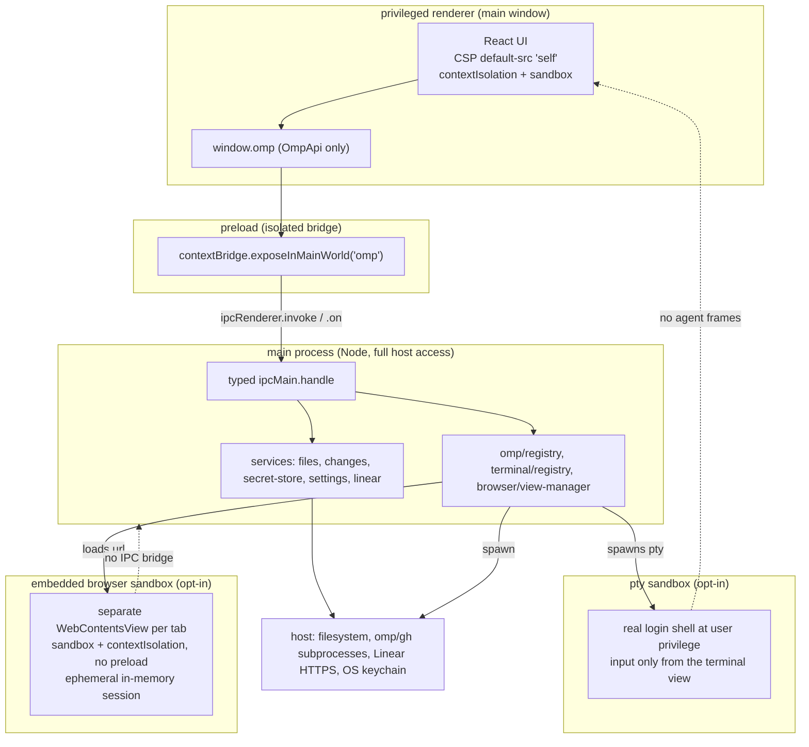

# Security

OMP Studio is a desktop cockpit that drives a real coding-agent harness, runs a
real shell, and embeds a real browser, so the trust model is the point. The
privileged renderer is locked down, every host-reaching capability lives in main
behind a typed IPC surface, and the two opt-in capabilities that touch untrusted
content (the terminal and the embedded browser) are isolated in their own
sandboxed contexts and off by default. This page is the boundary map; the
per-subsystem deep dives live in the [systems deep dives](#systems-deep-dives)
section.

## Trust boundaries

The privileged renderer never touches the host directly and never loads remote
content. The terminal and embedded browser are deliberately separate contexts
with their own, looser trust posture, gated behind opt-in settings.

## Boundary table

| Boundary | Enforcement | File(s) |
| --- | --- | --- |
| Renderer has no Node or Electron | `contextIsolation: true` and `sandbox: true` on the main `BrowserWindow`; the preload publishes only the curated `OmpApi` via `contextBridge.exposeInMainWorld`. The renderer has no `ipcRenderer`, `require`, or Node built-ins. | `src/main/index.ts`, `src/preload/index.ts` |
| No remote content in the privileged renderer | The window loads only the local bundle (dev server URL in dev, built `index.html` in production). `setWindowOpenHandler` denies every popup and routes http(s) targets to the OS browser; `will-navigate` denies any navigation away from the bundle (dev-server URLs excepted in dev). | `src/main/index.ts` |
| Content Security Policy | `src/renderer/index.html` ships `default-src 'self'; script-src 'self'; style-src 'self' 'unsafe-inline'; img-src 'self' data: https:; font-src 'self' data:; connect-src 'self'`. No inline or remote scripts; the renderer's own `connect-src` is `'self'` so it cannot call out to the network. | `src/renderer/index.html` |
| External opens are policed | Every URL handed to the OS browser (`shell.openExternal`) funnels through `validateExternalUrl`: http/https only, no embedded credentials, normalized `href`. `safeOpenExternal` is the single Electron-side wrapper; the embedded browser re-runs the same check as a last line. | `src/main/external-open.ts`, `src/main/services/external-url.ts` |
| Embedded browser is a separate sandbox | Each browser tab is its own `WebContentsView` with `sandbox: true`, `contextIsolation: true`, `nodeIntegration: false`, `webSecurity: true`, and no preload, so the loaded page has no `window.omp`, no `ipcRenderer`, and no Node. It uses an ephemeral in-memory session partition by default, all Chromium permissions are denied, navigation is policed to http(s) only with an optional host allowlist, `window.open` is denied, and bounds are clamped against the parent window. The main renderer's CSP is unchanged. | `src/main/browser/view-manager.ts` (see [Browser subsystem](systems/browser.md)) |
| Terminal is a real shell, off by default | A pty runs the user's login shell at full user privilege, spawned only when `settings.terminal.enabled` is set, only in a validated `cwd`, and concurrency-capped. Input reaches a pty only from the local terminal view via `terminal:write`; agent frames, `evt:rpc`, and remote content are never written to pty input. `node-pty` loads lazily so a missing addon never breaks startup. | `src/main/terminal/registry.ts`, `src/main/terminal/pty-session.ts` (see [Terminal subsystem](systems/terminal.md)) |
| Secrets stay out of settings | The Linear API key is OS-keychain ciphertext via Electron `safeStorage`, written to `<userData>/secrets/<name>.bin` with `0600` perms, never in settings JSON. When OS encryption is unavailable the store falls back to an in-memory map for the session and never writes plaintext to disk. All Linear HTTP runs in main; the renderer never sees the key or the network. | `src/main/services/secret-store.ts` (see [Secret store](systems/secret-store.md)), `src/main/services/linear.ts`, `src/main/ipc/linear.ts` |
| Settings drop token-shaped keys | `mergeKnown` is the single funnel for read and update: it copies only the known `StudioSettings` keys and structurally drops anything unknown, invalid, or token-shaped (`apiKey`/`token`). Identifier strings used as persisted map keys are guarded by `isSafeId` against credential smuggling. Secure defaults: `terminal.enabled`, `browser.enabled`, and `linear.writesEnabled` are all `false`. | `src/main/services/settings-service.ts` (see [Settings service](systems/settings-service.md)) |
| Renderer cannot reach the host directly | Filesystem, subprocess spawning, and shell commands all live in main behind the typed IPC surface. Files and changes are path-contained under a single workspace root the renderer selects and main validates against its own settings; an unknown root yields safe-empty results, never a probe of somewhere else. Git commands run with `core.fsmonitor=false` and `--no-ext-diff --no-textconv` so a workspace's `.git/config` cannot execute arbitrary commands. | `src/main/services/files.ts`, `src/main/services/changes.ts`, `src/main/ipc/files.ts`, `src/main/ipc/changes.ts` (see [Files and changes](systems/files-and-changes.md)) |
| Linear writes are gated | Linear reads are the v2 default; issue and comment CRUD is gated behind `settings.linear.writesEnabled` (off by default). The gate is enforced in main on every write channel. | `src/main/ipc/linear.ts` (see [Linear integration](features/linear.md)) |
| Child-process hygiene | `SessionRegistry`, `TerminalRegistry`, and `BrowserViewManager` are all disposed on `window-all-closed` and `before-quit`, so no `omp` child, pty shell, or remote-content view outlives the app. | `src/main/index.ts`, `src/main/omp/registry.ts`, `src/main/terminal/registry.ts`, `src/main/browser/view-manager.ts` |

## The two opt-in capabilities

The terminal and the embedded browser are the only surfaces that touch
untrusted-or-powerful content, and both are off by default. Enabling either is a
deliberate user choice, and neither is described as "safe":

- The **terminal** runs a real shell at full user privilege. It can run anything
  the user can. The boundary is that the agent never drives it: pty input comes
  only from the local terminal view, never from `evt:rpc` frames or remote
  content.
- The **embedded browser** loads remote web content in a separate, locked-down
  `WebContentsView` with no IPC bridge. The boundary is isolation: its content
  cannot reach `window.omp`, the main renderer, or Node, and the main
  renderer's CSP is not relaxed by enabling it.

## Reporting a vulnerability

The disclosure policy lives in `SECURITY.md` at the repo root (AGE-833). Do
not open a public GitHub issue for vulnerabilities; report them privately via
GitHub Security Advisories (the repository Security tab). Blank issues are
disabled and `.github/ISSUE_TEMPLATE/config.yml` carries a contact link that
points security reports at the advisory form. The project is pre-1.0 and only
the latest `main` is supported; older tags receive fixes at maintainer
discretion.

## Systems deep dives

The per-subsystem pages document the implementation of each boundary:

- [Browser subsystem](systems/browser.md) — the sandboxed `WebContentsView`,
  navigation policing, ephemeral session, deny-all permissions.
- [Terminal subsystem](systems/terminal.md) — the pty capability gate,
  concurrency cap, output coalescing, agent/terminal separation.
- [Secret store](systems/secret-store.md) — `safeStorage`, the in-memory
  fallback, why the key never lands in settings.
- [Files and changes](systems/files-and-changes.md) — path containment, the
  settings-validated root, git hardening prefixes.
- [Settings service](systems/settings-service.md) — `mergeKnown`, the
  token-drop, secure defaults, the additive v1 -> v2 migration.
- [Architecture](overview/architecture.md) — the process model and the
  in-context security notes.
