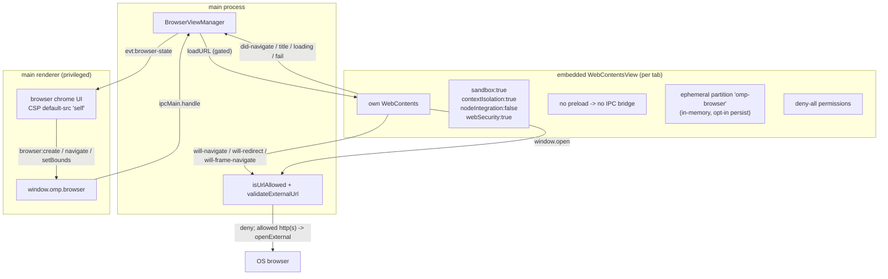

# Browser subsystem

The browser subsystem is the embedded browser. Each browser tab is a distinct
`WebContentsView` with its own `WebContents`, a separate web context from the
main renderer, so embedding remote content never relaxes the main window's CSP.
Every view is locked down hard: sandbox and context isolation on, Node
integration off, no preload, an ephemeral in-memory session partition by
default, all Chromium permissions denied, and navigation policed by main to
http(s) only (with an optional host allowlist). The embedded view has no IPC
bridge of any kind. All control (navigate, back, forward, reload, bounds,
destroy) is driven by main on behalf of the trusted main renderer; the manager
positions each view over a renderer-reported rect and emits `BrowserViewState`
so the bridge can push `evt:browser-state`. The renderer side is the browser
chrome, described in [`../features/browser.md`](../features/browser.md). The
isolation boundary is the centerpiece of the app-wide security model in
[`../security.md`](../security.md).

## Directory layout

```text
src/main/browser/
  view-manager.ts       BrowserViewManager — one isolated WebContentsView per tab
src/main/ipc/
  browser.ts            registerBrowserIpc — bridges window.omp.browser to the manager
src/main/services/
  external-url.ts       validateExternalUrl (shared external-open policy)
src/main/
  logger.ts             scoped('browser') for blocked-navigation / load-fail logs
src/shared/
  domain.ts             BrowserViewState
  ipc.ts                CH.browserCreate / Navigate / GoBack / GoForward / Reload / OpenDevTools / OpenExternal / SetBounds / Destroy + evt:browser-state
```

## Key abstractions

| Abstraction | File | Role |
| --- | --- | --- |
| `BrowserViewManager` | `src/main/browser/view-manager.ts` | Owns the `Map<id, ViewRecord>`. Creates, positions, navigates, and tears down views; polices navigation; pushes `BrowserViewState` to state listeners. `destroyAll` for the quit hooks. |
| `ViewRecord` | `src/main/browser/view-manager.ts` | `{ id, view, error? }`. The per-view error string is surfaced in `BrowserViewState.error` and cleared on a successful navigation or reload. |
| `ManagedWebContents` / `ManagedView` | `src/main/browser/view-manager.ts` | Minimal structural slices of Electron's `WebContents` and `WebContentsView`. Declared locally (not imported as a value) so the module never resolves Electron's named exports at static link time and `bun test` can load it with an injected fake factory. |
| `ViewFactory` | `src/main/browser/view-manager.ts` | `(opts: { partition }) => ManagedView`. The default factory builds a real sandboxed `WebContentsView`. Injectable for tests. |
| `defaultCreateView` | `src/main/browser/view-manager.ts` | The real view builder. Resolves the session partition, installs `denyAllPermissions`, and constructs the `WebContentsView` with `sandbox`, `contextIsolation`, `nodeIntegration:false`, `webSecurity:true`, and no preload. |
| `isUrlAllowed` | `src/main/browser/view-manager.ts` | The navigation gate. A well-formed `http:`/`https:` URL whose host passes the allowlist (when one is configured). Everything else (file, about, data, chrome, malformed, disallowed host) is rejected. Exported for unit tests. |
| `denyAllPermissions` | `src/main/browser/view-manager.ts` | Installs a deny-all `setPermissionRequestHandler` and `setPermissionCheckHandler` on the partition session. Camera, mic, geolocation, notifications, clipboard-read, midi, and every other Chromium permission is answered `false` with no prompt. Idempotent. |
| `clampBounds` | `src/main/browser/view-manager.ts` | Clamps renderer-supplied geometry to a maximum box. Non-finite values collapse to 0, fractions floor, origins stay inside the content area. A malformed or hostile bounds payload collapses to a zero rect instead of leaking a live view slot. |
| `DEFAULT_PARTITION` | `src/main/browser/view-manager.ts` | `"omp-browser"`, a non-`persist:` partition name. Non-persisted partitions are in-memory: cookies, storage, and cache are discarded on exit. A persisted partition is a human opt-in. |
| `MAX_LIVE_VIEWS` | `src/main/browser/view-manager.ts` | 8. Each `WebContentsView` is a full renderer process; a looping renderer bug cannot accumulate them unboundedly. |
| `onState` | `src/main/browser/view-manager.ts` | Subscribe to per-view `BrowserViewState` pushes; returns an unsubscribe. The IPC layer wires this to `evt:browser-state`. |
| `wire` | `src/main/browser/view-manager.ts` | Attaches the navigation guards, the window-open handler, and the title/loading/fail-load state listeners to a view's `WebContents`. |
| `defaultOpenExternal` | `src/main/browser/view-manager.ts` | Last-line enforcement on the default OS opener: runs `validateExternalUrl` and only hands the validated href to `shell.openExternal`. |

## How it works

### The isolation model

The main renderer is a privileged, sandboxed context with CSP
`default-src 'self'` and no remote content. The embedded browser is a separate,
locked-down `WebContentsView` per tab. The two never share a web context.



The view's `webPreferences` are fixed by `defaultCreateView`:

- `sandbox: true` and `contextIsolation: true` isolate the loaded page from any
  renderer process APIs.
- `nodeIntegration: false` so web content cannot reach Node.
- `webSecurity: true` so same-origin policy holds.
- No `preload` script: the embedded view has no `window.omp`, no `ipcRenderer`,
  and no Node. There is no IPC bridge of any kind from the embedded content to
  main.

The session partition is `DEFAULT_PARTITION` (`"omp-browser"`) by default. It is
a non-`persist:` name, so Electron keeps it in memory and discards cookies,
storage, and cache when the app exits. A persisted partition is a human opt-in
and never the default. `denyAllPermissions` is re-installed on the shared
partition every time a view is created; it is idempotent and keeps the lockdown
adjacent to the only place the partition is resolved.

### Navigation policing

Every navigation the loaded content can trigger is policed against
`isUrlAllowed`, not just the user's in-page navigation. `wire` attaches guards
to three `WebContents` events:

- `will-navigate` for page- or user-initiated navigations.
- `will-redirect` for server-side 30x redirects, so an allowlisted page cannot
  302 the view to a blocked host.
- `will-frame-navigate` for subframe navigations, so the allowlist covers all
  loaded web content, frames included.

A blocked navigation calls `preventDefault`, records a `blocked navigation`
warning through `scoped('browser')`, sets the view's `error`, and emits state.
`loadURL` is policed separately in `load()` (the same `isUrlAllowed` gate) so a
blocked create allocates nothing. `file://` and every non-http/https scheme
(`about:`, `data:`, `chrome:`, custom schemes) are rejected by construction.
`""` is the renderer's blank-tab flow and loads nothing.

`window.open` and new-window popups inside the embedded view are denied by
`setWindowOpenHandler`. An allowed http(s) target is routed to the OS browser
through `openExternalUrl` instead; the view never spawns child windows.

### Bounds management

The renderer reports a rect for each view via `browser:setBounds`. The manager
clamps it against the current parent window content box (or a bounded fallback
when no window is attached) using `clampBounds`, so a hostile bounds payload can
never park a view outside the window or size it absurdly. The view is attached
with `win.contentView.addChildView` and positioned with `view.setBounds`. On
create, the initial bounds are clamped the same way before the first load.

### View state

`BrowserViewState` carries `id`, `url`, `title`, `loading`, `canGoBack`,
`canGoForward`, and an optional `error`. The manager emits state on every
navigation, title, and loading transition (`did-navigate`,
`did-navigate-in-page`, `did-start-loading`, `page-title-updated`,
`did-stop-loading`) and on `did-fail-load` for main-frame failures (code `-3`
is the cancelled-navigation sentinel and is ignored). The IPC layer subscribes
through `onState` and pushes each state over `evt:browser-state` via
`sendToWindow`.

### Lifecycle

`create` is the only allocation path. It checks the live-view cap
(`MAX_LIVE_VIEWS`), validates the initial URL against `isUrlAllowed` before any
`WebContentsView` exists (a rejected create allocates nothing), builds the view,
wires it, clamps and applies the bounds, attaches it to the window, and loads
the URL. The capability gate (`settings.browser.enabled`, off by default) is
enforced in main on every `create` inside `registerBrowserIpc`; the renderer
toggle is only UX. Destroy, list, and teardown stay available while disabled so
an in-flight view can always be torn down after a toggle-off.

`destroy` removes the view from the window, stops and closes its `WebContents`
if still alive, and drops the record. `destroyAll` does this for every view and
clears the map; `index.ts` wires it into `window-all-closed` and `before-quit`
so no embedded renderer outlives the app.

### External open

`openExternal(id)` reads the view's current URL and routes it to the OS browser
through a double gate: `isUrlAllowed` (the embedded policy) and then
`validateExternalUrl` (the shared http(s)-only, no-credentials policy). A URL
that fails either sets the view's `error` and emits state instead of reaching
the OS handler. The default opener (`defaultOpenExternal`) re-runs
`validateExternalUrl` as a last line, so even a new call site that forgets to
check cannot hand a blocked URL to `shell.openExternal`.

### The main renderer's CSP is unchanged

The embedded browser is a separate `WebContentsView`. Its remote content never
loads inside the main renderer, so the main renderer's CSP
(`default-src 'self'`, no inline/remote scripts) is not relaxed by enabling the
browser. The browser capability gate is the only thing that changes when the
feature is toggled on.

## Integration points

- **Browser chrome UI**: [`../features/browser.md`](../features/browser.md)
  renders the address bar, navigation controls, and the embedded view overlay,
  and drives `browser:create` / `navigate` / `setBounds` / `destroy`.
- **Security boundary**: the isolation, permission, and navigation guarantees
  are the centerpiece of [`../security.md`](../security.md).
- **IPC layer**: `registerBrowserIpc` wires the channels and enforces the
  capability gate; see [`./ipc-layer.md`](./ipc-layer.md).
- **Settings**: `browser.enabled` (off by default) comes from
  `src/main/services/settings-service.ts`; see
  [`./settings-service.md`](./settings-service.md).
- **External-open policy**: `validateExternalUrl` in
  `src/main/services/external-url.ts` is the shared gate every OS-browser open
  funnels through; see [`./files-and-changes.md`](./files-and-changes.md).
- **Quit hooks**: `index.ts` calls `browsers.destroyAll()` on
  `window-all-closed` and `before-quit`; see [`./ipc-layer.md`](./ipc-layer.md).
- **Domain types**: `BrowserViewState` is defined in `src/shared/domain.ts`;
  see [`../primitives/domain-types.md`](../primitives/domain-types.md).
- **IPC contract**: the `browser:*` and `evt:browser-state` channel names live
  in `src/shared/ipc.ts`; see
  [`../primitives/ipc-contract.md`](../primitives/ipc-contract.md).

## Entry points for modification

- **Add a browser control** (e.g. stop, find-in-page): add the method to
  `BrowserViewManager` in `src/main/browser/view-manager.ts`, register the
  channel in `src/shared/ipc.ts`, wire it in `registerBrowserIpc`, and add the
  method to `OmpApi.browser`.
- **Change the default partition or make it persisted**: `DEFAULT_PARTITION` and
  the `partition` option in `src/main/browser/view-manager.ts`. A `persist:`
  prefix persists across launches.
- **Tighten or relax navigation**: `isUrlAllowed` and the `allowlist` option.
  The allowlist is allowlist-first: a provided list (even empty) permits only
  the listed hosts and their subdomains; `undefined` permits any http/https
  host.
- **Change the live-view cap**: `MAX_LIVE_VIEWS` in
  `src/main/browser/view-manager.ts`.
- **Add a Chromium permission** (none are granted today): `denyAllPermissions`
  is the single place to revisit; do not add a per-permission allow without an
  accompanying security review.
- **Change bounds clamping**: `clampBounds` and `clampToWindow` in
  `src/main/browser/view-manager.ts`.

## Key source files

| File | Purpose |
| --- | --- |
| `src/main/browser/view-manager.ts` | `BrowserViewManager`: isolated `WebContentsView` per tab, navigation policing, bounds, state, lifecycle. |
| `src/main/ipc/browser.ts` | `registerBrowserIpc`: bridges `window.omp.browser` to the manager and enforces the capability gate. |
| `src/main/services/external-url.ts` | `validateExternalUrl`, the shared external-open policy. |
| `src/main/logger.ts` | `scoped('browser')` for blocked-navigation and load-failure warnings. |
| `src/shared/domain.ts` | `BrowserViewState`. |
| `src/shared/ipc.ts` | The `browser:*` and `evt:browser-state` channel names, `BrowserBookmark`, `BrowserHistoryEntry`. |
