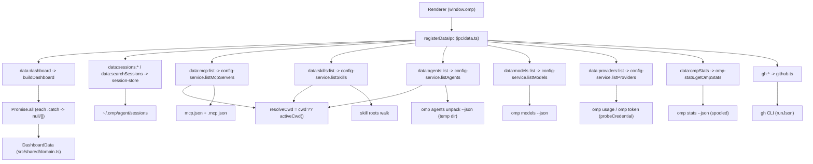

# Data services

The data services are the read-only main-process subsystem that maps host
sources into the `src/shared/domain.ts` types the renderer browses. They are
invoked through `registerDataIpc` in `src/main/ipc/data.ts`, which registers the
`data:*` and `gh:*` handlers. Each service degrades gracefully: a missing tool,
an unauthenticated CLI, or a missing file resolves to `null` or `[]` across IPC,
never a throw. The dashboard aggregate, the sessions list, the MCP, skills,
agents, models, providers, omp-stats, and GitHub browsers all read through this
layer. The Linear integration (`src/main/services/linear.ts` +
`src/main/ipc/linear.ts`) and the session store
([`./session-store.md`](./session-store.md)) have their own pages and are not
covered here.

## Directory layout

```text
src/main/services/
  cli.ts             runCli / runJson / probeCredential / parseJsonOutput
  config-service.ts  MCP, skills, agents, models, providers
  omp-stats.ts       omp stats --json -> OmpStatsSnapshot
  github.ts          gh CLI -> GhRepo / GhIssue / GhPr
  session-store.ts   sessions (own page)
  linear.ts          Linear HTTP (own page)
  external-url.ts    validateExternalUrl (http(s)-only, no credentials)
src/main/ipc/
  data.ts            registerDataIpc — wires services to ipcMain + buildDashboard
src/shared/
  domain.ts          DashboardData, McpServerInfo, SkillInfo, AgentInfo, ModelInfo, ProviderInfo, …
  ipc.ts             CH channel map (data:* / gh:*) + OmpApi surface
```

## Key abstractions

| Abstraction | File | Role |
| --- | --- | --- |
| `registerDataIpc` | `src/main/ipc/data.ts` | Registers the `data:*` and `gh:*` handlers, builds the dashboard aggregate, injects the active-cwd resolver, and wires the session-store mutating actions with Electron `shell` capabilities. |
| `buildDashboard` | `src/main/ipc/data.ts` | Fan-out aggregate. Awaits sessions, models, mcp, skills, agents, repo, issues, and prs in parallel (each wrapped in `.catch(() => …)`), groups sessions by project, and returns `DashboardData`. |
| `runCli` | `src/main/services/cli.ts` | Spawns a CLI and collects stdout/stderr. Never throws: a spawn failure or timeout resolves with `code: -1`. Supports `maxBytes` cap and `spoolOutput` (temp files) to avoid losing trailing output from fast Bun binaries under Electron. |
| `runJson` | `src/main/services/cli.ts` | `runCli` + `parseJsonOutput`. Returns `null` on a non-zero exit, missing payload, or invalid JSON. |
| `probeCredential` | `src/main/services/cli.ts` | Count-only credential probe. Reports only the exit code and whether stdout produced any bytes; the bytes are discarded the instant they arrive and never accumulated, stored, returned, or logged. Used for `omp token <provider>`. |
| `parseJsonOutput` | `src/main/services/cli.ts` | Parses JSON that may have a human-readable prelude by scanning for the first `{` or `[` and bracket-matching to its end. omp prints extension warnings before its JSON payload. |
| `resolveCwd` | `src/main/ipc/data.ts` | `cwd ?? activeCwd()` for project-scoped reads. The renderer-supplied cwd always wins; otherwise the active workspace cwd is used. |

## How it works

### Service-to-source-to-domain map

| Service | Source | Domain type | Notes |
| --- | --- | --- | --- |
| `buildDashboard` (`src/main/ipc/data.ts`) | fan-out of the services below | `DashboardData` | Sessions grouped by project (`ProjectSessions[]`); models/providers counted; GitHub open issue/PR counts. |
| `listSessions` (`src/main/services/session-store.ts`) | `~/.omp/agent/sessions/<slug>/*.jsonl` | `SessionSummary[]` | Own page: [`./session-store.md`](./session-store.md). |
| `readSession` / `searchSessions` / actions | same JSONL | `SessionTranscript` / `SessionSearchHit[]` | Own page. |
| `listMcpServers` (`src/main/services/config-service.ts`) | `mcpConfigPath()` (user) + `<cwd>/.mcp.json` (project) | `McpServerInfo[]` | `source: "user" | "project"`. |
| `listSkills` (`src/main/services/config-service.ts`) | skill roots walk (see below) | `SkillInfo[]` | `source: "builtin" | "managed" | "user" | "claude" | "project"`. |
| `listAgents` (`src/main/services/config-service.ts`) | `omp agents unpack --json` (temp dir) + `<agentDir>/agents` + `<cwd>/.omp/agents` | `AgentInfo[]` | `source: "builtin" | "user" | "project"`; `readOnly` inferred from description. |
| `listModels` (`src/main/services/config-service.ts`) | `omp models --json` | `ModelInfo[]` (= `AvailableModel`) | Parsed from the first `{`. |
| `listProviders` (`src/main/services/config-service.ts`) | models grouped + `omp usage --json --redact` + `omp token <provider>` | `ProviderInfo[]` | `authStatus` + `authSource`; 60s cache. |
| `getOmpStats` (`src/main/services/omp-stats.ts`) | `omp stats --json` | `OmpStatsSnapshot | null` | Spooled output, 2MB cap, 30s timeout. |
| `currentRepo` / `listRepos` / `listIssues` / `listPrs` (`src/main/services/github.ts`) | `gh` CLI | `GhRepo` / `GhRepo[]` / `GhIssue[]` / `GhPr[]` | `cwd` threaded for repo-scoped queries. |

### Skills discovery

`listSkills` walks an ordered set of roots, lowest precedence first, and dedupes
by name so later sources overwrite earlier ones (builtin < managed < user <
project precedence). The roots are:

- builtin: `<agentDir>/workflow-kit` (deep recursion),
- managed: `<agentDir>/managed-skills` (the exact subdir, never a broad
  `agentDir()` scan, which also holds sessions, blobs, and the SQLite DBs),
- user: `~/.agents/skills`, `~/.agent/skills`, `~/.claude/skills`,
- project: `.agents/skills` and `.agent/skills` found by walking up from `cwd`
  (farthest ancestor first so the nearest dir wins), then `<cwd>/.claude/skills`.

Each root is scanned for `SKILL.md` files; frontmatter (`name`, `description`)
is parsed with a small column-0 YAML reader. Roots already classified above are
skipped during the project walk-up so a `cwd` nested under home does not re-add
the user `~/.agents`/`~/.agent` dirs as `source: "project"` and clobber the
correct user entries.

### Provider auth detection

`listProviders` groups models by provider, then resolves auth status per group:

1. If `omp usage --json --redact` reports the provider, it is `authenticated`
   (`authSource: "usage"`).
2. Else if every model in the group is cost-free (e.g. a local llama.cpp), it is
   `not_required` (`authSource: "local"`).
3. Else it runs a count-only `omp token <provider>` probe through
   `probeCredential`. A clean exit with at least one stdout byte is
   `authenticated` (`authSource: "token"`); a clear non-zero exit is
   `unauthenticated` (`authSource: "none"`); a timeout or spawn failure (exit
   code < 0) is too ambiguous to call a negative, so it degrades to `unknown`
   (`authSource: "error"`).

The probe never captures the token bytes (see `probeCredential`). The result is
cached for 60 seconds because spawning `omp` is not free.

### The active-cwd resolver

Project-scoped reads (`listMcpServers`, `listSkills`, `listAgents`, and the
dashboard) thread the active workspace cwd. `resolveCwd` in `registerDataIpc` is
`cwd ?? activeCwd()`, where `activeCwd` is injected from `src/main/index.ts` as
`activeSessionCwd()` (the most-recently-active chat session's cwd). A
renderer-supplied cwd always wins, so a browser opened for a specific workspace
reads that workspace's project files.

### Graceful degradation

Every service returns `null` or `[]` on any failure (missing tool, spawn
failure, timeout, non-zero exit, invalid JSON, network error). `registerDataIpc`
wraps the dashboard fan-out components in `.catch(() => [])` / `.catch(() => null)`
so the aggregate stays usable even when one source is missing. No handler throws
across the IPC boundary.



### Helpers

`pickDirectory` (`data:pickDirectory`) opens an Electron
`dialog.showOpenDialog` for a directory and returns the first selection or
`null`. `openExternal` (`data:openExternal`) hands a URL to the OS browser
through `safeOpenExternal`, which funnels everything through
`validateExternalUrl` in `src/main/services/external-url.ts`: only well-formed
`http:` / `https:` URLs without embedded credentials reach the OS handler.

## Integration points

- **Dashboard UI**: [`../features/dashboard.md`](../features/dashboard.md)
  consumes `data:dashboard` and `data:ompStats`.
- **Sessions browser**: [`../features/sessions-browser.md`](../features/sessions-browser.md)
  consumes the session channels (powered by [`./session-store.md`](./session-store.md)).
- **MCP servers**: [`../features/mcp-servers.md`](../features/mcp-servers.md)
  consumes `data:mcp:list`.
- **Skills and commands**: [`../features/skills-and-commands.md`](../features/skills-and-commands.md)
  consumes `data:skills:list`.
- **Agents**: [`../features/agents.md`](../features/agents.md) consumes
  `data:agents:list`.
- **Models and providers**: [`../features/models-and-providers.md`](../features/models-and-providers.md)
  consumes `data:models:list` and `data:providers:list`.
- **GitHub**: [`../features/github.md`](../features/github.md) consumes the
  `gh:*` channels.
- **Domain types**: `src/shared/domain.ts`; see
  [`../primitives/domain-types.md`](../primitives/domain-types.md).
- **IPC contract**: the `data:*` and `gh:*` channel names and the `OmpApi`
  surface are in `src/shared/ipc.ts`; see
  [`../primitives/ipc-contract.md`](../primitives/ipc-contract.md).
- **IPC layer**: [`./ipc-layer.md`](./ipc-layer.md) for the ipcMain handler
  registration model.
- **RPC bridge**: [`./rpc-bridge.md`](./rpc-bridge.md) for the chat side, which
  is separate from these read-only services.

## Entry points for modification

- **Add a new read-only browser**: add a service function under
  `src/main/services/` that maps a host source into a `src/shared/domain.ts`
  type and degrades to `null`/`[]`, add the channel to `CH` in
  `src/shared/ipc.ts`, register the handler in `registerDataIpc`, and add the
  method to `OmpApi`.
- **Change a source mapping**: the relevant function in
  `src/main/services/config-service.ts`, `src/main/services/github.ts`, or
  `src/main/services/omp-stats.ts`.
- **Change project-scoped cwd resolution**: `resolveCwd` and the `activeCwd`
  injection in `src/main/ipc/data.ts` (sourced from `activeSessionCwd()` in
  `src/main/index.ts`).
- **Add a CLI-backed read**: use `runJson` from `src/main/services/cli.ts` so
  prelude text and a non-zero exit degrade to `null` automatically.
- **Tighten external-open policy**: `validateExternalUrl` in
  `src/main/services/external-url.ts`.

## Key source files

| File | Purpose |
| --- | --- |
| `src/main/ipc/data.ts` | `registerDataIpc`, `buildDashboard`, `resolveCwd`, `pickDirectory`, `openExternal`. |
| `src/main/services/cli.ts` | `runCli`, `runJson`, `probeCredential`, `parseJsonOutput`. |
| `src/main/services/config-service.ts` | MCP, skills, agents, models, providers. |
| `src/main/services/omp-stats.ts` | `omp stats --json` -> `OmpStatsSnapshot`. |
| `src/main/services/github.ts` | `gh` CLI -> `GhRepo` / `GhIssue` / `GhPr`. |
| `src/main/services/external-url.ts` | `validateExternalUrl` for `openExternal`. |
| `src/shared/domain.ts` | The domain output types. |
| `src/shared/ipc.ts` | The `data:*` and `gh:*` channel names and `OmpApi`. |
