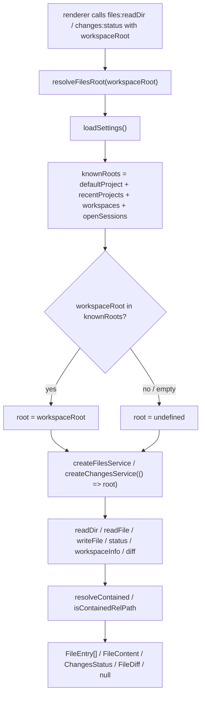

# Files and changes

The files and changes services are the workspace-scoped main-process subsystem
for reading the local file tree, editing files, and producing a read-only git
diff. Both are plain Node (no Electron import) so they stay unit-testable under
`bun test`, and both are path-contained under a single workspace root that the
renderer selects and main validates against its own settings. There is no
fallback to an unrelated active-chat cwd: a missing or unknown workspace root
yields safe-empty results, never a probe of somewhere else. The files service
gives the file tree and editor their data; the changes service gives the
changes panel its status and per-file hunks. The renderer surfaces are the file
tree and the changes panel, described in
[`../features/shell-layout.md`](../features/shell-layout.md). The
path-containment boundary is part of the app-wide security model in
[`../security.md`](../security.md).

## Directory layout

```text
src/main/services/
  files.ts         createFilesService, containedPath, canonicalize, readDir/readFile/writeFile
  changes.ts       createChangesService, status/workspaceInfo/diff, porcelain + diff parsers
  external-url.ts  validateExternalUrl (shared external-open policy)
  cli.ts           runCli (used by changes to spawn git; see ./data-services.md)
src/main/ipc/
  files.ts         registerFilesIpc + resolveFilesRoot (settings-validated root)
  changes.ts       registerChangesIpc (reuses resolveFilesRoot)
src/shared/
  domain.ts        FileEntry, FileContent, ChangedFile, ChangeStatus, ChangesStatus, DiffHunk, FileDiff, GitWorkspaceInfo
  ipc.ts           CH.filesReadDir / filesReadFile / filesWriteFile / changesStatus / changesWorkspaceInfo / changesDiff
```

## Key abstractions

| Abstraction | File | Role |
| --- | --- | --- |
| `createFilesService` | `src/main/services/files.ts` | Binds a `FilesService` to a `GetRoot` resolver. The root is injected per-call by the IPC layer, so the service never knows how the root was chosen. |
| `resolveContained` | `src/main/services/files.ts` | The containment core. Resolves a renderer-supplied `relPath` under `root` to its canonical absolute path, or `null` when it escapes. Layered: syntactic pre-check, `realpathSync` of the root, `canonicalize` of the join, final `relative()` check. |
| `containedPath` | `src/main/services/files.ts` | Thin wrapper over `resolveContained` returning the absolute path or `null`. Used by `changes.ts` for the untracked-file fallback gate. |
| `canonicalize` | `src/main/services/files.ts` | Resolves a path to its real, symlink-free form. When the leaf does not exist yet (a fresh write target), it walks up to the nearest existing ancestor, canonicalizes that, and re-appends the tail, so a symlinked ancestor cannot smuggle the path out of the tree. |
| `readDir` | `src/main/services/files.ts` | Shallow listing. Skips `node_modules` and `.git`, sorts directories first then files case-insensitively, caps at `MAX_ENTRIES` (1000), and `lstat`s only the survivors for size (never follows a symlink, so a link to an outside file cannot leak the target's byte size). |
| `readFile` | `src/main/services/files.ts` | Reads one file. `stat` first; files over `MAX_FILE_BYTES` (2 MiB) return `tooLarge`; a NUL-byte sniff in the first 8 KiB marks `binary`; otherwise the UTF-8 text. Missing or unreadable returns `null`. |
| `writeFile` | `src/main/services/files.ts` | Atomic write. Writes a `.<name>.<uuid>.tmp` file in the resolved parent, then `rename`s onto the target. After `mkdir -p`, it re-resolves the parent's real path and re-verifies containment to close the TOCTOU window where a local process could swap the parent for a symlink between validation and write. |
| `createChangesService` | `src/main/services/changes.ts` | Binds a `ChangesService` to the same `GetRoot` resolver shape. All git access is read-only porcelain. |
| `status` | `src/main/services/changes.ts` | `git rev-parse --is-inside-work-tree` probe, then `git status --porcelain=v1 --untracked-files=all -z -- .` scoped to the workspace root. Returns `ChangesStatus` (`repo` flag + `ChangedFile[]`). Non-repo or missing git returns `repo: false, files: []`. |
| `workspaceInfo` | `src/main/services/changes.ts` | `branch --show-current` and `rev-parse --show-toplevel` in parallel after the repo probe. Returns `GitWorkspaceInfo` (`branch`, `worktreePath`). |
| `diff` | `src/main/services/changes.ts` | `git diff HEAD -- <path>` for tracked files (staged and unstaged combined). If that is empty, an untracked file falls back to a `--no-index /dev/null <path>` diff gated on a realpath containment check so an untracked symlink cannot read outside the root. Returns `FileDiff` with `hunks` and a `binary` flag. |
| `parseStatusPorcelainZ` | `src/main/services/changes.ts` | Pure NUL-separated porcelain parser. Handles the rename/copy two-field layout (current path kept, old path discarded). Exported for deterministic unit tests. |
| `parseFileDiff` | `src/main/services/changes.ts` | Pure `git diff` parser into `DiffHunk[]` with `DiffLineType` per line. Detects `Binary files` lines. Exported for tests. |
| `isContainedRelPath` | `src/main/services/changes.ts` | Fast lexical guard for the diff relPath: rejects absolute paths, git pathspec magic (`:`), and any `..` segment. The no-index fallback adds the realpath containment check on top. |
| `GIT_BASE` / `DIFF_SAFE` | `src/main/services/changes.ts` | Git argv prefixes that disable hostile repo-configured helpers: `core.fsmonitor=false` for status, `--no-ext-diff --no-textconv` for diff. A workspace's `.git/config` cannot execute arbitrary commands through this surface. |
| `resolveFilesRoot` | `src/main/ipc/files.ts` | The authorization hinge. Loads settings, builds a `Set` of known roots (`defaultProject`, `recentProjects`, `workspaces`, `openSessions` cwds), and returns the renderer-supplied root only if it is in that set. Anything else resolves `undefined` (safe-empty). Reused by `registerChangesIpc`. |

## How it works

### One root, validated by main

Both services are constructed per IPC call around a single root resolved by
`resolveFilesRoot`. The renderer sends its selected workspace `cwd` as the last
argument to every `files:*` and `changes:*` call. Main loads settings, checks
that `cwd` against the set of roots it persists (`defaultProject`,
`recentProjects`, `workspaces`, `openSessions`), and hands the resolved root (or
`undefined`) to the service factory. A root that is not in settings is refused:
the service gets `undefined` and returns safe-empty results. No selected
workspace means the file tree and changes panel are inert, never redirected to
an unrelated active chat cwd.



### Containment

`resolveContained` is the security boundary for every filesystem path the
renderer can influence. Defense is layered so a traversal attempt is rejected
before it can probe outside the root:

1. A syntactic pre-check rejects an absolute `relPath` or any `..` segment
   before a single syscall. `node:path.resolve` would honor an absolute path
   verbatim, so this is refused up front.
2. The root itself is canonicalized with `realpathSync` so a symlinked workspace
   root is unmasked.
3. The joined path is run through `canonicalize`, which resolves the real path
   of the nearest existing ancestor and re-appends the tail. A symlink planted
   under the root that points outside is exposed here.
4. A final `relative()` check rejects anything whose canonical path still
   escapes the root.

`readDir` uses `lstat` (not `stat`) for the size lookup, so a symlink entry is
left size-less and never followed: a `link -> /outside/secret` cannot leak the
target's byte size.

### File operations

`readDir` is shallow on purpose: the file tree expands lazily as the user opens
directories. `node_modules` and `.git` are omitted from listings. The result is
capped at 1000 entries and sorted directories-first.

`readFile` stats the target first. A file over 2 MiB returns
`{ tooLarge: true }` without being read. A NUL byte in the first 8 KiB marks the
file `{ binary: true }`. Otherwise the UTF-8 text comes back. Every failure
(missing, unreadable, a directory) returns `null`.

`writeFile` is atomic. It writes a temp file in the resolved parent and renames
onto the target. Between `mkdir -p` and the write, it re-resolves the parent's
real path and re-checks containment, so a local process that swaps the parent
for a symlink after validation still cannot redirect the write outside the root.
The temp file is cleaned up on failure. Files are written with mode `0o600`.

### Git diff

`changes.ts` runs only read-only porcelain git commands, scoped to the same
validated root as files. A cheap `rev-parse --is-inside-work-tree` probe gates
everything: a non-git workspace or missing git reports `repo: false` with no
parsing.

`status` runs `git status --porcelain=v1 --untracked-files=all -z -- .`, scoped
to the workspace cwd so a workspace that is a subdirectory of a larger repo
reports only its own changes. The NUL-separated output is parsed by
`parseStatusPorcelainZ`, which collapses the two-char `XY` status into one
`ChangeStatus` and discards the rename old-path field.

`diff` runs `git diff HEAD -- <path>` for tracked files. If that is empty (an
untracked file shows nothing against HEAD), it falls back to a
`git diff --no-index /dev/null <path>` diff that renders the whole file as
added. The fallback is gated on `containedPath(root, relPath)` so an untracked
symlink cannot read a target outside the workspace root.

Two git hardening prefixes run on every command. `GIT_BASE`
(`-c core.fsmonitor=false`) disables a repo-configured fsmonitor hook that
`git status` would otherwise invoke. `DIFF_SAFE` (`--no-ext-diff --no-textconv`)
disables repo-configured external diff drivers and textconv filters, which could
otherwise execute arbitrary commands from the workspace's `.git/config`. Output
is byte-capped (`MAX_STATUS_BYTES` 512 KiB, `MAX_DIFF_BYTES` 1 MiB) so a huge
diff cannot exhaust the process.

### Shared external-open policy

`src/main/services/external-url.ts` exports `validateExternalUrl`, the single
check every OS-browser open funnels through. It allows only well-formed `http:`
/ `https:` URLs with no embedded credentials, and returns the normalized `href`
so callers hand the parsed form (not the raw string) to the OS. The files and
changes services do not open URLs themselves, but the file tree and changes
panel can hand a link to `data:openExternal`, which routes through this check.
See [`../security.md`](../security.md).

## Integration points

- **File tree and changes panel**: [`../features/shell-layout.md`](../features/shell-layout.md)
  consumes `files:readDir` / `files:readFile` / `files:writeFile` and
  `changes:status` / `changes:workspaceInfo` / `changes:diff`.
- **Security boundary**: the path-containment and git-hardening guarantees are
  part of the app-wide model in [`../security.md`](../security.md).
- **IPC layer**: `registerFilesIpc` and `registerChangesIpc` wire the channels;
  see [`./ipc-layer.md`](./ipc-layer.md).
- **CLI runner**: `changes.ts` spawns git through `runCli` from
  `src/main/services/cli.ts`, described in [`./data-services.md`](./data-services.md).
- **Settings**: the known-root set comes from `loadSettings` in
  `src/main/services/settings-service.ts`; see
  [`./settings-service.md`](./settings-service.md).
- **Domain types**: `FileEntry`, `FileContent`, `ChangedFile`, `ChangesStatus`,
  `FileDiff`, `GitWorkspaceInfo` are defined in `src/shared/domain.ts`; see
  [`../primitives/domain-types.md`](../primitives/domain-types.md).
- **IPC contract**: the `files:*` and `changes:*` channel names live in
  `src/shared/ipc.ts`; see [`../primitives/ipc-contract.md`](../primitives/ipc-contract.md).

## Entry points for modification

- **Add a file operation** (e.g. create-directory, delete, rename): add the
  method to `FilesService` in `src/main/services/files.ts`, funnel every path
  through `resolveContained`, register the channel in `src/shared/ipc.ts`, and
  wire it in `registerFilesIpc`.
- **Change the read caps or skip-list**: `MAX_ENTRIES`, `MAX_FILE_BYTES`,
  `BINARY_SNIFF_BYTES`, and `SKIP_DIRS` in `src/main/services/files.ts`.
- **Add a changes query** (e.g. staged-only diff, log): add the method in
  `src/main/services/changes.ts` using the `GIT_BASE` / `DIFF_SAFE` prefixes and
  a byte cap, register the channel, and wire it in `registerChangesIpc`.
- **Tighten containment**: `resolveContained` and `canonicalize` in
  `src/main/services/files.ts`, and `isContainedRelPath` plus the no-index
  realpath gate in `src/main/services/changes.ts`.
- **Change which roots are trusted**: `resolveFilesRoot` in
  `src/main/ipc/files.ts`.

## Key source files

| File | Purpose |
| --- | --- |
| `src/main/services/files.ts` | The files service: containment, shallow readDir, readFile, atomic writeFile. |
| `src/main/services/changes.ts` | The changes service: read-only git status, workspaceInfo, diff, with parsers. |
| `src/main/services/external-url.ts` | `validateExternalUrl`, the shared external-open policy. |
| `src/main/ipc/files.ts` | `registerFilesIpc` and `resolveFilesRoot` (settings-validated root). |
| `src/main/ipc/changes.ts` | `registerChangesIpc`, reusing `resolveFilesRoot`. |
| `src/shared/domain.ts` | `FileEntry`, `FileContent`, `ChangedFile`, `ChangesStatus`, `FileDiff`, `GitWorkspaceInfo`. |
| `src/shared/ipc.ts` | The `files:*` and `changes:*` channel names. |
