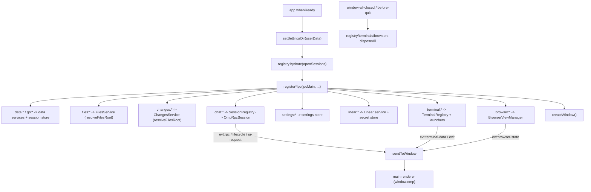

# IPC layer

The IPC layer is the set of `src/main/ipc/` handlers that bind the `CH` channels
to the main-process registries and services. Each `register*Ipc` function takes
`ipcMain` (and the registry or manager it fronts) and installs the
`ipcMain.handle` handlers for one subsystem. The coordinator (`src/main/index.ts`)
constructs the registries and calls every registrar once during `app.whenReady`.
The layer is thin: it does not own business logic, only forwards renderer calls
to the right main-owned object and pushes main-owned events back to the renderer
through the `sendToWindow` helper. The chat handlers sit in front of the
`SessionRegistry`; the data, settings, linear, terminal, browser, files, and
changes handlers sit in front of their respective services. The bridge itself
(the RPC session wrapper that talks to the `omp` child) has its own page at
[`./rpc-bridge.md`](./rpc-bridge.md). The channel map and the `OmpApi` surface
the handlers implement are documented in
[`../primitives/ipc-contract.md`](../primitives/ipc-contract.md).

## Directory layout

```text
src/main/ipc/
  chat.ts       registerChatIpc — bridges window.omp.chat to the SessionRegistry
  data.ts       registerDataIpc — bridges data:* / gh:* to the data services + session store
  settings.ts   registerSettingsIpc — bridges settings:get / settings:update to the settings store
  linear.ts     registerLinearIpc — bridges linear:* to the Linear service + secret store
  terminal.ts   registerTerminalIpc — bridges terminal:* to TerminalRegistry + external launchers
  browser.ts    registerBrowserIpc — bridges browser:* to BrowserViewManager
  files.ts      registerFilesIpc + resolveFilesRoot — bridges files:* to the files service
  changes.ts    registerChangesIpc — bridges changes:* to the changes service (reuses resolveFilesRoot)
  send.ts       sendToWindow — the one safe path for pushing a main event to the renderer
src/main/
  index.ts      Constructs the registries and calls every registrar in app.whenReady
src/shared/
  ipc.ts        CH channel map + OmpApi (the surface these handlers implement)
```

## Key abstractions

| Abstraction | File | Role |
| --- | --- | --- |
| `registerChatIpc` | `src/main/ipc/chat.ts` | Installs the `chat:*` handlers against a `SessionRegistry`. Forwards only known create fields (never spreads the raw payload), contains resume descriptors' `sessionFile` under `sessionsDir()`, and pushes `evt:rpc` / `evt:lifecycle` / `evt:ui-request` through `forward`. |
| `registerDataIpc` | `src/main/ipc/data.ts` | Installs the `data:*` and `gh:*` handlers, builds the dashboard aggregate inline (`buildDashboard`), threads the active-cwd resolver, and injects Electron `shell` capabilities into the session-store mutating actions. |
| `registerSettingsIpc` | `src/main/ipc/settings.ts` | Installs `settings:get` (load with defaults) and `settings:update` (merge a known-key patch, persist atomically, return the new settings). |
| `registerLinearIpc` | `src/main/ipc/linear.ts` | Installs the `linear:*` handlers against a main-process Linear service bound to the secret store. Owns the electron-bound key get/set/clear, validates a new key before persisting, and gates writes behind `settings.linear.writesEnabled`. |
| `registerTerminalIpc` | `src/main/ipc/terminal.ts` | Installs the `terminal:*` handlers against a `TerminalRegistry` and `ExternalTerminalLaunchers`. Uses a `handle` helper that rethrows clean `Error`s. Pushes `evt:terminal-data` / `evt:terminal-exit` through `forward`. |
| `registerBrowserIpc` | `src/main/ipc/browser.ts` | Installs the `browser:*` handlers against a `BrowserViewManager`. Enforces the `browser.enabled` gate on `create`. Subscribes to `onState` and pushes `evt:browser-state`. |
| `registerFilesIpc` | `src/main/ipc/files.ts` | Installs the `files:*` handlers. Each call resolves a settings-validated root via `resolveFilesRoot` and constructs a fresh `FilesService` bound to it. |
| `registerChangesIpc` | `src/main/ipc/changes.ts` | Installs the `changes:*` handlers, reusing `resolveFilesRoot` for the same authorization as files. |
| `sendToWindow` | `src/main/ipc/send.ts` | The one safe path for pushing a main event to the renderer. Sends `payload` on `channel` only if the window and its `WebContents` are alive; a missing or destroyed target drops the event silently. Every event forwarder funnels through this guard. |
| `handle` helper | `src/main/ipc/chat.ts`, `src/main/ipc/terminal.ts` | Wraps a handler in a try/catch that rethrows a clean `Error` so the renderer sees a message, not `[object Object]`. Used by the stateful subsystems that throw on bad input (unknown session, disabled capability). |
| `forward` | `src/main/ipc/chat.ts`, `src/main/ipc/terminal.ts` | Subscribes a freshly created session/pty to its event streams and pushes them over the `evt:*` channels through `sendToWindow`. Shared by `create` and `resume` so a resumed child streams like a fresh one. |
| `resolveFilesRoot` | `src/main/ipc/files.ts` | The shared authorization for files and changes. Loads settings, checks the renderer-supplied root against the known-roots set, and returns the root or `undefined`. |
| `activeSessionCwd` | `src/main/index.ts` | Resolves the active workspace cwd for project-scoped data reads by picking the most-recently-active chat session's cwd. Passed to `registerDataIpc` as the `activeCwd` fallback. |

## How it works

### Wiring in `index.ts`

The coordinator constructs the three stateful registries once at module load
(`SessionRegistry`, `TerminalRegistry`, `ExternalTerminalLaunchers`,
`BrowserViewManager`) and registers every IPC handler inside
`app.whenReady`, after `setSettingsDir` and the registry hydrate from persisted
open-session descriptors. The registration order is data, files, changes, chat,
settings, linear, terminal, browser, then `createWindow`. Each registrar
receives `ipcMain` plus the object it fronts (and a `getWindow` accessor for the
event-push forwarders, since the window is created after registration).



### Two handler shapes

The handlers come in two shapes, and the shape is chosen by what the caller
needs to know.

- **Return-safe handlers** (data, files, changes, settings, linear reads): each
  handler wraps its body in a try/catch that returns the inert default (`null`,
  `[]`, `{ repo: false, files: [] }`, the empty `GitWorkspaceInfo`) on any
  failure. This is the graceful-degradation convention: a missing tool, an
  unauthenticated CLI, or a missing file degrades across IPC rather than
  rejecting. The renderer never sees a thrown error from these surfaces.
- **Throw-clean handlers** (chat, terminal): the `handle` helper wraps each
  body in a try/catch that rethrows an `Error` (rethrowing `error instanceof
  Error ? error : new Error(String(error))`). These are stateful surfaces where
  the caller needs to know why nothing happened (unknown session, disabled
  capability, concurrency cap reached). The preload surfaces the message to the
  renderer.

### Event pushes

Main pushes events to the renderer over the `evt:*` channels through
`sendToWindow`. The helper is the single safe path: it checks the window and its
`WebContents` are alive before calling `contents.send`, so a forwarder firing
from child stdio, a pty callback, or a `WebContents` event after the window has
closed or reloaded drops the event instead of throwing
`Object has been destroyed`. Every consumer surface re-hydrates from main-owned
state on mount, so a dropped event is not a data loss.

The `forward` pattern is shared by chat and terminal. On `chat:create` (and
`chat:resume`), the chat registrar subscribes the `OmpRpcSession`'s `frame`,
`lifecycle`, and `ui-request` emitters and pushes them over `evt:rpc`,
`evt:lifecycle`, and `evt:ui-request`. On `terminal:create`, the terminal
registrar subscribes the `PtySession`'s `data` and `exit` emitters and pushes
them over `evt:terminal-data` and `evt:terminal-exit`. The browser registrar
subscribes `BrowserViewManager.onState` once at registration time and pushes
each `BrowserViewState` over `evt:browser-state`.

### What sits in front of what

- **chat** handlers front the `SessionRegistry`. The registry owns the `omp`
  RPC children; the bridge wrapper that talks JSONL stdio to `omp` is
  [`./rpc-bridge.md`](./rpc-bridge.md).
- **data** handlers front the read-only data services
  ([`./data-services.md`](./data-services.md)) and the session store
  ([`./session-store.md`](./session-store.md)), with Electron `shell`
  capabilities injected for the mutating session actions.
- **settings** handlers front the settings store
  ([`./settings-service.md`](./settings-service.md)).
- **linear** handlers front the Linear HTTP service and the secret store
  ([`./secret-store.md`](./secret-store.md)). All Linear HTTP runs in main; the
  renderer CSP `connect-src 'self'` is satisfied and `api.linear.app` is never
  added to it.
- **terminal** handlers front the `TerminalRegistry`
  ([`./terminal.md`](./terminal.md)).
- **browser** handlers front the `BrowserViewManager`
  ([`./browser.md`](./browser.md)).
- **files** and **changes** handlers front the workspace-scoped services
  ([`./files-and-changes.md`](./files-and-changes.md)).

### Authorization at the boundary

Two boundaries do main-owned authorization before the service runs. The chat
registrar's `sanitizeResumeDescriptor` rebuilds a resume descriptor from known
fields only (never spreading the raw payload), validates `ompSessionId` against a
strict token alphabet so a path-shaped id cannot smuggle an arbitrary file to
`omp --resume`, and contains `sessionFile` under `sessionsDir()`. The files and
changes registrars share `resolveFilesRoot`, which checks the renderer-supplied
workspace root against the known-roots set in settings before any filesystem or
git access. Both are the security hinge for their subsystem; see
[`../security.md`](../security.md).

## Integration points

- **Channel map**: the `CH` constants and the `OmpApi` surface these handlers
  implement are documented in
  [`../primitives/ipc-contract.md`](../primitives/ipc-contract.md).
- **Chat / RPC bridge**: [`./rpc-bridge.md`](./rpc-bridge.md) covers the
  `OmpRpcSession` the chat handlers front.
- **Session store**: [`./session-store.md`](./session-store.md) covers the
  store the `data:sessions:*` handlers call.
- **Settings service**: [`./settings-service.md`](./settings-service.md) covers
  the store the `settings:*` handlers call.
- **Secret store**: [`./secret-store.md`](./secret-store.md) covers the
  keychain the `linear:*` handlers read and write.
- **Data services**: [`./data-services.md`](./data-services.md) covers the
  read-only services the `data:*` and `gh:*` handlers call.
- **Terminal subsystem**: [`./terminal.md`](./terminal.md) covers the
  `TerminalRegistry` the `terminal:*` handlers front.
- **Browser subsystem**: [`./browser.md`](./browser.md) covers the
  `BrowserViewManager` the `browser:*` handlers front.
- **Files and changes**: [`./files-and-changes.md`](./files-and-changes.md)
  covers the services the `files:*` and `changes:*` handlers front.
- **Security**: the boundary authorization and the event-push safety are part
  of [`../security.md`](../security.md).

## Entry points for modification

- **Add a new IPC channel**: add the channel string to `CH` and the method to
  `OmpApi` in `src/shared/ipc.ts`, implement the preload forwarder in
  `src/preload/index.ts`, and add the `ipcMain.handle` in the matching
  `src/main/ipc/*.ts` registrar.
- **Add a new event push**: add an `evt:*` channel to `CH` and an `on*`
  subscription method to `OmpApi`, then push it through `sendToWindow` from the
  owning registrar (follow the `forward` pattern).
- **Change graceful-degradation behavior**: the return-safe handlers each have
  their own catch returning the inert default; tighten or loosen per subsystem.
- **Change authorization**: `resolveFilesRoot` in `src/main/ipc/files.ts` for
  files and changes; `sanitizeResumeDescriptor` in `src/main/ipc/chat.ts` for
  chat resume.
- **Change registration order or wiring**: `app.whenReady` in
  `src/main/index.ts`.

## Key source files

| File | Purpose |
| --- | --- |
| `src/main/index.ts` | Constructs the registries and calls every registrar in `app.whenReady`; wires the quit hooks. |
| `src/main/ipc/chat.ts` | `registerChatIpc` and `sanitizeResumeDescriptor`. |
| `src/main/ipc/data.ts` | `registerDataIpc` and the inline `buildDashboard`. |
| `src/main/ipc/settings.ts` | `registerSettingsIpc`. |
| `src/main/ipc/linear.ts` | `registerLinearIpc`, the key get/set/clear, and the write gate. |
| `src/main/ipc/terminal.ts` | `registerTerminalIpc` and the terminal `forward`. |
| `src/main/ipc/browser.ts` | `registerBrowserIpc` and the `onState` subscription. |
| `src/main/ipc/files.ts` | `registerFilesIpc` and `resolveFilesRoot`. |
| `src/main/ipc/changes.ts` | `registerChangesIpc`. |
| `src/main/ipc/send.ts` | `sendToWindow`, the one safe event-push path. |
| `src/shared/ipc.ts` | `CH` channel map and `OmpApi` surface. |
