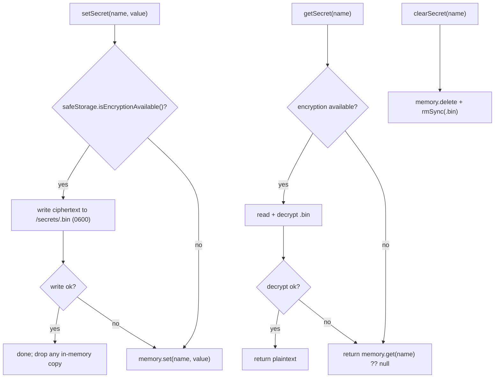

# Secret store

The secret store is the main-process subsystem that persists small secrets
through the OS keychain. It is backed by Electron `safeStorage` (the macOS
Keychain, Windows DPAPI, or libsecret on Linux) with no native `keytar`
dependency. Secrets are written as OS-encrypted ciphertext to
`<userData>/secrets/<name>.bin` with `0600` permissions, and when OS encryption
is unavailable the store falls back to an in-memory map for the session rather
than ever writing plaintext to disk. The store is generic (`getSecret` /
`setSecret` / `clearSecret`) and currently backs one secret, the Linear personal
API key. The security boundary it sits on is documented in
[`../security.md`](../security.md), and the Linear UI that consumes the key is in
[`../features/linear.md`](../features/linear.md).

## Directory layout

```text
src/main/services/
  secret-store.ts   Generic safeStorage-backed get/set/clear + in-memory fallback
src/main/ipc/
  linear.ts         The ONLY caller — wires the Linear key getter into the linear service
src/main/services/
  linear.ts         Plain-node Linear service — receives the key via an injected getter
```

## Key abstractions

| Abstraction | File | Role |
| --- | --- | --- |
| `getSecret` | `src/main/services/secret-store.ts` | Reads a secret. When OS encryption is available, reads and decrypts the `.bin` file; otherwise returns any in-memory value. Returns `null` when none is stored. Never throws. |
| `setSecret` | `src/main/services/secret-store.ts` | Persists a secret as OS-encrypted ciphertext at `<userData>/secrets/<name>.bin` (`0600`, parent dir `0700`). Falls back to the in-memory map when encryption is unavailable or the disk write fails. Never writes plaintext. |
| `clearSecret` | `src/main/services/secret-store.ts` | Removes a secret from both disk and memory. Best-effort; never throws. |
| `setSecretBackend` | `src/main/services/secret-store.ts` | Test seam that injects a fake Electron `app` / `safeStorage` backend (or `null` to reset), so the store is deterministically testable without an Electron runtime. |
| `ElectronBackend` | `src/main/services/secret-store.ts` | The minimal structural surface (`app.getPath` + `safeStorage`) the store reaches Electron through, loaded lazily via `createRequire` so plain-node test graphs can load the module without resolving Electron's named exports. |
| `LINEAR_SECRET` | `src/main/ipc/linear.ts` | The keychain entry name `"linear"`, which maps to `<userData>/secrets/linear.bin`. |

## How it works

### Storage path and permissions

`secretPath(name)` resolves to `<userData>/secrets/<name>.bin`, where
`<userData>` is `app.getPath("userData")`. `setSecret` creates the `secrets`
directory with mode `0700`, writes the ciphertext with mode `0600`, and then
calls `chmodSync(path, 0o600)` again to enforce `0600` even when overwriting a
pre-existing file with looser permissions. The ciphertext is the output of
`safeStorage.encryptString(value)`; on read, `safeStorage.decryptString` returns
the plaintext.

### The in-memory fallback

When `safeStorage.isEncryptionAvailable()` is false (for example a Linux box with
no libsecret) or a disk operation fails, the store keeps the value in an
in-memory `Map` for the session. This means the value survives reads within the
run (so a key set during a session keeps working) but is gone after a restart,
at which point status reports unauthenticated. The store never falls back to
plaintext on disk.



### How it backs the Linear API key

The store is wired only in `src/main/ipc/linear.ts`. The Linear IPC layer is the
Electron boundary: it imports `getSecret` / `setSecret` / `clearSecret`, defines
`LINEAR_SECRET = "linear"`, and constructs the plain-node Linear service with an
injected key getter:

```ts
const linear = createLinearService(async () => getSecret(LINEAR_SECRET));
```

The Linear service itself (`src/main/services/linear.ts`) never imports Electron.
It receives the decrypted key through the `getApiKey: () => Promise<string | null>`
injection point, resolves it on every request (so a key set or cleared mid-session
is picked up immediately), and sends it raw in the `Authorization` header (Linear
rejects the `Bearer ` prefix for personal API keys). When the renderer sets a new
key (`linear:setApiKey`), the IPC layer validates it with a `viewer` probe before
calling `setSecret`; clearing the key (`linear:clearApiKey`) calls `clearSecret`.

This split keeps the secret store as the single Electron-bound secret surface and
the Linear service unit-testable under `bun test` by stubbing `fetch` and
`getApiKey`.

## Integration points

- **Linear UI and service**: [`../features/linear.md`](../features/linear.md)
  for the renderer surface; the service in `src/main/services/linear.ts` consumes
  the injected getter.
- **Security boundary**: [`../security.md`](../security.md) documents why the key
  lives in the keychain and never in settings JSON.
- **Settings service**: [`./settings-service.md`](./settings-service.md) drops
  any token-shaped key from `settings.linear`, so the two stores are mutually
  exclusive by construction.
- **IPC layer**: `src/main/ipc/linear.ts` is the only caller of the store; see
  [`./ipc-layer.md`](./ipc-layer.md).

## Entry points for modification

- **Add a new secret**: pick a keychain entry name, wire `getSecret` / `setSecret`
  / `clearSecret` in the relevant IPC handler (not in a plain-node service), and
  inject a getter into the electron-free service.
- **Change the on-disk layout**: `secretPath` and the directory/file modes in
  `src/main/services/secret-store.ts`.
- **Replace the backend**: the `ElectronBackend` surface and `setSecretBackend`
  seam in `src/main/services/secret-store.ts`.
- **Tighten the fallback policy**: the `memory` map and the `isEncryptionAvailable`
  branches in `src/main/services/secret-store.ts`.

## Key source files

| File | Purpose |
| --- | --- |
| `src/main/services/secret-store.ts` | Generic safeStorage-backed get/set/clear with in-memory fallback. |
| `src/main/ipc/linear.ts` | The only caller; wires the Linear key getter and gates writes. |
| `src/main/services/linear.ts` | Plain-node Linear service; receives the key via the injected getter. |
