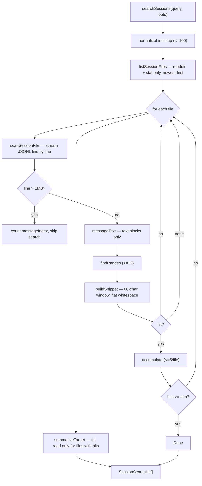

# Session store

The session store is the main-process subsystem that reads `omp`'s on-disk
session transcripts, builds the summaries and transcripts the UI browses, runs
transcript search, and performs the mutating session actions (rename, delete,
archive, reveal, export). It owns no agent logic and no `omp` child; it only
parses the JSONL files `omp` writes under `~/.omp/agent/sessions/`. The store is
plain Node with no Electron imports, so the host capabilities it needs (OS trash,
reveal in folder, the `omp --export` runner) are injected by the IPC layer. The
renderer never calls it directly; it goes through the `data:sessions:*` and
`data:searchSessions` channels, which feed the sessions browser described in
[`../features/sessions-browser.md`](../features/sessions-browser.md). The
live-session transcript path the chat RPC bridge reports (`sessionFile`) points
at the same files this store reads; see [`./rpc-bridge.md`](./rpc-bridge.md).

## Directory layout

```text
src/main/services/
  session-store.ts   The store: list, read, search, rename, delete, archive, reveal, export
  session-paths.ts   Path containment + archive root + canonicalization (renderer-influenced paths)
src/main/ipc/
  data.ts            registerDataIpc — wires the store to ipcMain + injects shell capabilities
src/main/
  paths.ts           sessionsDir(), agentDir() (honor PI_CODING_AGENT_DIR)
src/shared/
  domain.ts          SessionSummary, SessionTranscript, SessionSearchHit, ListSessionsOptions
```

## Key abstractions

| Abstraction | File | Role |
| --- | --- | --- |
| `parseSession` | `src/main/services/session-store.ts` | One-pass JSONL parser. Captures the first `{type:"session"}` header (`id`, `cwd`, `title`, `timestamp`), counts every `{type:"message"}` record, records the last `model_change`, and optionally collects the `OmpMessage[]`. Tolerant of bad lines. |
| `toSummary` | `src/main/services/session-store.ts` | Builds a `SessionSummary` from a parsed session + `fs.Stats`. Falls back to the uuid in the filename stem (`<ts>_<uuid>.jsonl`) when the header has no `id`; uses `stats.mtime` as `updatedAt`. |
| `listSessions` | `src/main/services/session-store.ts` | Enumerates `sessionsDir()` (and the archive root when `includeArchived`), reads each `.jsonl` whole, summarizes it, applies display aliases, and sorts newest-first by `updatedAt`. Missing directories are skipped, never thrown. |
| `readSession` | `src/main/services/session-store.ts` | Resolves a renderer path through `resolveSessionPath`, reads the file, and returns a `SessionTranscript` (`summary` + `messages`). On any failure it returns an inert empty transcript with a basename-derived id, so the read surface never rejects across IPC. |
| `searchSessions` | `src/main/services/session-store.ts` | Case-insensitive substring search over message text, returning `SessionSearchHit[]` with snippets and highlight ranges. Streams files one at a time, newest-first, and stops at the hard cap. |
| `resolveSessionPath` | `src/main/services/session-paths.ts` | Containment check for every renderer-supplied session path. Canonicalizes (symlink-resolved) both the roots and the candidate, rejects non-`.jsonl` paths and anything escaping both roots, and returns the matched root plus the root-relative layout. |
| `archivedDir` | `src/main/services/session-paths.ts` | `<agentDir>/archived-sessions`, a sibling outside `sessionsDir()` so the default listing never treats the archive as a project. Archiving is a plain rename across the shared filesystem. |
| Display aliases | `src/main/services/session-store.ts` | `~/.omp/agent/studio-session-aliases.json`, keyed by absolute JSONL path. Renaming records an alias instead of rewriting `omp`'s JSONL header. Atomically written (temp file + rename). |
| Injected capabilities | `src/main/services/session-store.ts` | `TrashItem` and `RevealItem` function types let the IPC layer pass in Electron `shell.trashItem` / `shell.showItemInFolder` without the service importing Electron. |

## How it works

### Transcript file layout

`omp` writes one JSONL file per session at
`~/.omp/agent/sessions/<project-slug>/<timestamp>_<uuid>.jsonl` (the directory
comes from `sessionsDir()` in `src/main/paths.ts`, which honors
`PI_CODING_AGENT_DIR`). The file is line-oriented:

- a single `{type:"session", id, cwd, title, timestamp}` header line,
- zero or more `{type:"message", message: OmpMessage}` records (the transcript),
- `{type:"model_change", model}` and `{type:"thinking_level_change", ...}`
  metadata lines interleaved with the messages.

`parseSession` walks the lines once. It keeps the first `session` header, counts
every `message` record (so `messageCount` is accurate even when the messages
themselves are not collected), and tracks the last `model_change` as the summary
`model`. Malformed lines are skipped.

### Listing and reading

`listSessions` enumerates each project slug directory under the sessions root,
reads every `.jsonl` file in full, and summarizes it. Archived sessions are
included only when `opts.includeArchived` is set, pulling from `archivedDir()`.
After summarizing, it overlays display aliases (so a renamed historical session
shows its studio title) and sorts by `updatedAt` descending.

`readSession` takes a renderer-supplied path, funnels it through
`resolveSessionPath` for containment, reads the file with `collectMessages: true`,
and returns `{ summary, messages }`. The containment step is the security hinge:
a hostile or malformed path that canonicalizes outside both roots throws, and
`readSession` catches that throw and returns an empty transcript (basename-derived
id, no messages) rather than rejecting. No `fs` call ever touches the raw
renderer path.

### Search

`searchSessions` is the streaming substring search. It never loads every
transcript up front.



Key search properties:

- A cheap metadata pass (`listSessionFiles`: `readdir` + `stat`, no content read)
  orders files newest-first, so recent transcripts are scanned first.
- Each file is streamed with `createReadStream` + `readline`, never held whole in
  memory. Scanning stops as soon as the global cap is reached.
- `messageIndex` advances for every valid `message` record, including over-long
  lines that are skipped for searching (almost always base64 image blocks). This
  keeps the index aligned with the `messages` array returned by `readSession`, so
  a hit's `messageIndex` maps directly to the transcript.
- `messageText` concatenates only `text` content blocks. Tool-call arguments and
  image payloads are excluded from search.
- `buildSnippet` windows 60 characters around the first match, flattens control
  whitespace one-for-one (length-preserving), and re-bases the highlight ranges
  to the snippet string so the renderer can highlight directly.
- Only sessions that actually produce hits pay for a full summary read
  (`summarizeTarget`). An empty or whitespace-only query returns `[]` without
  touching the filesystem.

The hard caps: `SEARCH_RESULT_CAP` (100 total), `SEARCH_HITS_PER_SESSION` (5 per
file), `SEARCH_SNIPPET_RADIUS` (60 chars), `SEARCH_MAX_RANGES` (12 per hit),
`SEARCH_MAX_LINE_LENGTH` (1,000,000 chars).

### Mutating actions

All mutating actions funnel through `resolveSessionPath` first, so a hostile
path can never reach the host capability.

- **Rename** (`renameSession`): writes a display alias to
  `studio-session-aliases.json`. The JSONL header is never rewritten. An empty
  title clears the alias.
- **Delete** (`deleteSession`): calls the injected `TrashItem`
  (`shell.trashItem`), so the file goes to the OS trash and is recoverable. The
  store never `unlink`s.
- **Archive / unarchive** (`archiveSession` / `unarchiveSession`): moves the
  JSONL between `sessionsDir()` and `archivedDir()`, preserving the
  `<project>/<file>` layout. Any display alias follows the file to its new path.
- **Reveal** (`revealSession`): calls the injected `RevealItem`
  (`shell.showItemInFolder`).
- **Export to HTML** (`exportSessionHtml`): runs `omp --export <jsonl>` in a
  dedicated `<agentDir>/studio-exports` directory, parses the `Exported to:
  <name>` line from stdout, and returns the absolute HTML path. A 60-second
  timeout guards a hung export. The CLI runner is injectable for tests.

### Path containment

`session-paths.ts` is the security boundary for renderer-influenced session
paths. `resolveSessionPath` rejects anything that is not a non-empty `.jsonl`
string, then canonicalizes both the candidate and each root with `realpathSync`
so a symlink planted under a root cannot smuggle a path outside the tree. When
the leaf does not exist yet, `canonicalize` walks up to the nearest existing
ancestor, resolves that, and re-appends the tail. `containedSessionFile` is the
stricter variant used for live subagent drill-in transcript paths, which must
live under the sessions root only.

## Integration points

- **Sessions browser UI**: [`../features/sessions-browser.md`](../features/sessions-browser.md)
  consumes `listSessions`, `readSession`, `searchSessions`, and the mutating
  actions.
- **Chat RPC bridge**: [`./rpc-bridge.md`](./rpc-bridge.md) reports the live
  session's `sessionFile` (an absolute JSONL path under the same root), which is
  what `readSession` and the drill-in paths point at.
- **IPC layer**: `registerDataIpc` in `src/main/ipc/data.ts` registers the
  `data:sessions:*` and `data:searchSessions` handlers and injects the Electron
  `shell` capabilities. See [`./ipc-layer.md`](./ipc-layer.md).
- **Domain types**: `SessionSummary`, `SessionTranscript`, `SessionSearchHit`
  are defined in `src/shared/domain.ts`; see
  [`../primitives/domain-types.md`](../primitives/domain-types.md).
- **IPC contract**: the channel names (`data:sessions:list`, `data:searchSessions`,
  `data:sessions:rename`, etc.) live in `src/shared/ipc.ts`; see
  [`../primitives/ipc-contract.md`](../primitives/ipc-contract.md).

## Entry points for modification

- **Add a new transcript metadata field** (e.g. a new `*_change` record): extend
  `parseSession` and `toSummary`, then add the field to `SessionSummary` in
  `src/shared/domain.ts`.
- **Change search scope or caps**: tune the `SEARCH_*` constants or
  `messageText` in `src/main/services/session-store.ts`.
- **Add a new session action**: add the function in `session-store.ts` (funnel
  through `resolveSessionPath`), register the channel in `src/shared/ipc.ts`,
  and wire it in `registerDataIpc`.
- **Change the archive location**: `archivedDir()` in
  `src/main/services/session-paths.ts`.
- **Tighten path containment**: `resolveSessionPath` and `canonicalize` in
  `session-paths.ts`.

## Key source files

| File | Purpose |
| --- | --- |
| `src/main/services/session-store.ts` | The store: list, read, search, aliases, mutate, export. |
| `src/main/services/session-paths.ts` | Path containment, archive root, canonicalization. |
| `src/main/ipc/data.ts` | Registers the session IPC handlers and injects host capabilities. |
| `src/main/paths.ts` | `sessionsDir()`, `agentDir()` (honor `PI_CODING_AGENT_DIR`). |
| `src/shared/domain.ts` | `SessionSummary`, `SessionTranscript`, `SessionSearchHit`. |
| `src/shared/ipc.ts` | The `data:sessions:*` and `data:searchSessions` channel names. |
