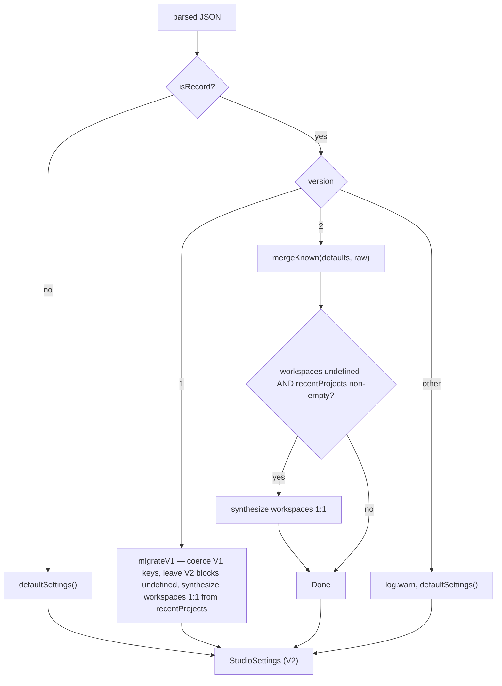

# Settings service

The settings service is the main-process subsystem that owns the versioned user
settings schema and persists it under `<userData>/settings.json`. It is plain
Node with no Electron imports; the userData directory is injected at app startup
through `setSettingsDir` (with an `OMP_STUDIO_SETTINGS_DIR` override for
non-Electron contexts such as `bun test`). The hard rule is that settings never
hold secrets: persistence only ever writes the known `StudioSettings` (V2) keys,
and unknown or token-shaped keys are dropped on both read and update, so the
Linear API key can never land in the settings JSON. The renderer reads and
updates settings through the `settings:get` and `settings:update` IPC channels.
The schema, channels, and the `OmpApi.settings` surface live in
`src/shared/ipc.ts`; see
[`../primitives/ipc-contract.md`](../primitives/ipc-contract.md). The workspaces
and shell-layout blocks back the UI in
[`../features/workspaces.md`](../features/workspaces.md) and
[`../features/shell-layout.md`](../features/shell-layout.md).

## Directory layout

```text
src/main/services/
  settings-service.ts   The store: defaults, coerce/validate, migrate, load, save, update
src/main/ipc/
  settings.ts           registerSettingsIpc — settings:get / settings:update handlers
src/main/
  index.ts              injects app.getPath("userData") via setSettingsDir at boot
src/shared/
  ipc.ts                StudioSettingsV1, StudioSettingsV2, Workspace, LayoutSettings, UiPrefs
```

## Key abstractions

| Abstraction | File | Role |
| --- | --- | --- |
| `StudioSettingsV1` | `src/shared/ipc.ts` | The legacy schema: `version: 1`, theme, default project/model/thinking/approval, `liveSessionLimit`, `recentProjects`, `openSessions`. |
| `StudioSettingsV2` | `src/shared/ipc.ts` | The current schema: `version: 2`, an additive bump over V1 (via `Omit<…, "version">`) that adds optional `workspaces`, `layout`, `ui`, `linear`, `terminal`, and `browser` blocks. `StudioSettings` is an alias for V2. |
| `defaultSettings` | `src/main/services/settings-service.ts` | Returns a fresh V2 object with secure-by-default capability flags: `terminal.enabled`, `browser.enabled`, and `linear.writesEnabled` are all `false`. |
| `migrate` | `src/main/services/settings-service.ts` | Normalizes any parsed JSON into a valid `StudioSettings`. A V1 file is upgraded by `migrateV1`; a V2 file is coerced field by field; any other or missing version falls back to defaults with a logged warning. Never throws. |
| `mergeKnown` | `src/main/services/settings-service.ts` | Merges only the known keys from a patch onto a base, coercing each value and dropping anything unknown, invalid, or token-shaped. Used both to normalize an on-disk V2 object (base = defaults) and to apply a renderer update patch (base = current). |
| `updateSettings` | `src/main/services/settings-service.ts` | Serialized read-modify-write over a module-level promise-queue mutex. Object form applies a partial patch; function form (`SettingsUpdater`) receives the fresh current settings inside the mutex for transactional updates. |
| `coerceLayout` / `coerceUiPrefs` / `coerceWorkspaces` | `src/main/services/settings-service.ts` | Per-namespace coercers that rebuild a fresh object from known fields only, so extra (including token-shaped) keys are structurally dropped. Each returns `undefined` when the input is missing or the wrong shape, so a caller only overrides its base value when the patch carries a valid one. |

## How it works

### Schema versions

V1 is the original shape. V2 is an additive bump: every new field is optional,
so a persisted V1 file and any partial update patch stay valid. The new V2
blocks are:

- **`workspaces`** (`Workspace[]`): first-class project workspaces
  (`{ id, cwd, label, pinned, lastUsedAt, color? }`) that supersede the V1
  `recentProjects` log. `id` is a stable uuid that survives label and preference
  edits; `color` is a curated palette key (`WORKSPACE_COLOR_KEYS`). Selecting a
  workspace re-targets new chats at its `cwd`.
- **`layout`** (`LayoutSettings`): persisted shell layout. `sidebarWidthPct`,
  `sidebarCollapsed`, `chatRailWidthPct`, `chatRailCollapsed`, `navOrder` and
  `navHidden` (ordered/hidden sidebar route ids), `chatRailPanels`
  (`{ id, visible }[]`), `rightPanelId` (the last-open right-rail destination
  route id, or `null` when collapsed), `rightPanelWidthPct` (legacy fallback),
  and `rightPanelWidthsPx` (per-route overlay sheet widths in px).
- **`ui`** (`UiPrefs`): `collapsed` (a `Record<string, boolean>` keyed by each
  Collapsible `persistKey`) and `pinnedCommands` (an id array for the Commands
  palette).
- **`linear`**: non-secret metadata only. `{ writesEnabled: boolean;
  defaultTeamId?: string | null }`. The API key lives in the OS keychain, never
  here (see [`./secret-store.md`](./secret-store.md)).
- **`terminal`** (`TerminalSettings`): `{ enabled, maxConcurrent,
  defaultTarget?, externalProfile? }`. `enabled` and `maxConcurrent` are
  materialized on a fresh install; an upgraded V1 file leaves `terminal`
  `undefined` (still disabled) until the user opts in.
- **`browser`**: `{ enabled, bookmarks?, history? }` plus URL sanitization for
  bookmarks and history (http/https only, credentials stripped, token-shaped
  path/query segments rejected).

### Migration

`migrate` switches on the stored `version`:



`migrateV1` coerces only the V1 fields and intentionally leaves the new V2
namespaces `undefined` (an upgrading user opts into capabilities explicitly, so
any V2-shaped keys smuggled into a V1 file are ignored). The one new field it
materializes is `workspaces`, synthesized one-to-one from the migrated
`recentProjects` with `pinned: false`. The V2 branch does the same synthesis when
a V2 file written before workspaces existed carries `recentProjects` but no
`workspaces` key, so the workspace picker is not empty on upgrade.

### Coercion and the token-drop

`mergeKnown` is the single funnel for both reading and updating. It copies the
base, runs `applyV1Keys` for the legacy fields, then runs each V2 namespace
coercer. Every coercer rebuilds a fresh object from known fields only, so any
extra key (including a token-shaped `apiKey` or `token` a caller might pass) is
structurally dropped. A non-empty input that yields nothing valid is treated as
malformed and the prior value is preserved; an explicit empty array or empty
record is honored as a clear.

Identifier strings that flow into persisted settings as JSON keys or array
elements (collapse `persistKey`s, command and route ids, panel ids) are guarded
at the persistence boundary by `isSafeId`: a tame shape (`SAFE_ID`) plus a
rejection of anything matching `TOKEN_MARKER` or `TOKEN_PREFIX`. A hostile
`settings:update` patch cannot smuggle a credential through as a map key. User
project data (workspace `cwd` and `label`) is genuinely arbitrary and is not
subject to this guard. `coerceLinearMeta` copies only `writesEnabled` and
`defaultTeamId`, dropping everything else.

### Persistence and the write mutex

`loadSettings` reads `<userData>/settings.json` and runs `migrate`. A missing,
unreadable, or corrupt file returns defaults and never throws. `saveSettings`
runs the value through `mergeKnown(defaults, …)` before writing, so unknown keys
are dropped even if present on the in-memory object, then writes atomically
(temp file + rename over the target on a single filesystem).

`updateSettings` serializes every read-modify-write over a module-level
promise-queue mutex (`writeQueue`). This prevents the lost-update race between
concurrent writer families, for example the registry persisting `openSessions`
versus a renderer `settings:update` patch. The object form applies a partial
patch (the renderer shape). The function form (`SettingsUpdater`) receives the
fresh current settings inside the mutex and returns the next settings, for
callers that must merge against the latest persisted state. The queue tail
advances through failures, so one rejection cannot wedge later writes.

### IPC

`registerSettingsIpc` in `src/main/ipc/settings.ts` registers two handlers:

- `settings:get` -> `loadSettings()`
- `settings:update` -> `updateSettings(patch)`, returning the new settings

The renderer's `window.omp.settings` surface mirrors these.

## Integration points

- **Workspaces UI**: [`../features/workspaces.md`](../features/workspaces.md)
  reads and writes `settings.workspaces`.
- **Shell layout UI**: [`../features/shell-layout.md`](../features/shell-layout.md)
  reads and writes `settings.layout` and `settings.ui`.
- **Linear integration**: `settings.linear.writesEnabled` gates the Linear write
  surface; the API key itself is stored by
  [`./secret-store.md`](./secret-store.md). See
  [`../features/linear.md`](../features/linear.md).
- **RPC bridge**: [`./rpc-bridge.md`](./rpc-bridge.md) persists open-session
  descriptors through `updateSettings` (the transactional function form).
- **IPC contract**: the schema and `settings:get` / `settings:update` channels
  are in `src/shared/ipc.ts`; see
  [`../primitives/ipc-contract.md`](../primitives/ipc-contract.md).

## Entry points for modification

- **Add a new settings block**: add an optional field to `StudioSettingsV2` in
  `src/shared/ipc.ts`, add a `coerce*` function and call it from `mergeKnown` in
  `src/main/services/settings-service.ts`, and mint its secure default in
  `defaultSettings` only when it should appear on a fresh install.
- **Add a new V1 field**: extend `StudioSettingsV1`, `applyV1Keys`, and the V1
  coercers.
- **Bump the schema version**: add a new case to `migrate` and a migration
  function; keep every new field optional so older files still load.
- **Change the persistence path**: `setSettingsDir` and `resolveSettingsDir` in
  `src/main/services/settings-service.ts`.
- **Tighten the token-drop**: `SAFE_ID`, `TOKEN_MARKER`, and `TOKEN_PREFIX` in
  `src/main/services/settings-service.ts`.

## Key source files

| File | Purpose |
| --- | --- |
| `src/main/services/settings-service.ts` | Defaults, coercion, migration, load/save, the write mutex. |
| `src/main/ipc/settings.ts` | Registers `settings:get` and `settings:update`. |
| `src/main/index.ts` | Injects `app.getPath("userData")` via `setSettingsDir` at boot. |
| `src/shared/ipc.ts` | `StudioSettingsV1`, `StudioSettingsV2`, `Workspace`, `LayoutSettings`, `UiPrefs`, the `CH` channels. |
