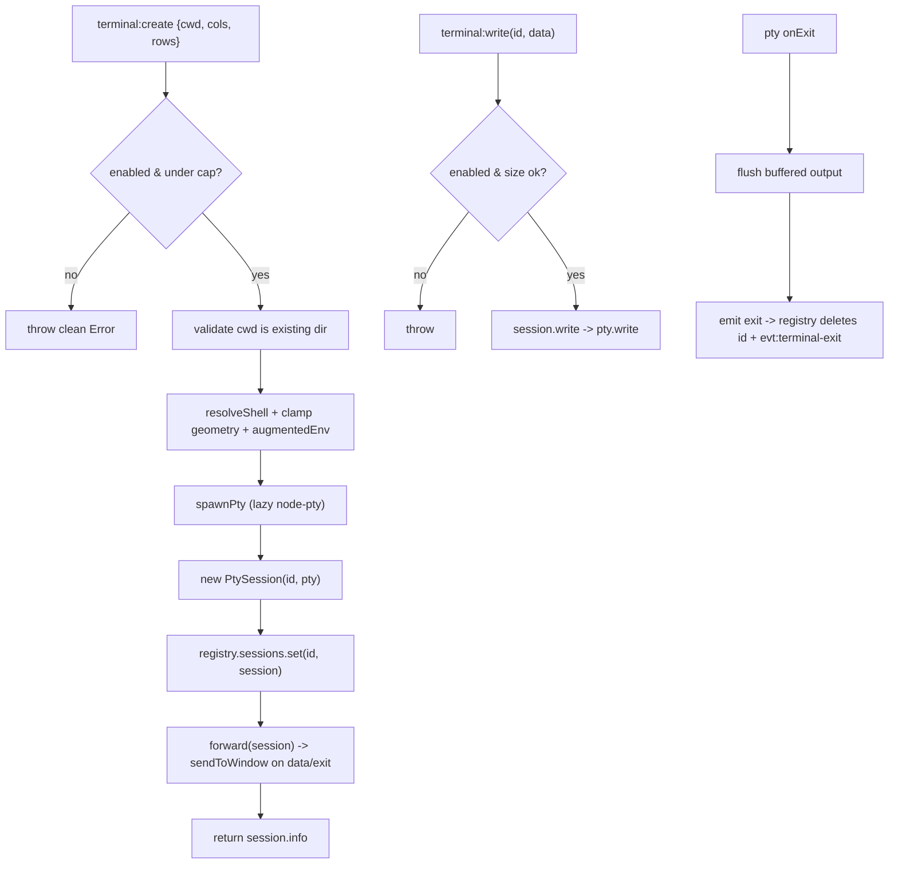

# Terminal subsystem

The terminal subsystem is the main-process pty layer. It owns a set of live
pseudo-terminal sessions, one `node-pty` `IPty` per opaque terminal id the
renderer addresses, and adapts each pty's high-frequency byte stream into
batched, IPC-friendly events. A pty is a real shell running at full user
privilege, so the subsystem is a gated capability: off by default
(`settings.terminal.enabled`), concurrency-capped, and input only ever
originates from the local terminal view. Agent frames never write to pty input.
The subsystem also owns the external terminal launchers, which open a workspace
cwd in a detected external terminal app instead of the embedded xterm. The
renderer side is the xterm.js terminal view, described in
[`../features/terminal.md`](../features/terminal.md). The privilege boundary is
part of the app-wide security model in [`../security.md`](../security.md).

## Directory layout

```text
src/main/terminal/
  registry.ts            TerminalRegistry — one IPty per id, capability + concurrency gate, disposeAll
  pty-session.ts         PtySession — wraps one IPty, coalesces output, emits data/exit
  external-launchers.ts  ExternalTerminalLaunchers — detect + open external terminal apps
src/main/ipc/
  terminal.ts            registerTerminalIpc — bridges window.omp.terminal to the registry + launchers
src/main/
  paths.ts               augmentedEnv() (PATH for spawned shells), resolveShell fallbacks
src/shared/
  domain.ts              TerminalInfo
  ipc.ts                 CH.terminalCreate / Write / Resize / Kill / List / ExternalLaunchers / OpenExternal + evt:terminal-data / evt:terminal-exit
```

## Key abstractions

| Abstraction | File | Role |
| --- | --- | --- |
| `TerminalRegistry` | `src/main/terminal/registry.ts` | Owns the `Map<id, PtySession>`. Enforces the capability gate and concurrency cap on `create`, validates cwd, re-checks the capability on every `write`, and provides a synchronous `disposeAll` for the quit hooks. Injectable `PtyFactory` and `TerminalCapsReader` seams keep tests hermetic. |
| `PtySession` | `src/main/terminal/pty-session.ts` | Wraps one `IPtyLike` handle. Coalesces output over a 16 ms / 16 KiB window and emits `"data"`; emits `"exit"` (with the code) at most once after flushing the final bytes. Owns `write`, `resize`, `kill`, and an idempotent `dispose`. |
| `IPtyLike` | `src/main/terminal/pty-session.ts` | The minimal structural slice of `node-pty`'s `IPty` this module depends on (`pid`, `onData`, `onExit`, `write`, `resize`, `kill`). Kept structural so `pty-session.ts` never statically imports `node-pty` and loads under plain Node. |
| `PtyFactory` | `src/main/terminal/registry.ts` | `(opts: PtySpawnOptions) => IPtyLike`. The default factory lazily `require`s `node-pty` only on first spawn, so a missing or unbuilt native addon never breaks app startup, only an opted-in `terminal:create`. Tests inject a fake. |
| `TerminalCaps` / `TerminalCapsReader` | `src/main/terminal/registry.ts` | `{ enabled, maxConcurrent }` read fresh from settings on every `create` and `write`, so a toggle takes effect immediately, even for ptys spawned while enabled. |
| `defaultFactory` | `src/main/terminal/registry.ts` | The real spawn path. `requireNative("node-pty").spawn(shell, [], { name, cwd, env, cols, rows })`. Lazy load mirrors `secret-store`'s lazy Electron require. |
| `resolveShell` | `src/main/terminal/registry.ts` | Cross-platform login shell. On win32 prefers `ComSpec` (cmd.exe) then `powershell.exe`; elsewhere honors `$SHELL` then falls back to `/bin/bash`. |
| `ExternalTerminalLaunchers` | `src/main/terminal/external-launchers.ts` | Detects and opens external terminal apps. `list()` reports availability per profile; `open({ cwd, profile })` spawns a detached, unref'd process in the workspace cwd. |
| `SPECS` | `src/main/terminal/external-launchers.ts` | The launcher table: `system`, `ghostty`, `kitty`, `iterm2`, `alacritty`, `wezterm`, each with macOS app paths and PATH command names plus per-profile argv. |
| `forward` | `src/main/ipc/terminal.ts` | Subscribes a freshly created `PtySession` to `data` / `exit` and pushes them over `evt:terminal-data` / `evt:terminal-exit` via `sendToWindow`. Mirrors the chat frame-forwarding pattern. |
| `MAX_WRITE_BYTES` | `src/main/terminal/registry.ts` | 1 MiB hard ceiling on one `terminal:write` payload, counted in UTF-8 bytes (not UTF-16 code units) so a non-ASCII payload cannot exceed the fd limit by 3x. |

## How it works

### Registry lifecycle

`TerminalRegistry` mirrors `SessionRegistry`'s discipline: a map keyed by an
opaque id, injectable seams so tests never spawn a real shell, and a
synchronous `disposeAll` that `index.ts` wires into the Electron quit hooks.
`create` is the only spawn path:

1. Read caps fresh. If `enabled` is false, throw `terminal capability is
   disabled`. If `sessions.size >= maxConcurrent`, throw `terminal limit
   reached`.
2. Validate `cwd` is a non-empty string naming an existing directory. A shell is
   never spawned in an unvalidated directory.
3. Resolve the shell (`resolveShell`), clamp the renderer geometry to positive
   integers (fallback 80x24), and build the spawn env with `augmentedEnv()`.
4. Materialize the pty through `spawnPty`, assign a uuid, wrap it in a
   `PtySession`, store it, and wire the session's `"exit"` to delete its record
   so it stops counting against the cap and leaves `terminal:list`.

`create` throws clean errors rather than degrading silently, because the caller
needs to know why no terminal appeared. The IPC layer surfaces the message.

### Output coalescing

A pty can emit bytes faster than the renderer wants IPC messages. `PtySession`
buffers output in `pending` and flushes on the sooner of a 16 ms quiet timer
(`FLUSH_INTERVAL_MS`) or a 16 KiB threshold (`FLUSH_SIZE_THRESHOLD`). Each flush
emits one `"data"` event, bounding both latency and the number of
`evt:terminal-data` messages. On exit, the buffer is flushed before the
`"exit"` emit so the renderer never loses the final bytes a program wrote right
before terminating.

`dispose` is the hard teardown used by `disposeAll` on quit: it stops the flush
timer, kills the child, detaches the native `onData`/`onExit` subscriptions
(`removeAllListeners` alone would leave the addon-side callbacks alive), and
drops the emitter's listeners. It is idempotent and silent, and emits no final
`"data"`/`"exit"` since the renderer is going away with the process.



### Input gating

Input flows only from the local terminal view via `terminal:write`. The
registry re-checks the capability on every write (a fresh settings read, so a
toggle-off takes effect immediately, even for ptys spawned while enabled) and
validates the payload shape and byte size before it can reach the native handle.
An unknown id is a silent no-op: the renderer may race a write against an exit
it has not processed yet. `PtySession.write` drops input once the pty has exited
or been disposed so a late write never hits a dead handle.

The pty input is never auto-fed from agent output, `evt:rpc` frames, or remote
content. The agent and the terminal are deliberately separate channels.

### External terminal launchers

`ExternalTerminalLaunchers` lets a workspace cwd be opened in an external
terminal app instead of the embedded xterm. `list()` walks `SPECS` and detects
each profile: on macOS it looks for the app bundle in standard locations
(`/Applications/Ghostty.app`, etc.); elsewhere (or when no app is found) it
searches `PATH` for the command. Each result is `mac-app`, `command`, or
`unavailable`. `open({ cwd, profile })` validates cwd is a directory, picks the
requested profile (or the first available for `system`), and spawns a detached,
unref'd process with profile-specific argv (`--working-directory` for ghostty,
`--directory` for kitty, `start --cwd` for wezterm, `open -a <app> <cwd>` for
macOS apps). The launched process is independent of OMP Studio and survives the
app closing.

### IPC wiring

`registerTerminalIpc` bridges `window.omp.terminal` to the registry and the
launchers. `create`/`write`/`resize`/`kill`/`list` and
`externalLaunchers`/`openExternal` are request/response over `ipcMain.handle`.
A `handle` helper wraps each handler in a try/catch that rethrows a clean
`Error` (so the renderer sees a message, not `[object Object]`). `resize` and
`kill` no-op on an unknown id for the same race reason as `write`. Each created
session is passed to `forward`, which subscribes its `data`/`exit` streams and
pushes them over `evt:terminal-data` / `evt:terminal-exit` through
`sendToWindow`. The `getWindow` accessor the registry receives means a
destroyed window (close/reload) drops the event instead of throwing.

## Integration points

- **Terminal view UI**: [`../features/terminal.md`](../features/terminal.md)
  renders the xterm.js terminal and drives `terminal:create` / `write` /
  `resize` / `kill`, plus the external-launcher picker.
- **Security boundary**: the real-shell privilege and the agent/terminal
  separation are part of [`../security.md`](../security.md).
- **IPC layer**: `registerTerminalIpc` wires the channels; see
  [`./ipc-layer.md`](./ipc-layer.md).
- **Settings**: `terminal.enabled` and `terminal.maxConcurrent` (default 4) come
  from `src/main/services/settings-service.ts`; see
  [`./settings-service.md`](./settings-service.md).
- **Paths**: `augmentedEnv()` in `src/main/paths.ts` builds the PATH the spawned
  shell inherits; see [`./paths-and-logging.md`](./paths-and-logging.md).
- **Quit hooks**: `index.ts` calls `terminals.disposeAll()` on
  `window-all-closed` and `before-quit` so no orphan shell outlives the app; see
  [`./ipc-layer.md`](./ipc-layer.md).
- **Domain types**: `TerminalInfo` is defined in `src/shared/domain.ts`; see
  [`../primitives/domain-types.md`](../primitives/domain-types.md).
- **IPC contract**: the `terminal:*` and `evt:terminal-*` channel names live in
  `src/shared/ipc.ts`; see [`../primitives/ipc-contract.md`](../primitives/ipc-contract.md).

## Entry points for modification

- **Add a terminal setting** (e.g. a default shell override): extend
  `TerminalSettings` in `src/shared/ipc.ts`, default it in
  `src/main/services/settings-service.ts`, and read it in
  `TerminalCapsReader` or `resolveShell`.
- **Change the concurrency cap or write limit**: `DEFAULT_MAX_CONCURRENT` and
  `MAX_WRITE_BYTES` in `src/main/terminal/registry.ts`, or
  `terminal.maxConcurrent` in settings.
- **Tune output coalescing**: `FLUSH_INTERVAL_MS` and `FLUSH_SIZE_THRESHOLD` in
  `src/main/terminal/pty-session.ts`.
- **Add an external terminal profile**: add a `LauncherSpec` to `SPECS` and a
  case to `commandArgs` in `src/main/terminal/external-launchers.ts`, then add
  the profile to `ExternalTerminalProfile` in `src/shared/ipc.ts`.
- **Change shell resolution**: `resolveShell` in
  `src/main/terminal/registry.ts`.
- **Add a terminal IPC channel**: register it in `src/shared/ipc.ts`, wire it in
  `registerTerminalIpc`, and add the method to `OmpApi.terminal`.

## Key source files

| File | Purpose |
| --- | --- |
| `src/main/terminal/registry.ts` | `TerminalRegistry`: capability gate, concurrency cap, lazy `node-pty` spawn, `disposeAll`. |
| `src/main/terminal/pty-session.ts` | `PtySession`: output coalescing, data/exit emits, idempotent dispose. |
| `src/main/terminal/external-launchers.ts` | `ExternalTerminalLaunchers`: detect + open external terminal apps. |
| `src/main/ipc/terminal.ts` | `registerTerminalIpc`: bridges `window.omp.terminal` to the registry and launchers. |
| `src/main/paths.ts` | `augmentedEnv()` for the spawned shell's PATH. |
| `src/shared/domain.ts` | `TerminalInfo`. |
| `src/shared/ipc.ts` | The `terminal:*` and `evt:terminal-*` channel names, `TerminalSettings`, `ExternalTerminalProfile`. |
